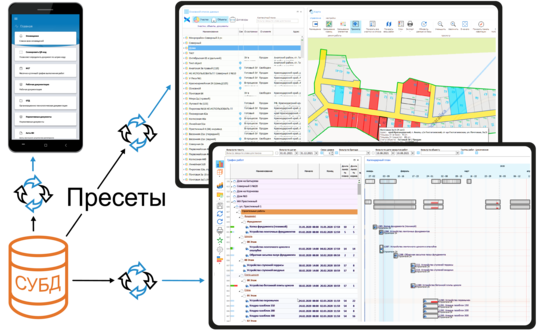

# Платформа «ЭТОС»: технологические особенности

Платформа «ЭТОС» – программный комплекс для создания информационных систем автоматизации деятельности предприятий и организаций. Разработанные на платформе программные продукты применяются для управления сложными процессами с участием большого числа контрагентов, в частности, в сфере промышленного строительства.

В таких проектах к IT-решениям предъявляются особые требования. Они должны предоставлять всем участникам единое информационное пространство для взаимодействия, но при этом учитывать специфику их отношений, то есть гибко адаптироваться к любому набору бизнес-процессов.

## Архитектура платформы

Для решения этих задач разработчиками платформы «ЭТОС» была реализована особая архитектура системы, состоящая из трех основных уровней:

1. **Хранилище значений**.
2. **Пресеты**.
3. **Пользовательские интерфейсы**.
   
Хранилище значений – это базы данных, содержащие не связанные друг с другом таблицы значений. Платформа поддерживает работу с базами PostgreSQL, MS SQL Server, MySQL Server, MS SQL Compact, SQLite, MS Access.

Пресет – набор параметров конфигурации программы, заданных разработчиками (настройки по умолчанию) или сохраненных самим пользователем в процессе работы. Пресет – ключевой элемент платформы «ЭТОС», именно он отвечает за структурирование данных, то есть за то, какие именно значения будут загружены из «жестких» таблиц базы данных, как различные типы значений будут связаны друг с другом и в каком виде показаны пользователю.

Пользовательский интерфейс – конкретный способ представления данных, например, таблица, график, диаграмма Ганта и пр., а также графические инструменты управления ими. 

Рассмотрим подробнее, из каких параметров формируются пресеты – это позволит лучше понять принцип их работы. Для каждого пресета доступно пять групп параметров:

1) *Графики* – отвечает за то, в каком виде будут структурированы значения: вертикальный список, иерархический список, календарный план и т.п.;
2) *Строки* – отвечает за то, какой тип данных будет загружен и где именно нужные значения «лежат» в базе данных (наименование таблицы, ID строки). Типы данных сгруппированы в коллекции: объекты, организации, документы и пр.
3) *Колонки* – отвечает за то, какие атрибуты будут присвоены значениям в строках, и где их искать в базе данных (для объектов такими атрибутами являются, например, адрес, реквизиты земельного участка, плановые и фактические даты начала и окончания строительства, стоимость и пр.);
4) *Фильтры* – используются для ограничения количества значений, загружаемых из базы;
5) *Действия* – отвечает за функции элементов управления пользовательского интерфейса.
   
При запуске пресета в соответствии с его параметрами программа автоматически формирует SQL-запрос, а затем возвращает пользователю нужные значения в предусмотренной теми же параметрами форме – и уже с этими данными, заранее «упакованными» пресетом в удобный графический интерфейс, пользователь дальше и работает. 

## Преимущества платформы

Именно такой алгоритм работы с данными и отличает «ЭТОС» от большинства представленных на рынке ERP-систем. Последние для решения того же круга задач используют жесткую структуру данных, то есть набор тех же таблиц, только более сложных. Соответственно, любое структурное изменение системы (например, когда возникает необходимость связать между собой данные из разных таблиц) требует создания новой таблицы, а следовательно – модификации исходного кода, что не может быть реализовано без участия разработчиков системы. 

При использовании пресетов необходимость в новых таблицах не возникает: сами пресеты берут на себя роль «надстройки» над базой данных, гибко связывая значения из разных таблиц. Соответственно, отпадает и потребность в модификации исходного кода – вместо него меняются параметры пресетов, а поскольку эти изменения относятся к «надстройке» и не затрагивают «базиса», самогó программного инструмента создания и исполнения пресетов, они могут быть сделаны самим пользователем – через программный модуль «Настройка пресетов» и/или путем создания пользовательских скриптов на C# или Visual Basic. 

Помимо повышения гибкости и адаптивности системы, отсутствие необходимости переписывать код под каждый новый проект существенно сокращает и сроки внедрения программы. Ведь, по сути, при внедрении кастомизированного решения на платформе «ЭТОС» речь идет не столько о разработке, сколько о настройке программы в соответствии с потребностями заказчика и ролевой моделью конкретного проекта.

При этом наряду со структурой данных (уровень 1) настраиваются и пользовательские интерфейсы (уровень 3). Платформа поддерживает более 60 типов диаграмм и 190 элементов управления WinForms, а также импорт/экспорт файлов всех основных форматов, включая расширения MS Office, PDF, DVG, XML и др. Настроена интеграция с популярными системами управления проектами:  «1С:ERP», MS Project, Oracle Primavera. 

Немаловажное внимание при разработке платформы «ЭТОС» было уделено и вопросам безопасности. Разработанные на ее основе решения успешно прошли апробацию в крупнейших атомных и нефтегазовых корпорациях страны. Разработчик платформы, компания «Стройформ», имеет лицензию Центра по лицензированию, сертификации и защите государственной тайны ФСБ России (ЛСЗ №0015343); используемые в решениях на базе платформы «ЭТОС» средства защиты информации сертифицированы ФСТЭК России по 4-му уровню доверия (сертификат №4099). 

[Вернуться к списку сайтов](../index.md)