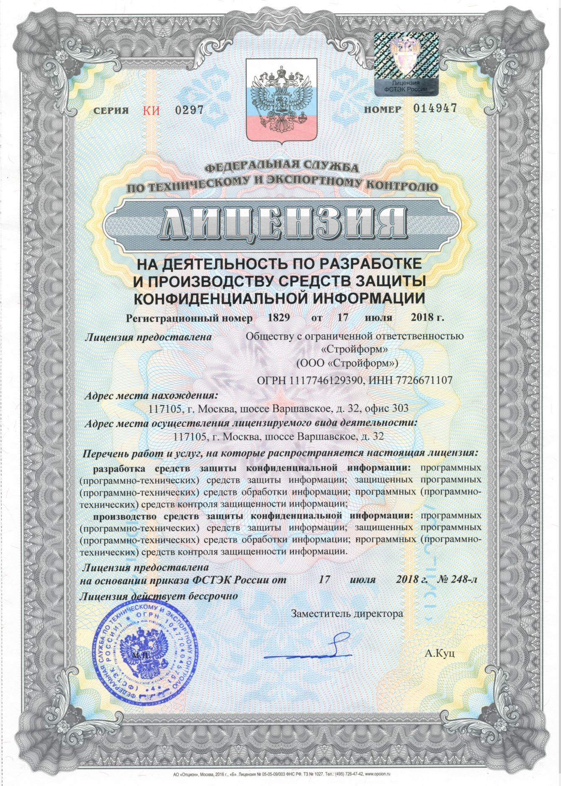

# Лицензия ФСТЭК на разработку средств защиты конфиденциальной информации

Лицензия ФСТЭК России на право осуществления деятельности по разработке и производству средств защиты конфиденциальной информации (в части пункта 3 пп. «а» - разработка средств защиты конфиденциальной информации, в том числе: программных (программно-технических) средств защиты информации; защищенных программных (программно-технических) средств обработки информации; программных (программно-технических) средств контроля защищенности информации; пп. «б» - производство средств защиты конфиденциальной информации, в том числе: программных (программно-технических) средств защиты информации; защищенных программных (программно-технических) средств обработки информации; программных (программно-технических) средств контроля защищенности информации)

