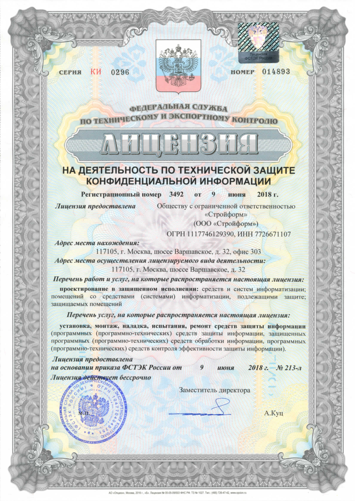

# Лицензия ФСТЭК на техническую защиту конфиденциальной информации

Лицензия ФСТЭК России на право осуществления деятельности по технической защите конфиденциальной информации в части работ, предусмотренных подпунктом «д» и «е» пункта 4 Положения о лицензировании деятельности по технической защите конфиденциальной информации, утвержденного Постановлением Правительства Российской Федерации от 03.02.2012 № 79 «О лицензировании деятельности по технической защите конфиденциальной информации», а именно «работы и услуги по проектированию в защищенном исполнении средств и систем информатизации» и «услуги по установке, монтажу, испытаниям средств защиты информации (программных (программно-технических) средств защиты информации)»

