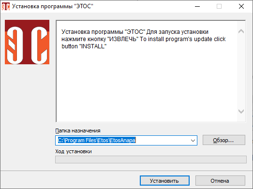

# Установка программы

## Описание и компоненты программы

Программ «ЭТОС» (далее – Программа) предназначена для автоматизации деятельности организаций различных сфер деятельности.

Для работы Программы необходимо наличие СУБД на базе языка структурированных запросов (structured query language – SQL).

По умолчанию вместе с программой выполняется установка СУБД Microsoft SQL Server Compact Edition и СУБД SQLite. Эти СУБД, однако, имеют ограниченный функционал и предназначены для тестирования Программы.

В качестве основных рекомендуется использовать следующие СУБД:

- Microsoft SQL Server.
- MySQL Server.
- PostgreSQL.
  
СУБД SQLite может быть использована для хранения базы данных адресов.

Как правило, на сервере выполняется установка СУБД, а сама Программа устанавливается на рабочие места пользователей и администраторов. Установка СУБД выполняется в соответствии с документацией. После установки СУБД нужно создать базы данных (БД). Минимально необходимый набор для работы Программы включает в себя следующие БД:

- Основная БД.
- Информационная БД замечаний, нарушений, предписаний.
- БД с вложенными файлами.
  
Подробная информация о работе с БД в Программе приведена в разделе [«Настройка конфигураций»](08_configuration.md).

После установки СУБД и создания необходимых БД можно переходить к установке Программы.

## Установка Программы

Для установки Программы нужно запустить установочный файл, имеющий вид:

>ETOS_update_8.2.7.1921_Core64.exe,

где 8.2.7.1921 - версия Программы.

Для этого нужно дважды щелкнуть на нем левой кнопкой мыши (ЛКМ) или нажать правую кнопку мыши (ПКМ) и выбрать пункт «Открыть». Для правильной работы Программы установку нужно производить с правами администратора.

После запуска установочного файла открывается окно с текстом лицензионного соглашения:

 

Для продолжения установки нужно нажать кнопку «Принять». Откроется окно с выбором места установки:

Если необходимо выполнить установку в директорию, отличную от выбранной по умолчанию, нужно нажать кнопку «Обзор» и указать нужную директорию или создать ее, воспользовавшись кнопкой «Создать папку»:

После выбора директории следует нажать «ОК» и «Установить».

Далее требуется дождаться завершения установки. Ход установки отражается в виде строки прогресса:
 

После завершения установки можно выполнить запуск Программы, воспользовавшись ярлыком на рабочем столе ( ) или в разделе «Программы» меню «Пуск». 

Окно программы при первом запуске будет выглядеть так:

