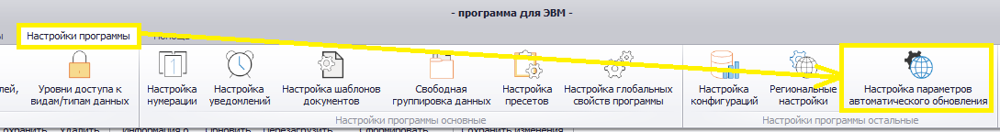
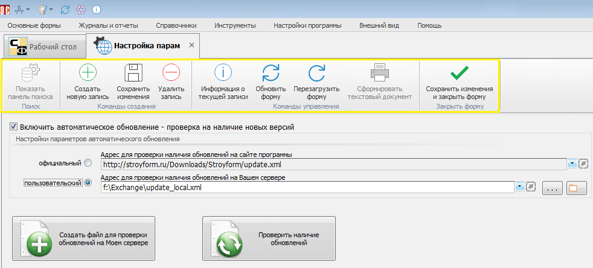
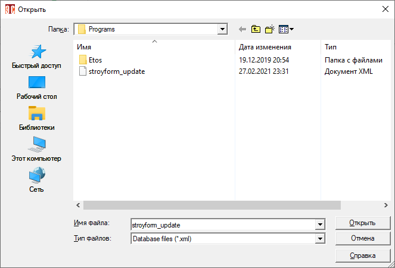
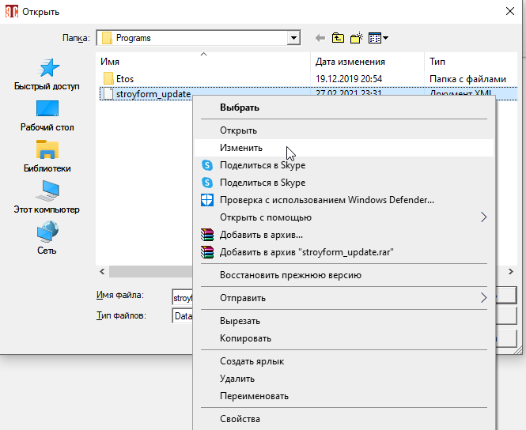
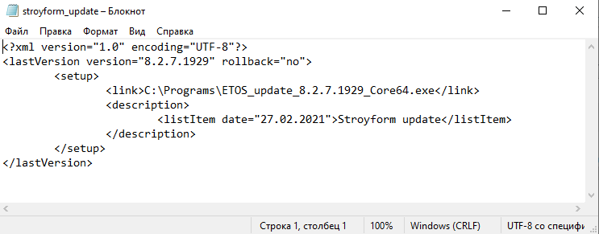
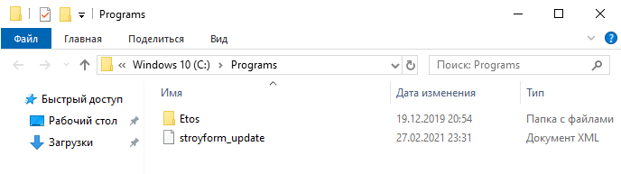
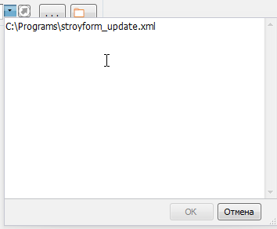
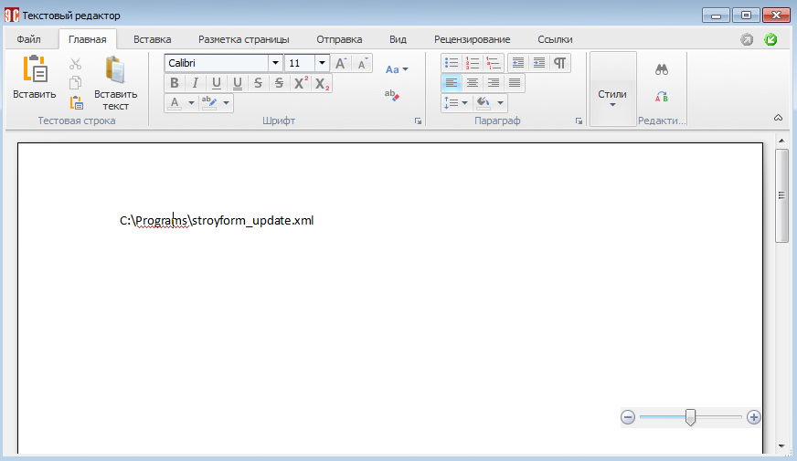
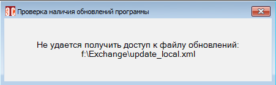

# Настройка обновлений

## Автоматическое обновление

Функция автоматического обновления (АО) проверяет наличие новых версий Программы и устанавливает их в автоматическом режиме.

Для перехода к настройкам АО в главном меню нужно перейти на вкладку «Настройки программы» и выбрать пункт «Настройка параметров автоматического обновления» (рис.1)

 
<i>Рисунок 1. Переход к настройкам АО</i>

Откроется форма, показанная на рис.2.

 
<i>Рисунок 2. Форма настройки АО</i>

В верхней части форма содержит панель меню (на рис.2 выделена желтым). Назначение кнопок описано в табл.1.

<table border="1">
<tr>
    <td align="center"><b>Вид кнопки</b></td>
    <td align="center"><b>Название</b></td>
    <td align="center"><b>Назначение</b></td>
    <td align="center"><b>«Горячие» клавиши</b></td>
</tr>
<tr>
    <td align="center"></td>
    <td>Сохранить изменения</td>
    <td>Сохраняет изменения, сделанные в форме. Форма остается открытой</td>
    <td>Ctrl+S</td>
</tr>
<tr>
    <td align="center"></td>
    <td>Обновить форму</td>
    <td>Обновляет данные и перерисовывает форму. При этом информация считывается из базы данных, а значит, все несохраненные изменения будут потеряны</td>
    <td>Ctrl+R или F5</td>
</tr>
<tr>
    <td align="center"></td>
    <td>Перезагрузить форму</td>
    <td>Заново перезагружает форму и все данные в ней. Информация загружается из базы данных, все несохраненные изменения будут потеряны</td>
    <td>Ctrl+F5 или F6</td>
</tr>
<tr>
    <td align="center"></td>
    <td>Сохранить изменения и закрыть форму</td>
    <td>Сохраняет сделанные изменения и закрывает форму</td>
    <td>Ctrl+E</td>
</tr>
</table>

<i>Таблица 1. Назначение кнопок панели меню</i>

В нижней части формы настраиваются параметры АО. Для включения АО нужно установить флаг «Включить автоматическое обновление – проверка на наличие новых версий» (по умолчанию включен). После установки флага появляется возможность выбрать источник обновлений:

- Официальный.
- Пользовательский.
  
При выборе официального источника поиск обновлений будет осуществляться на официальном сайте Программы http://stroyform.ru/Downloads/Stroyform/update.xml.

Пользовательский вариант АО, как правило, используется в сетях (сегментах сети) организаций, не имеющих доступа к Интернету или ограничивающих его в целях безопасности.

При выборе этого варианта в качестве источника обновлений можно указать файл, в котором хранятся параметры проверки обновлений. Для этого нужно нажать кнопку «Выбрать файл» ( ), в открывшемся диалоговом окне (рис.3) выбрать файл обновления (в данном случае stroyform_update.xml):

 
<i>Рисунок 3. Окно выбора файла с параметрами обновления</i>

 
Для настройки параметров обновления в контекстном меню файла необходимо выбрать пункт «Изменить» (рис.4).

 
<i>Рисунок 4. Переход к редактированию параметров обновления</i>

 
В открывшемся файле (рис.5) указываем расположение файла обновления Программы (строка с тегом \<link>), а также версию Программы, до которой требуется выполнить обновление (значение в кавычках после слова version).

 
<i>Рисунок 5. Файл настройки параметров обновления</i>

 
Далее требуется сохранить сделанные изменения и закрыть файл. После этого у всех пользователей, в настройках программы которых включено АО, при ее запуске будет выполнено обновление.

Кнопка «Открыть выбранный файл» (  ) открывает каталог, содержащий файл, указанный в строке пользовательского варианта обновления (рис.6). Здесь также можно выполнить настройку обновлений, как было описано выше.

 
<i>Рисунок 6. Каталог с файлом настройки обновлений</i>

Кнопки «Увеличить текстовое поле» (  ) и «Развернуть текст на весь экран» (  ) позволяют получить полную информацию о пути размещения обновлений (рис.7 и рис.8). Эти функции могут понадобиться, если путь длинный и не помещается в строке. Путь при этом можно скорректировать и сохранить.

 
<i>Рисунок 7. Просмотр пути обновления с помощью </i>

 
<i>Рисунок 8. Просмотр пути обновления с помощью </i>

## Откат обновления

Если после обновления наблюдаются проблемы с работой программы (подвисает, работает нестабильно и т.д.), может потребоваться откат до предыдущей версии. Для этого в файле настройки обновлений нужно указать расположение файла более ранней версии Программы, а также саму эту версию, как описано выше. Кроме того, необходимо изменить значение параметра rollback с no на yes. Это позволить вернуться к более ранней версии.

При необходимости можно создать новый файл настройки обновлений. Для этого рекомендуется скопировать имеющийся файл, переименовать его и прописать необходимые параметры обновления, после чего сохранить и указать измененный файл как источник пользовательского варианта обновлений.

Кнопка «Проверить наличие обновлений» (  ) позволяет выполнить немедленную проверку наличия обновлений. В случае наличия обновлений будет выполнена их загрузка и установка. При отсутствии доступа к указанному в настройках источнику обновлений будет показано сообщение об ошибке (рис.9).

 
<i>Рисунок 9. Сообщение «Источник обновлений недоступен»</i>

