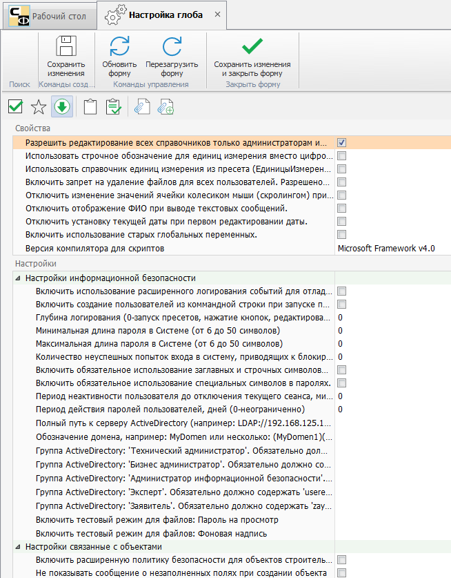

# Настройка глобальных свойств

Для перехода к настройке глобальных свойств Программы (ГСП) в главном меню нужно открыть вкладку «Настройки программы» и выбрать одноименный пункт (рис.1).

 
<i>Рисунок 1. Переход к настройкам ГСП</i>

Откроется форма настройки ГСП (рис.2).

 
<i>Рисунок 2. Форма настройки ГСП</i>

В верхней части формы расположено меню формы (на рис.2 выделено желтым), ниже – меню глобальных свойств (на рис.2 выделено зеленым). Назначение кнопок меню формы преведено в табл.1.

<table border="1">
<tr>
    <td align="center"><b>Вид кнопки</b></td>
    <td align="center"><b>Название</b></td>
    <td align="center"><b>Назначение</b></td>
    <td align="center"><b>«Горячие» клавиши</b></td>
</tr>
<tr>
    <td align="center"></td>
    <td>Сохранить изменения</td>
    <td>Сохраняет изменения, сделанные в форме. Форма остается открытой</td>
    <td>Ctrl+S</td>
</tr>
<tr>
    <td align="center"></td>
    <td>Обновить форму</td>
    <td>Обновляет данные и перерисовывает форму. При этом информация считывается из базы данных, а значит, все несохраненные изменения будут потеряны</td>
    <td>Ctrl+R или F5
</td>
</tr>
<tr>
    <td align="center"></td>
    <td>Перезагрузить форму</td>
    <td>Заново перезагружает форму и все данные в ней. Информация загружается из базы данных, все несохраненные изменения будут потеряны</td>
    <td>Ctrl+F5 или F6
</td>
</tr>
<tr>
    <td align="center"></td>
    <td>Сохранить изменения и закрыть форму</td>
    <td>Сохраняет сделанные изменения и закрывает форму</td>
    <td>Ctrl+E</td>
</tr>
</table>

<i>Таблица 1. Назначение кнопок меню формы</i>

Назначение кнопок меню глобальных свойств представлено в табл.2.

<table border="1">
<tr>
    <td align="center"><b>Вид кнопки</b></td>
    <td align="center"><b>Название</b></td>
    <td align="center"><b>Назначение</b></td>
</tr>
<tr>
    <td align="center"></td>
    <td>Применить изменения настроек</td>
    <td>Внесенные изменения будут сохранены в памяти Программы. Для сохранения изменений в БД нужно нажать кнопку «Сохранить изменения» в меню формы</td>
</tr>
<tr>
    <td align="center"></td>
    <td>Показать заполненные свойства</td>
    <td>Выполняется переключение между режимами отображения свойств: только заполненные/все свойства </td>
</tr>
<tr>
    <td align="center"></td>
    <td>Раскрыть все свойства</td>
    <td>Выполняется раскрытие списка всех свойств. При повторном нажатии список будет свернут</td>
</tr>
<tr>
    <td align="center">></td>
    <td>Скопировать пресет в буфер обмена</td>
    <td>Пресет копируется в буфер обмена в виде строки Base64</td>
</tr>
<tr>
    <td align="center"></td>
    <td>Загрузить пресет из буфера обмена</td>
    <td>Пресет загружается из буфера обмена, полностью заменяя текущий</td>
</tr>
<tr>
    <td align="center"></td>
    <td>Сохранить пресет в файл</td>
    <td>Пресет сохраняется в файл</td>
</tr>
<tr>
    <td align="center"></td>
    <td>Загрузить пресет из файла</td>
    <td>Пресет загружается из файла, полностью заменяя текущий</td>
</tr>
</table>

<i>Таблица 2. Назначение кнопок меню глобальных свойств</i>

ГСП разделены на группы, которые содержат наборы свойств. При нажатии  будет выведен список всех свойств (рис.3). Для активации/деактивации нужных свойств требуется выставить/снять флаг напротив нужного свойства или выбрать/ввести одно из допустимых значений.

 
<i>Рисунок 3. Свойства настроек ГСП в развернутом виде</i>

В таблицах ниже дано описание свойств настроек ГСП. 

## Группа «Свойства»

<table border="1">
<tr>
    <td align="center"><b>№ п/п</b></td>
    <td align="center"><b>Название</b></td>
    <td align="center"><b>Допустимые значения</b></td>
    <td align="center"><b>Описание/примечание</b></td>
</tr>
<tr>
    <td>1</td>
    <td>Разрешить редактирование всех справочников только администраторам</td>
    <td></td>
    <td>Редактирование справочников доступно пользователям, имеющим права администратора</td>
</tr>
<tr>
    <td>2</td>
    <td>Использовать строчное обозначение для единиц измерения вместо цифрового (например, кв.м. вместо м2)</td>
    <td></td>
    <td></td>
</tr>
<tr>
    <td>3</td>
    <td>Использовать справочник единиц изменения из пресета (ЕдиницыИзмерения) вместо встроенного</td>
    <td></td>
    <td></td>
</tr>
<tr>
    <td>4</td>
    <td>Включить запрет на удаление файлов для всех пользователей. Разрешено удалять только админам и тем, у кого разрешение на форме «Пользователи»</td>
    <td></td>
    <td></td>
</tr>
<tr>
    <td>5</td>
    <td>Отключить изменение значений ячейки колесиком мыши (скроллингом) при редактировании: чисел, даты и времени</td>
    <td></td>
    <td></td>
</tr>
<tr>
    <td>6</td>
    <td>Отключить отображение ФИО при вводе текстовых сообщений</td>
    <td></td>
    <td></td>
</tr>
<tr>
    <td>7</td>
    <td>Отключить установку текущей даты при первом редактировании даты</td>
    <td></td>
    <td></td>
</tr>
<tr>
    <td>8</td>
    <td>Включить использование старых глобальных переменных</td>
    <td></td>
    <td></td>
</tr>
</table>

<i>Таблица 3. Описание настроек ГСП (группа «Свойства»)</i>

## Группа «Настройки»/подгруппа «Настройки информационной безопасности»

<table border="1">
<tr>
    <td align="center"><b>№ п/п</b></td>
    <td align="center"><b>Название</b></td>
    <td align="center"><b>Допустимые значения</b></td>
    <td align="center"><b>Описание/примечание</b></td>
</tr>
<tr>
    <td>9</td>
    <td>Включить использование расширенного логирования событий для отладки программы</td>
    <td></td>
    <td>При активации опции будет выполняться расширенное логирование. После включения опции нужно установить глубину логирования в пункте 11 таблицы</td>
</tr>
<tr>
    <td>10</td>
    <td>Включить создание пользователей из командной строки при запуске программы</td>
    <td></td>
    <td>Опция позволяет создавать профили пользователей путем запуска программы из командной строки с использованием различных ключей</td>
</tr>
<tr>
    <td>11</td>
    <td>Глубина логирования (0 – запуск пресетов, нажатие кнопок, редактирование ячеек; 1 – выбор строк; 3 – выполнение скриптов; 4 – пресеты автоуведомлений)</td>
    <td>0-4</td>
    <td>Опция определяет степень расширенного логирования. Значение 1 предполагает логирование событий значения 0, значенеие 2 предполагает логирование событий 0 и 1 и т.д. Для работы опции нужно включить расширенное логирование в пункте 9 таблицы</td>
</tr>
<tr>
    <td>12</td>
    <td>Минимальная длина пароля в системе (от 6 до 50 символов)</td>
    <td>6-50</td>
    <td>При записи пароля выполняется проверка его соответствия минимальной длине. Рекомендуется не менее 8 символов для пользователя и не менее 10 для администратора</td>
</tr>
<tr>
    <td>13</td>
    <td>Максимальная длина пароля в системе (от 6 до 50 символов)</td>
    <td>6-50</td>
    <td>При записи пароля выполняется проверка его соответствия максимальной длине</td>
</tr>
<tr>
    <td>14</td>
    <td>Количество неуспешных попыток входа в систему, приводящих к блокировке учетной записи (0 – отключено)</td>
    <td></td>
    <td></td>
</tr>
<tr>
    <td>15</td>
    <td>Включить обязательное использование заглавных и строчных символов в паролях</td>
    <td></td>
    <td></td>
</tr>
<tr>
    <td>16</td>
    <td>Включить обязательное использование специальных символов в паролях</td>
    <td></td>
    <td></td>
</tr>
<tr>
    <td>17</td>
    <td>Период неактивности пользователя до отключения текущего сеанса, минут (0 – отключено)</td>
    <td></td>
    <td>При неактивности пользователя в течение указанного времени сеанс блокируется, для разблокировки требуется ввод пароля. Рекомендуется 5-10</td>
</tr>
<tr>
    <td>18</td>
    <td>Период действия паролей пользователей, дней (0 – неограниченно)</td>
    <td></td>
    <td>По истечении указанного времени пользователю потребуется сменить пароль. Рекомендуется 30-45</td>
</tr>
<tr>
    <td>19</td>
    <td>Полный путь к серверу ActiveDirectory (например: LDAP://192.168.125.132 или LDAP://MyDomen)</td>
    <td>Путь к серверу контроллера домена</td>
    <td></td>
</tr>
<tr>
    <td>20</td>
    <td>Обозначение домена, например: MyDomen, или несколько: (MyDomen1)(MyDomen2)(Local)</td>
    <td>Обозначение домена</td>
    <td></td>
</tr>
<tr>
    <td>21</td>
    <td>Группа ActiveDirectory: ‘Технический администратор’. Обязательно должно содержать ‘techadmin’</td>
    <td>Группа технических администраторов</td>
    <td>Если в Программе есть бизнес-роль «Технический администратор», при привязке к домену эта роль будет автоматически назначена пользователям, включенным в группу (OU) ActiveDirectory, содержащую techadmin. Сервис синхронизации пользователей с доменом может быть включен в поставку Программы</td>
</tr>
<tr>
    <td>22</td>
    <td>Группа ActiveDirectory: ‘Бизнес администратор’. Обязательно должно содержать ‘businesadmin’</td>
    <td>Группа бизнес-администраторов</td>
    <td>Аналогично пункту 21, но для бизнес-роли «Бизнес администратор». Бизнес-роли, указанные в пунктах 21-25 таблицы, расположены порядке приоритета. Например, если пользователь состоит в группах ActiveDirectory, содержащих techadmin и businesadmin, ему будет присвоена роль с более высоким приоритетом (т.е. «Технический администратор»)</td>
</tr>
<tr>
    <td>23</td>
    <td>Группа ActiveDirectory: ‘Администратор информационной безопасности’. Обязательно должно содержать ‘security’</td>
    <td>Группа администраторов информационной безопасности</td>
    <td>Аналогично пункту 21, но для бизнес-роли «Администратор информационной безопасности». О приоритете ролей см. пункт 22</td>
</tr>
<tr>
    <td>24</td>
    <td>Группа ActiveDirectory: ‘Эксперт’. Обязательно должно содержать ‘userexpert’</td>
    <td>Группа экспертов</td>
    <td>Аналогично пункту 21, но для бизнес-роли «Эксперт». О приоритете ролей см. пункт 22</td>
</tr>
<tr>
    <td>25</td>
    <td>Группа ActiveDirectory: ‘Заявитель’. Обязательно должно содержать ‘zayaitel’. Это внешние пользователи</td>
    <td>Группа заявители</td>
    <td>Аналогично пункту 21, но для бизнес-роли «Заявитель». О приоритете ролей см. пункт 22. Внешние пользователи имеют доступ только к личному кабинету</td>
</tr>
<tr>
    <td>26</td>
    <td>Включить тестовый режим для файлов: Пароль на просмотр</td>
    <td>Пароль</td>
    <td>Пароль на просмотр файла. Действует до закрытия программы</td>
</tr>
<tr>
    <td>27</td>
    <td>Включить тестовый режим файлов: Фоновая запись</td>
    <td>Текст</td>
    <td>При просмотре файла по диагонали будет выведен введенный здесь текст</td>
</tr>
</table>

<i>Таблица 4. Описание настроек ГСП (группа «Настройки»/подгруппа «Настройки информационной безопасности»)</i>

 
<i>Рисунок 4. Внешние пользователи имеют доступ только к личному кабинету</i>

 

## Группа «Настройки»/подгруппа «Настройки связанные с объектами»

<table border="1">
<tr>
    <td align="center"><b>№ п/п</b></td>
    <td align="center"><b>Название</b></td>
    <td align="center"><b>Допустимые значения</b></td>
    <td align="center"><b>Описание/примечание</b></td>
</tr>
<tr>
    <td>28</td>
    <td>Включить расширенную политику безопасности для объектов строительства</td>
    <td></td>
    <td>Включает дополнительные настройки уровней доступа. Например, можно дать доступ только к объектам определенного района или статуса </td>
</tr>
<tr>
    <td>29</td>
    <td>Не показывать сообщение о незаполненных полях при создании объекта</td>
    <td></td>
    <td>Не будут выдаваться предупреждения о незаполненных полях (красный текст)</td>
</tr>
<tr>
    <td>30</td>
    <td>Скрыть текстовые поля для кадастрового номера на форме объект (оставить только список)</td>
    <td></td>
    <td>Не будут отражаться выделенные поля</td>
</tr>
<tr>
    <td>31</td>
    <td>Использовать список 2014 для источника финансирования</td>
    <td></td>
    <td>Используется устаревший список (по умолчанию используется новый)</td>
</tr>
<tr>
    <td>32</td>
    <td>Разрешить добавление подрядных организаций к объекту, если нет прав на изменение объекта</td>
    <td></td>
    <td>Вкладка «Организации» в форме «Объект». Если в уровнях доступа включены ограничения на редактирование объекта, то при этом флаге можно будет добавлять организации</td>
</tr>
</table>

<i>Таблица 5. Описание настроек ГСП (группа «Настройки»/подгруппа «Настройки связанные с объектами»)</i>

 
<i>Рисунок 5. Пример дополнительных настроек уровней доступа (свойство 28)</i>

 

 
<i>Рисунок 6. Поля, обязательные для заполнения (при активации свойства 29 предупреждение о том, что они не заполнены, не выводится)</i>

 

 
<i>Рисунок 7. Скрытие текстовые поля для кадастрового номера на форме объект (свойство 30)</i>

 

## Группа «Настройки»/подгруппа «Настройки связанные с физическими лицами»

<table border="1">
<tr>
    <td align="center"><b>№ п/п</b></td>
    <td align="center"><b>Название</b></td>
    <td align="center"><b>Допустимые значения</b></td>
    <td align="center"><b>Описание/примечание</b></td>
</tr>
<tr>
    <td>33</td>
    <td>Убирать пробел после инициалов и перед фамилией для сокращенного ФИО</td>
    <td></td>
    <td>В основном используется при печати документов</td>
</tr>
<tr>
    <td>34</td>
    <td>Использовать список направлений деятельности на форме физических лиц</td>
    <td></td>
    <td>Настройка для ГАУ ЦГЭ. Другим пользователям включать не рекомендуется</td>
</tr>
<tr>
    <td>35</td>
    <td>Использовать список ролей сотрудника в экспертной группе на форме физических лиц</td>
    <td></td>
    <td>Настройка для ГАУ ЦГЭ. Другим пользователям включать не рекомендуется</td>
</tr>
<tr>
    <td>36</td>
    <td>Вставлять пробел между инициалами для сокращенных ФИО при печати</td>
    <td></td>
    <td>Для печати документов</td>
</tr>
</table>

<i>Таблица 6. Описание настроек ГСП (группа «Настройки»/подгруппа «Настройки связанные с физическими лицами»)</i>

## Группа «Настройки»/подгруппа «Настройки связанные с документами»

<table border="1">
<tr>
    <td align="center"><b>№ п/п</b></td>
    <td align="center"><b>Название</b></td>
    <td align="center"><b>Допустимые значения</b></td>
    <td align="center"><b>Описание/примечание</b></td>
</tr>
<tr>
    <td>37</td>
    <td>При добавлении документа создавать его до открытия формы документа</td>
    <td></td>
    <td>Настройка для СГСНиЭ СПб. Другим пользователям включать не рекомендуется</td>
</tr>
<tr>
    <td>38</td>
    <td>Использовать для экспертизы форму СГСНиЭ СПб</td>
    <td></td>
    <td>Настройка для СГСНиЭ СПб. Другим пользователям включать не рекомендуется</td>
</tr>
</table>

<i>Таблица 7. Описание настроек ГСП (группа «Настройки»/подгруппа «Настройки связанные с документами»)</i>

## Группа «Настройки»/подгруппа «Настройки почтового провайдера № 1, № 2» 

В этих подгруппах указываются настройки почтового провайдера или настройки корпоративной почты.

<table border="1">
<tr>
    <td align="center"><b>№ п/п</b></td>
    <td align="center"><b>Название</b></td>
    <td align="center"><b>Допустимые значения</b></td>
    <td align="center"><b>Описание/примечание</b></td>
</tr>
<tr>
    <td>39</td>
    <td>Разрешить подключение к почтовому провайдеру</td>
    <td></td>
    <td></td>
</tr>
<tr>
    <td>40</td>
    <td>Использовать почтовый провайдер</td>
    <td>enAspose/enMicrosoft</td>
    <td></td>
</tr>
<tr>
    <td>41</td>
    <td>Обозначение отправителя (например: Иванов И.И.)</td>
    <td></td>
    <td></td>
</tr>
<tr>
    <td>42</td>
    <td>Почтовый адрес (например: ivanov.ii@mail.ru)</td>
    <td></td>
    <td></td>
</tr>
<tr>
    <td>43</td>
    <td>Логин для подключения (например: ivanov.ii@mail.ru)</td>
    <td></td>
    <td></td>
</tr>
<tr>
    <td>44</td>
    <td>Пароль для подключения (например: 12345678)</td>
    <td></td>
    <td></td>
</tr>
<tr>
    <td>45</td>
    <td>Smtp Host (например: smtp.mail.ru)</td>
    <td></td>
    <td></td>
</tr>
<tr>
    <td>46</td>
    <td>Smtp Port (например: 25, 465)</td>
    <td></td>
    <td></td>
</tr>
<tr>
    <td>47</td>
    <td>Включить защищенное соединение к почтовому провайдеру</td>
    <td></td>
    <td></td>
</tr>
<tr>
    <td>48</td>
    <td>Pop3 Host (например: pop.mail.ru)</td>
    <td></td>
    <td></td>
</tr>
<tr>
    <td>49</td>
    <td>Pop3 Port (например: 110, 995)</td>
    <td></td>
    <td></td>
</tr>
<tr>
    <td>50</td>
    <td>Imap Host (например: Imap.mail.ru)</td>
    <td></td>
    <td></td>
</tr>
<tr>
    <td>51</td>
    <td>Imap Port (например: 143, 993)</td>
    <td></td>
    <td></td>
</tr>
<tr>
    <td>52</td>
    <td>Imap Folder (например: Inbox)</td>
    <td></td>
    <td></td>
</tr>
<tr>
    <td>53</td>
    <td>Включить отправку учетных данных по умолчанию при запросе к почтовому серверу</td>
    <td></td>
    <td></td>
</tr>
<tr>
    <td>54</td>
    <td>Включить аутентификацию прокси-сервера (только для сервера Socks5)</td>
    <td></td>
    <td></td>
</tr>
<tr>
    <td>55</td>
    <td>HELO/EHLO сообщение почтовому серверу</td>
    <td></td>
    <td></td>
</tr>
<tr>
    <td>56</td>
    <td>Адрес прокси-сервера</td>
    <td></td>
    <td></td>
</tr>
<tr>
    <td>57</td>
    <td>Порт прокси-сервера</td>
    <td></td>
    <td></td>
</tr>
<tr>
    <td>58</td>
    <td>Логин пользователя для прокси-сервера Socks5 (Rfc 1929) или UserID для Socks4 (Rfc 1413)</td>
    <td></td>
    <td></td>
</tr>
<tr>
    <td>59</td>
    <td>Пароль пользователя для прокси-сервера Socks5 (Rfc 1929)</td>
    <td></td>
    <td></td>
</tr>
</table>

<i>Таблица 8. Описание настроек ГСП (группа «Настройки»/подгруппа «Настройки почтового провайдера № 1, № 2»)</i>

Подгруппа «Настройки почтового провайдера № 3 Tickets» используется для ГАУ ЦГЭ. 

Следующая группа свойств относится к настройкам внешнего вида и включается 3 подгруппы:

- Настройка внешнего вида всех элементов.
- Настройка внешнего вида горизонтального списка.
- Настройка внешнего вида вертикального списка.

Каждая группы содержит элементы, для которых можно выполнить настройку внешнего вида (строки, ячейки, заголовки и т.д.). Настройка внешнего вида может быть выполнена для разных состояний элементов: первичное состояние, при установлении фокуса, при наведении мышью и т.п. (рис.8).

 
<i>Рисунок 8. Возможности настройки внешнего вида элементов</i>

 
 
В табл.9 приведено описание свойств внешнего вида. Эти настройки, в отличие от тех, которые задаются в профилях пользователей, применяются ко всей Программе. При этом, если профилем пользователя для отдельных элементов заданы иные настройки, они будут иметь приоритет над глобальными. Если свойство содержит подсвойства (например, при выставлении флага «Изображение» раскрывается 3 источника), в таблице эта запись приводится в виде «Свойство --> Подсвойство» (для изображения: Изображение --> Изображение из файла и т.д.).

Свойства, описанные в табл.9, являются типовыми для всех элементов, настройка вида которых выполняется в ГСП. Однако для отдельных элементов ряд свойств может отсутствовать. Так, для внешнего вида панели с кнопками задаются только «Цвет 1 фона» и HatchStyle.

## Описание свойств настроек ГСП (группа «Дизайн»/подгруппа «Настройка внешнего вида всех элементов»)

<table border="1">
<tr>
    <td align="center"><b>№ п/п</b></td>
    <td align="center"><b>Название</b></td>
    <td align="center"><b>Допустимые значения</b></td>
    <td align="center"><b>Описание/примечание</b></td>
</tr>
<tr>
    <td>60</td>
    <td>Цвет 1 фона</td>
    <td>Цвет из палитры</td>
    <td></td>
</tr>
<tr>
    <td>61</td>
    <td>Цвет 2 фона</td>
    <td>Цвет из палитры</td>
    <td></td>
</tr>
<tr>
    <td>62</td>
    <td>GradientMode</td>
    <td>Задается один из вариантов градиента:
         - Горизонтально слева направо.
         - Вертикально сверху вниз.
         - По диагонали от правого верхнего угла до левого нижнего.
         - По обратной диагонали от левого верхнего угла до правого нижнего угла
    </td>
    <td></td>
</tr>
<tr>
    <td>63</td>
    <td>HatchStyle</td>
    <td>Один из вариантов штриховки</td>
    <td></td>
</tr>
<tr>
    <td>64</td>
    <td>Цвет текста</td>
    <td>Цвет из палитры</td>
    <td></td>
</tr>
<tr>
    <td>65</td>
    <td>Шрифт</td>
    <td>Параметры шрифта кнопки (шрифт, размер, начертание и др.) - по нажатию левой кнопки мыши</td>
    <td></td>
</tr>
<tr>
    <td>66</td>
    <td>Выравнивание текста</td>
    <td>Один из вариантов выравнивания текста на кнопке</td>
    <td></td>
</tr>
<tr>
    <td>67</td>
    <td>Изображение --> Изображение из файла</td>
    <td>Изображение кнопки, загруженное из файла или буфера</td>
    <td>Можно использовать изображение формата *.png разрешением не более 512*512 точек (рекомендуется 64*64). При использовании больших изображений работа Программы может замедлиться. При нажатии ЛКМ в поле будет открыто меню </td>
</tr>
<tr>
    <td>68</td>
    <td>Изображение --> Изображение как индекс</td>
    <td>Изображение через указание индекса</td>
    <td>Для выбора индекса нужно нажать ЛКМ рядом со свойством и выбрать нужный индекс</td>
</tr>
<tr>
    <td>68</td>
    <td>Изображение --> Ссылка на изображение</td>
    <td>Изображение для формы, которое будет использоваться в веб-версии Программы</td>
    <td>Для выбора индекса нужно нажать ЛКМ рядом со свойством и выбрать нужный индекс</td>
</tr>
<table>

<i>Таблица 9. Описание настроек ГСП (группа «Дизайн»/подгруппа «Настройка внешнего вида всех элементов»)</i>
