# Пользователи

После выполнения первого входа под учетной записью (УЗ) администратора в целях безопасности рекомендуется сменить пароль. Для этого в верхней части окна Программы необходимо открыть вкладку «Настройки программы» и нажать кнопку «Пользователи» (рис.1).

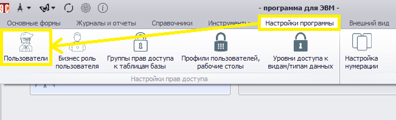 
<i>Рисунок 1. Переход к настройке пользователей</i>

 
Открывшаяся форма (рис.2) условно разделена на три области:

- Панель поиска (выделена зеленым).
- Настройки учетной записи (выделена желтым).
- Права доступа пользователя (выделена красным).

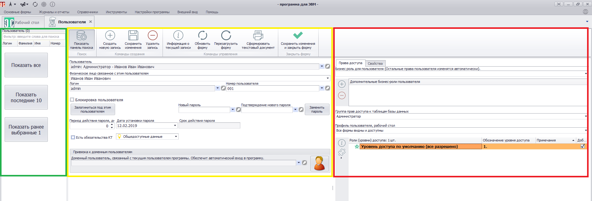 
<i>Рисунок 2. Форма работы с пользователями</i>

Новый пароль нужно ввести в поля «Новый пароль» и «Подтверждение нового пароля», после чего нажать кнопку «Заменить пароль» (рис.3).

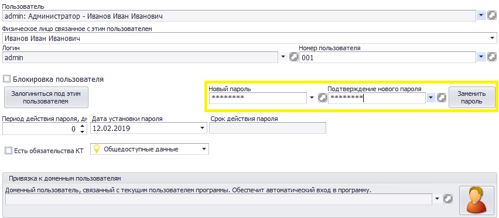 
<i>Рисунок 3. Смена пароля пользователя</i>

В случае соответствия пароля критериям сложности после нажатия кнопки «Заменить пароль» будет получено сообщение об успешной смене пароля (рис.4)

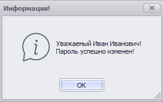 
<i>Рисунок 4. Смена пароля пользователя</i>

## Настройки УЗ пользователей

На рис.5 показана панель поиска со списком имеющихся УЗ. Воспользовавшись соответствующей кнопкой или применив текстовый фильтр, можно отразить все УЗ, последние 10 или ранее выбранные. УЗ будут отражены в виде списка (в данный момент в Программе только одна УЗ).

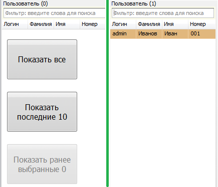 
<i>Рисунок 5. Область «Панель поиска»</i>

На рис.6 показана область настройки УЗ с меню формы (выделена цветом):

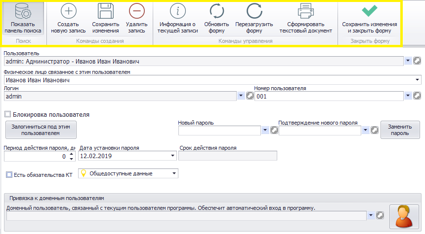 
<i>Рисунок 6. Область «Настройки учетной записи»</i>

 
Значение кнопок меню формы приведено в табл.1.

<table border="1">
<tr>
    <td align="center"><b>Вид кнопки</b></td>
    <td align="center"><b>Название</b></td>
    <td align="center"><b>Назначение</b></td>
    <td align="center"><b>«Горячие» клавиши</b></td>
</tr>
<tr>
    <td align="center"></td>
    <td>Показать панель поиска</td>
    <td>Отображает/скрывает панель поиска</td>
    <td>Ctrl+F</td>
</tr>
<tr>
    <td align="center"></td>
    <td>Создать новую запись</td>
    <td>Производиться очистка текущей формы и подготовка к внесению информации о новой УЗ</td>
    <td>Ctrl+N</td>
</tr>
<tr>
    <td align="center"></td>
    <td>Сохранить изменения</td>
    <td>Сохраняет изменения, сделанные в форме. Форма остается открытой</td>
    <td>Ctrl+S</td>
</tr>
<tr>
    <td align="center"></td>
    <td>Удалить запись</td>
    <td>Удаляет выбранную в панели поиска УЗ</td>
    <td></td>
</tr>
<tr>
    <td align="center"></td>
    <td>Информация о текущей записи</td>
    <td>Выводит подробную информацию о УЗ, выбранной в панели поиска</td>
    <td>Ctrl+I</td>
</tr>
<tr>
    <td align="center">></td>
    <td>Обновить форму</td>
    <td>Обновляет данные и перерисовывает форму. При этом информация считывается из базы данных, а значит, все несохраненные изменения будут потеряны</td>
    <td>Ctrl+R или F5</td>
</tr>
<tr>
    <td align="center"></td>
    <td>Перезагрузить форму</td>
    <td>Заново перезагружает форму и все данные в ней. Информация загружается из базы данных, все несохраненные изменения будут потеряны</td>
    <td>Ctrl+F5 или F6</td>
</tr>
<tr>
    <td align="center"></td>
    <td>Сформировать текстовый документ</td>
    <td>Формирует текстовый документ</td>
    <td>Ctrl+P</td>
</tr>
<tr>
    <td align="center"></td>
    <td>Сохранить изменения и закрыть форму</td>
    <td>Сохраняет сделанные в настройках УЗ изменения и закрывает форму</td>
    <td>Ctrl+E</td>
</tr>
</table>

<i>Таблица 1. Назначение кнопок меню формы</i>

## Создание новой УЗ пользователя

Для создания новой УЗ на панели меню нужно нажать кнопку  (Создать новую запись) или комбинацию Ctrl+N. Также для создания УЗ можно нажать ПКМ на панели поиска и в открывшемся меню выбрать пункт «Создать новую запись» (рис.7).

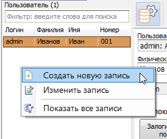 
<i>Рисунок 7. Создание УЗ с помощью контекстного меню</i>

В открывшемся окне (рис.8) нужно дважды ввести логин и пароль и нажать «Применить».

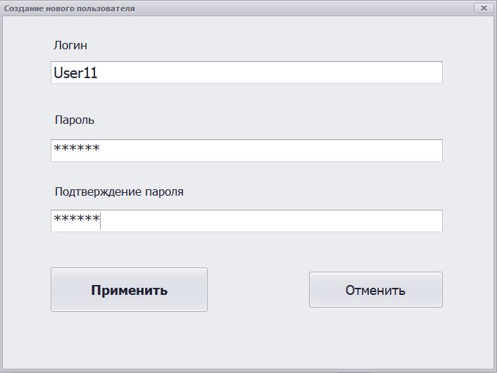 
<i>Рисунок 8. Ввод данных новой УЗ</i>

Созданная учетная запись появится в панели поиска (рис.9).

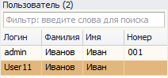 
<i>Рисунок 9. Новая УЗ</i>

 
Далее нужно выбрать созданную УЗ и ввести дополнительные сведения в ее настройках:

- ФИО физического лица, связанного с УЗ;
- номер пользователя (по умолчанию проставляется следующий по порядку, в нашем случае «002»);
- период действия пароля в днях (по умолчанию установлено значение «0» – неограниченно);
- срок действия пароля (задается дата окончания действия пароля).
  
Здесь же указывается информациия о наличии заключенного с пользователем договора (соглашения) о конфиденциальности и в выпадающем списке выбирается категория данных, к которой он имеет доступ: общедоступные данные, персональные данные, для служебного пользования, коммерческая тайна, государственная тайна (рис.10).

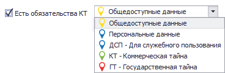 
<i>Рисунок 10. Данные о наличии доступа к конфиденциальной информации</i>

Также в настройках УЗ можно заблокировать пользователя, выставив флаг , или войти в систему с правами доступа выбранного пользователя, нажав кнопку «Залогиниться под этим пользователем» (рис.11).

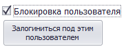 
<i>Рисунок 11. Возможности управления УЗ</i>

В нижней части поля настроек УЗ можно привязать выбранную учетную запись к УЗ доменного пользователя. Для этого нужно нажать кнопку «Выбрать доменного пользователя» ( 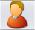 ), в открывшемся окне (рис.12) выбрать нужного пользователя и нажать  (рис.13).

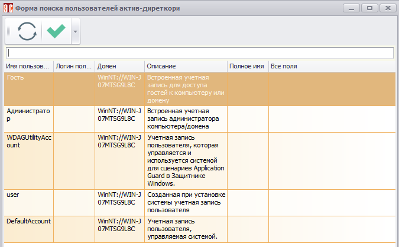 
<i>Рисунок 12. Поиск доменного пользовател</i>

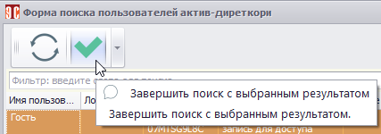 
<i>Рисунок 13. Выбор доменного пользователя</i>

После этого для выбранного доменного пользователя будет доступен автоматический вход в Программу.

При нажатии  или комбинации Ctrl+I будет выведена дополнительная информация об УЗ, выбранной в панели поиска (рис.14).

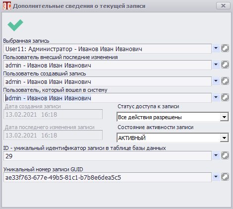 
<i>Рисунок 14. Расширенная информация об активной УЗ</i>

## Права доступа

Вкладка «Права доступа» пользователя, расположенная в правой части формы, позволяет настроить права пользователя, выбранного в панели поиска.

Права доступа пользователя Программы определяеются бизнес-ролью. Структура бизнес-роли показана в табли.2.

<table border="1">
<tr>
    <td colspan="2" align="center"><b>Компонент</b></td>
    <td align="center"><b>Назначение/описание</b></td>
</tr>
<tr>
    <td rowspan="3">Бизнес-роль (БР)</td>
    <td>Группа прав доступа (ГПД)</td>
    <td>Устанавливает правда доступа к таблицам БД</td>
</tr>
<tr>
    <td>Профиль пользователя, рабочий стол (ПП)</td>
    <td>Определяет возможность доступа к формам, настройкам боковой панели</td>
</tr>
<tr>
    <td>Уровень доступа (УД)</td>
    <td>Определяет права доступа к определенным типам документов, а также к документам «по статусу»</td>
</tr>
</table>

<i>Таблица 2. Компоненты разграничения прав доступа</i>

Как видно из таблицы, бизнес-роль объединяет в себе три компонента разграничения доступа. Допускается, однако, отдельно присваивать пользователю ГПД, ПП и УД. При этом, если пользователю присвоена бизнес-роль, права, ассоциированные с отдельно выбранными ГПД, ПП и УД, игнорируются.

Подробно настройки прав доступа описаны в соответствующих разделах:

- [Настройка бизнес-ролей](05_business_roles.md).
- [Группа прав доступа](09_access.md).
- [Профили пользователей](06_user_profiles.md).

Помимо основной, каждому пользователю могут быть присвоены дополнительные бизнес-роли. Для этого в области прав доступа рядом с полем «Дополнительные бизнес-роли пользователя» нужно нажать кнопку  («Добавить бизнес-роль пользователю») или кликнуть в пустой области ПКМ и выбрать соответствующий пункт меню (рис.15).

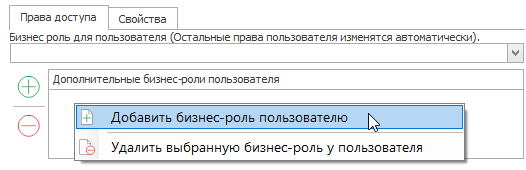 
<i>Рисунок 15. Добавление дополнительной бизнес-роли</i>

 
Далее в открывшемся окне (рис.16) требуется выбрать бизнес-роль и нажать  («Завершить поиск с выбранным результатом»).

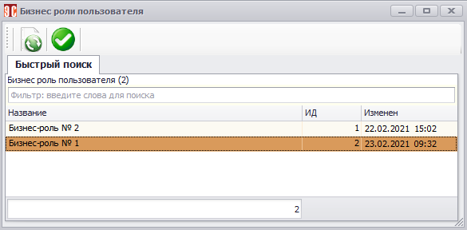 
<i>Рисунок 16. Выбор дополнительной бизнес-роли пользователя</i>

## Вкладка «Свойства»

Область прав доступа также содержит вкладку «Свойства» (рис.17), где пользователю можно задать дополнительные права доступа, не включенные в бизнес-роли.

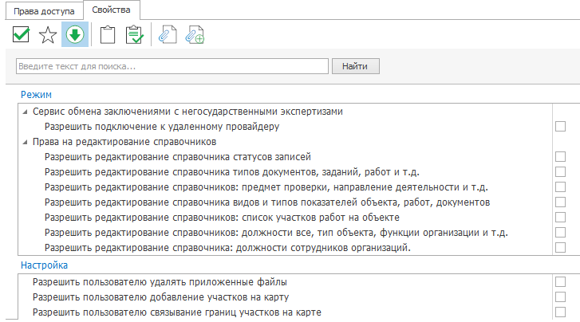 
<i>Рисунок 17. Вкладка «Свойства» области прав доступа</i>

В верхней части вкладки размещено меню, описание которого приведено в табл.3.

<table border="1">
<tr>
    <td align="center"><b>Вид кнопки</b></td>
    <td align="center"><b>Название</b></td>
    <td align="center"><b>Назначение</b></td>
</tr>
<tr>
    <td align="center"></td>
    <td>Применить изменения настроек</td>
    <td>Внесенные изменения будут сохранены в памяти Программы. Для сохранения изменений в БД нужно нажать кнопку «Сохранить изменения» в меню формы</td>
</tr>
<tr>
    <td align="center"></td>
    <td>Показать заполненные свойства</td>
    <td>Выполняется переключение между режимами отображения свойств: только заполненные/все свойства</td>
</tr>
<tr>
    <td align="center"></td>
    <td>Раскрыть все свойства</td>
    <td>Выполняется раскрытие списка всех свойств. При повторном нажатии список будет свернут</td>
</tr>
</table>

<i>Таблица 3. Назначение кнопок меню вкладки «Свойства»</i>

Свойства прав доступа вкладки разделены на группы «Режим» и «Настройка». Группа «Режим» включает в себя подгруппу для настройки сервиса обмена заключениями с негосударственными экспертизами. Для включения этой опции нужно выстановить флаг  напротив пункта «Разрешить подключение к удаленному провайдеру» и в появившемся списке настроек указать адрес подключения к провайдеру, а также логин и пароль (рис.18).

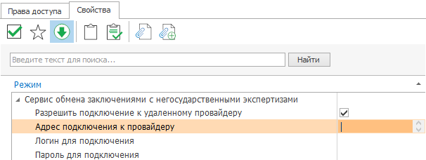 
<i>Рисунок 18. Настройки сервиса обмена заключениями с негосударственными экспертизами</i>

