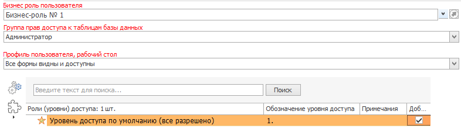

# Бизнес-роль пользователя

Разграничение прав доступа в Программе строится на базе следующих документов:

<table border="1">
<tr>
    <td colspan="2" align="center"><b>Компонент</b></td>
    <td align="center"><b>Назначение/описание</b></td>
</tr>
<tr>
    <td rowspan="3">Бизнес-роль (БР)</td>
    <td>Группа прав доступа (ГПД)</td>
    <td>Устанавливает правда доступа к таблицам БД</td>
</tr>
<tr>
    <td>Профиль пользователя, рабочий стол (ПП)</td>
    <td>Определяет возможность доступа к формам, настройкам боковой панели</td>
</tr>
<tr>
    <td>Уровень доступа (УД)</td>
    <td>Определяет права доступа к определенным типам документов, а также к документам «по статусу»</td>
</tr>
</table>

<i>Таблица 1. Компоненты разграничения прав доступа</i>

Как видно из таблицы, бизнес-роль включает в себя три других компонента разграничения доступа. В случае выбора БР для пользователя с его профилем будут автоматически связаны ГПД, ПП и УД, настроенные для данной роли. При этом возможно и отдельно присвоить пользователю ГПД, ПП и УД. БР в этом случае назначать не следует, так как в этом случае настройки ГПД, ПП и УД будут «привязаны» к БР, а выбранные отдельно ГПД, ПП и УД будут проигнорированы. 

>Внимание! Для настройки прав доступа предпочтительно использование БР. Отдельное назначение ГПД, ПП и УД не рекомендуется.

## Назначение бизнес-роли

Для назначения пользователю БР нужно перейти в настройки пользователя (рис.1).

 
<i>Рисунок 1. Переход к настройке пользователей</i>

Затем следует выбрать нужного пользователя в списке (рис.2).

 
<i>Рисунок 2. Выбор пользователя</i>

После этого в правой части формы в выпадающем списке выбрать нужную БР (рис.3).

 
<i>Рисунок 3. Выбор БР</i>

## Создание бизнес-роли

Сразу после установки БР в Программе отсутствуют.

К созданию БР можно перейти двумя способами:

1. Выбрать соответствующий пункт в главном меню Программы (рис.4).

 
<i>Рисунок 4. Переход к созданию БР из главного меню Программы</i>

2. Из формы пользователей, нажав ПКМ в поле «Бизнес-роль для пользователя» и выбрав пункт «Добавить новую бизнес-роль для пользователя» (рис.5).

 
<i>Рисунок 5. Переход к созданию БР из формы «Пользователи»</i>

В обоих случаях откроется форма создания БР (рис.6).

 
<i>Рисунок 6. Форма создания БР»</i>

 
В табл.2 приведено описание кнопок меню формы создания БР, расположенного в верхней части формы.

<table border="1">
<tr>
    <td align="center"><b>Вид кнопки</b></td>
    <td align="center"><b>Название</b></td>
    <td align="center"><b>Назначение</b></td>
    <td align="center"><b>«Горячие» клавиши</b></td>
</tr>
<tr>
    <td align="center"></td>
    <td>Показать панель поиска</td>
    <td>Отображает/скрывает панель поиска</td>
    <td>Ctrl+F</td>
</tr>
<tr>
    <td align="center"></td>
    <td>Создать новую запись</td>
    <td>Производиться очистка текущей формы и подготовка к внесению информации о новой БР</td>
    <td>Ctrl+N</td>
</tr>
<tr>
    <td align="center"></td>
    <td>Сохранить изменения</td>
    <td>Сохраняет изменения, сделанные в форме. Форма остается открытой</td>
    <td>Ctrl+S</td>
</tr>
<tr>
    <td align="center"></td>
    <td>Удалить запись</td>
    <td>Удаляет выбранную в панели поиска БР</td>
    <td></td>
</tr>
<tr>
    <td align="center"></td>
    <td>Информация о текущей записи</td>
    <td>Выводит подробную информацию о БР, выбранной в панели поиска</td>
    <td>Ctrl+I</td>
</tr>
<tr>
    <td align="center"></td>
    <td>Обновить форму</td>
    <td>Обновляет данные о БР и перерисовывает форму. При этом информация считывается из базы данных, а значит, все несохраненные изменения будут потеряны</td>
    <td>Ctrl+R или F5</td>
</tr>
<tr>
    <td align="center"></td>
    <td>Перезагрузить форму</td>
    <td>Заново перезагружает форму и все данные в ней. Информация загружается из базы данных, все несохраненные изменения будут потеряны</td>
    <td>Ctrl+F5 или F6</td>
</tr>
<tr>
    <td align="center"></td>
    <td>Сформировать текстовый документ</td>
    <td>Формирует текстовый документ</td>
    <td>Ctrl+P</td>
</tr>
<tr>
    <td align="center"></td>
    <td>Сохранить изменения и закрыть форму</td>
    <td>Сохраняет сделанные в настройках БР изменения и закрывает форму</td>
    <td>Ctrl+E</td>
</tr>
</table>

<i>Таблица 2. Назначение кнопок меню формы создания БР</i>

 
<i>Рисунок 7. Подробная информация о БР</i>

Для создания БР нужно ввести ее название в поле «Бизнес-роль пользователя», выбрать из выпадающего списка группу прав доступа и профиль пользователя, а также задать уровень доступа, выстановив флаг  напротив соответствующего уровня доступа (рис.8).

 
<i>Рисунок 8. Ввод данных БР</i>

После ввода указанных данных нужно нажать кнопку  («Сохранить изменения»), при этом форма останется открытой. Также можно нажать кнопку  («Сохранить изменения и закрыть форму»).

Все указанные поля обязательны для заполнения. Если одно или несколько полей окажутся пустыми, при попытке сохранить изменения Программа выдаст соответствующее предупреждение (рис.9).

 
<i>Рисунок 9. Предупреждение при создании БР, если не заполнены обязательные поля</i>

 
После заполнения всех полей и сохранения изменений созданная БР появится в области поиска (рис.10).

 
<i>Рисунок 10. Созданная БР в области поиска</i>

 
Если в Программе отсутствуют нужные для создания БР ГПД, ПП и/или УД, можно перейти к их настройке прямо из формы создания БР. Для этого нужно нажать ПКМ на соответствующем поле и выбрать пункт «Добавить новую группу прав доступа к таблица базы данных» и «Добавить новый профиль пользователя» соответственно (рис.11).

 
<i>Рисунок 11. Переход к настройке групп прав доступа и профилей пользователей из формы создания БР</i>

 
Для перехода к настройке уровней доступа из формы создания БР нужно нажать кнопку «Открыть форму настроек уровней доступа» () (рис.12).

 
<i>Рисунок 12. Переход к настройке уровней доступа из формы создания БР</i>

Область выбора уровней доступа также содержит меню «Настройка вида», открываемое при нажатии кнопки  (рис.13).

 
<i>Рисунок 13. Набор кнопок меню «Настройка вида»</i>

В табли.3 приведено описание кнопок меню «Настройка вида».

<table border="1">
<tr>
    <td align="center"><b>Вид кнопки</b></td>
    <td align="center"><b>Название</b></td>
    <td align="center"><b>Назначение</b></td>
</tr>
<tr>
    <td align="center"></td>
    <td>Показывать все колонки</td>
    <td>Отображает все колонки, содержащие данные уровней доступа, в соответствующем поле</td>
</tr>
<tr>
    <td align="center"></td>
    <td>Автоподбор высоты строк</td>
    <td>Автоматически настраивает высоту строк в таблице доступов </td>
</tr>
<tr>
    <td align="center"></td>
    <td>Автоподбор высоты колонок</td>
    <td>Автоматически настраивает высоту колонок в таблице доступов</td>
</tr>
<tr>
    <td align="center"></td>
    <td>Обновить</td>
    <td>Обновляет права доступа в таблицы данными из БД. Несохранные изменения будут потеряны</td>
</tr>
<tr>
    <td align="center"></td>
    <td>Экспорт и печать</td>
    <td>Позволяет экспортировать матрицу доступов в выбранный формат (рис.14), сохранить в виде файла и/или распечатать</td>
</tr>
</table>

<i>Таблица 3. Назначение кнопок меню «Настройка вида»</i>

 
<i>Рисунок 14. Меню «Экспорт и печать» матрицы доступов</i>

Кнопка «Расширенный экспорт» () открывает свойства уровней доступа в редакторе, в котором можно настроить различные параметры (верхний/нижний колонтитулы, цвет фона, размер бумаги, ориентацию, масштаб, водяной знак и др.), после чего сохранить файл и/или отправить на печать (рис.15).

 
<i>Рисунок 15. Меню «Экспорт и печать» матрицы доступов</i>

