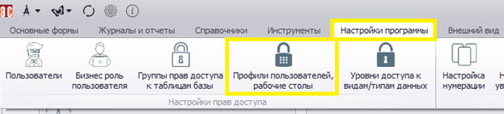
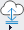
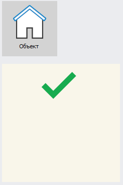

# Профили пользователей, рабочие столы

Профили пользователей, рабочие столы (далее – ПП) определяют дополнительные права доступа пользователей, а также включают настройки внешнего вида элементов Программы.

Перейти к настройкам ПП можно из формы настроек БР. Для этого нужно нажать ПКМ на строке «Профиль пользователя, рабочий стол» и выбрать пункт «Добавить новый профиль пользователя»:

Также к форме настройки ПП можно перейти, выбрав соответствующий пункт на вкладке «Настройки программы» в верхнем меню:

Откроется форма, состоящая из следующих элементов:

- Панель поиска (выделена зеленым).
- Панель меню (выделена желтым).
- Настройки ПП (выделена голубым).

В панели поиска отображается список ПП. Воспользовавшись соответствующей кнопкой, можно отразить все профили, последние 10 или ранее выбранные, а также применить текстовый фильтр. ПП будут отражены в виде списка. В данный момент в Программе имеется только один профиль, создаваемый при установке.

Описание кнопок панели меню приведено в таблице ниже.

<table border="1">
<tr>
    <td align="center"><b>Вид кнопки</b></td>
    <td align="center"><b>Название</b></td>
    <td align="center"><b>Назначение</b></td>
    <td align="center"><b>«Горячие» клавиши</b></td>
</tr>
<tr>
    <td></td>
    <td>Показать панель поиска</td>
    <td>Отображает/скрывает панель поиска</td>
    <td>Ctrl+F</td>
</tr>
<tr>
    <td></td>
    <td>Создать новую запись</td>
    <td>Производиться очистка текущей формы и подготовка к внесению информации о новой ПП</td>
    <td>Ctrl+N</td>
</tr>
<tr>
    <td></td>
    <td>Сохранить изменения</td>
    <td>Сохраняет изменения, сделанные в форме. Форма остается открытой</td>
    <td>Ctrl+S</td>
</tr>
<tr>
    <td></td>
    <td>Удалить запись</td>
    <td>Удаляет выбранную в панели поиска ПП</td>
    <td></td>
</tr>
<tr>
    <td></td>
    <td>Информация о текущей записи</td>
    <td>Выводит подробную информацию о ПП, выбранном в панели поиска</td>
    <td>Ctrl+I</td>
</tr>
<tr>
    <td></td>
    <td>Обновить форму</td>
    <td>Обновляет данные о ПП и перерисовывает форму. При этом информация считывается из базы данных, а значит, все несохраненные изменения будут потеряны</td>
    <td>Ctrl+R или F5</td>
</tr>
<tr>
    <td></td>
    <td>Перезагрузить форму</td>
    <td>Заново перезагружает форму и все данные в ней. Информация загружается из базы данных, все несохраненные изменения будут потеряны</td>
    <td>Ctrl+F5 или F6</td>
</tr>
<tr>
    <td></td>
    <td>Сформировать текстовый документ</td>
    <td>Формирует текстовый документ</td>
    <td>Ctrl+P</td>
</tr>
<tr>
    <td></td>
    <td>Сохранить изменения и закрыть форму</td>
    <td>Сохраняет сделанные в настройках ПП изменения и закрывает форму</td>
    <td>Ctrl+E</td>
</tr>
</table>

При нажатии  или комбинации Ctrl+I будет выведена дополнительная информация о выбранном в панели поиска ПП:

Помимо просмотра информации, в этом окне можно изменить статус доступа к ПП и состояние активности ПП. Изменения вносятся путем выбора опции в выпадающем списке.

Статус доступа к ПП может принимать одно из следующих значений:

- Все действия разрешены.
- Нельзя удалять запись.
- Нельзя изменять данные (только добавление).
- Только чтение.
- Запись невидима.
  
Состояние активности можно изменить с «активный» на «архив». В этом случае запись станет недействующей, но не будет удалена из Программы. При необходимости архивный ПП можно вернуть в статус активного. Для сохранения изменений нужно нажать кнопку  («Сохранить изменения и закрыть форму»). При закрытии формы с помощью  внесенные изменения будут отменены.

## Создание нового профиля

Кнопка  или комбинация Ctrl+N позволяют создать новый ПП. Также для создания профиля можно воспользоваться контекстным меню, вызвав его нажатием ПКМ на панели поиска:

Текущая форма профиля при этом будет очищена и подготовлена для внесения новой записи. При создании ПП нужно ввести его название (например, «Профиль 2»), при необходимости указать примечание и нажать «Сохранить изменения». Созданный ПП появится в панели поиска:

## Настройки профиля

Настройки профиля содержат 6 вкладок:

- Список форм.
- Настройка форм.
- Панель быстрого запуска.
- Настройка навигатора для Веб.
- Настройка боковой панели.
- Дополнительные настройки.

 
Ниже приведено подробное описание указанных вкладок.

### 1. Список форм

Вкладка «Список форм» содержит формы, к которым в рамках выбранного профиля пользователю может быть предоставлен доступ. Здесь возможно два варианта:

- Видимость формы в дереве форм для пользователя.
- Доступ к форме для пользователя.
  
«Доступ к форме пользователя» позволяет пользователю использовать соответствующую форму. «Видимость формы в дереве форм для пользователя» добавляет ее в главное меню Программы:

 
Доступ к формам обеспечивается путем выставления флага () в соответствующей графе напротив нужной формы:

 
Доступ может быть предоставлен как к отдельной форме, так и ко всей группе. В последнем случае нужно выставить флаг () рядом с названием соответствующей группы форм:

### 2. Настройка форм

Во вкладке «Настройка форм» доступно управление типовыми формами, типовыми настройками, документами и другими видами/типами записей:

 

#### 2.1 Добавление и настройка типовых форм

Для добавления формы нужно нажать кнопку «Добавление форм и настроек» () или ПКМ в поле действий формы, после чего выбрать пункт «Добавить типовую форму»:

В открывшемся окне для выбора форм нужно нажать на них ЛКМ. Типовая форма сразу добавляется во вкладку «Настройка форм»:

Стоит учитывать, что, если в перечне действий уже есть элемент, новые формы будут добавлены как вложенные в него. Вложенность форм видна по их смещению в списке. В данном случае формы «Физические лица» и «Организации» являются вложенными в форму «Объект»:

Чтобы убрать вложенность, элемент следует перетащить в нужное место списка, удерживая ЛКМ.

Для удобства работы формы рекомендуется группировать. Чтобы создать новую группу, в меню «Добавление форм и настроек» следует выбрать пункт «Добавить группу» (). Группы в списке помечены значком . Дважды кликнув по группе ЛКМ, можно изменить ее название. При необходимости внутри групп можно создавать другие группы.

После добавления типовой формы справа появится список ее свойств. Описание свойств типовых форм представлено в таблице ниже.

<table border="1">
<tr>
    <td align="center"><b>Свойство</b></td>
    <td align="center"><b>Описание</b></td>
    <td align="center"><b>Примечание</b></td>
</tr>
<tr>
    <td colspan="3" align="center"><b>Группа: Настройка действий</b></td>
</tr>
<tr>
    <td>Отключить данное действие</td>
    <td>При выставлении флага  все настройки, выполненные здесь для выбранной типовой формы, будет деактивированы (при выборе формы в меню будет выполнено действие, заданное по умолчанию)</td>
    <td>При деактивации настроек типовой формы после сохранения изменений ее отображение в списке форм сменится на пунктирное. Отключенные настройки, таким образом, можно определить по внешнему виду</td>
</tr>
<tr>
    <td colspan="3" align="center"><b>Группа: Режим</b></td>
</tr>
<tr>
    <td>Данные: Название</td>
    <td>Задается название формы</td>
    <td>Необходимо нажать ЛКМ в соответствующем поле и ввести название</td>
</tr>
<tr>
    <td>Данные: Комментарий</td>
    <td>Добавляются сведения, касающиеся этой формы</td>
    <td>Изначально поле было введено для разработчиков Программы. Может использоваться администраторами</td>
</tr>
<tr>
    <td>Данные: Всплывающая подсказка заголовка</td>
    <td>Указывается текст всплывающей подсказки</td>
    <td>Необходимо нажать ЛКМ в соответствующем поле и ввести текст</td>
</tr>
<tr>
    <td>Данные: Исходное обозначение поля</td>
    <td>Служит подсказкой на случай, если форме нужно будет вернуть исходное название</td>
    <td></td>
</tr>
<tr>
    <td>Данные: Тип выбранной записи</td>
    <td>В случае ошибки позволяет идентифицировать тип записи, чтобы передать данные разработчику</td>
    <td>Неизменяемое поле</td>
</tr>
<tr>
    <td>Данные: ID выбранной записи</td>
    <td>В случае ошибки позволяет идентифицировать ID записи, чтобы передать данные разработчику</td>
    <td>Неизменяемое поле</td>
</tr>
<tr>
    <td>Настройка управления данными</td>
    <td>При выставлении флага  откроются дополнительные настройки, где можно будет выбрать отличное от стандартного действие, выполняемое при нажатии на кнопку формы в меню</td>
    <td>Пример задания действия описан ниже</td>
</tr>
<tr>
    <td colspan="3" align="center"><b>Группа: Misc</b></td>
</tr>
<tr>
    <td>Изображение из файла</td>
    <td>Здесь можно задать изображение кнопки формы, загрузив его из файла</td>
    <td>Возможно использование изображение формата *.png разрешением не более 512*512 точек (рекомендуется 64*64). При использовании больших значений работа Программы может замедлиться</td>
</tr>
<tr>
    <td>Изображение как индекс</td>
    <td>Здесь можно задать изображение кнопки формы, указав индекс изображения</td>
    <td>Необходимо нажать ЛКМ рядом со свойством и выбрать нужный индекс</td>
</tr>
<tr>
    <td>Ссылка на изображение для веб</td>
    <td>Здесь можно задать изображение для формы, которое будет использоваться в веб-версии Программы</td>
    <td></td>
</tr>
</table>

 

*Отображение отключенных настроек форм*

 

*Настройки действия при нажатии кнопки формы*

 

 

*Пример выбора изображения по индексу*

 

В качестве действия, отличного от заданного по умолчанию и выполняемого при нажатии кнопки формы, можно установить, например, выполнение пресета. В таблице ниже приведено описание настроек отличного от заданного по умолчанию действия, выполняемого при нажатии кнопки формы.

<table border="1">
<tr>
    <td align="center"><b>Настройки управления данными</b></td>
    <td align="center"><b>Описание</b></td>
    <td align="center"><b>Примечание</b></td>
</tr>
<tr>
    <td>Пресет как строка</td>
    <td>Для работы с полем нужно воспользоваться кнопками меню, расположенными в его правой части:  – загрузить пресет из файла;   – сохранить пресет в файл;   – загрузить пресет из буфера обмена;   – скопировать пресет в буфер обмена</td>
    <td>Загрузка из файла и сохранение в файл выполняются в стандартных окнах проводника ОС Windows</td>
</tr>
<tr>
    <td>Пресет по номеру</td>
    <td>Указать номер пресета, который будет открываться при нажатии кнопки формы</td>
    <td>Необходимо нажать ЛКМ в соответствующем поле, после чего ввести номер пресета. Можно воспользоваться функцией вставки (Ctrl+V или меню по нажатию ПКМ)</td>
</tr>
</table>

 

#### 2.2 Работа с типовыми настройками

Работа с типовыми настройками на вкладке «Настройка форм» позволяет настроить меню Программы, которое будет видеть тот или иной пользователь. Перечень типовых настроек меню показан на рисунке ниже:

 

Для корректной работы меню пункты перечня должны быть определенным образом структурированы. Из них обязательными для отображения типовых настроек являются:

- Управляющее основное меню программы (сверху).
- Страница меню.
- Категория меню.

Элементы перечислены в порядке убывания приоритета. Элемент «Страница меню» должен быть вложен в «Управляющее основное меню программы (сверху)», а «Категория меню» - вложен в элемент «Страницу меню». Например, для отображения типовых настроек «О программе» и «Лицензионное соглашение» требуется сформировать структуру, показанную на рисунке ниже (в ином случае добавленные типовые настройки не повлияют на меню программы):

 

После сохранения изменений меню Программы будет выглядеть так:

 
 
Для добавления типовых настроек нужно нажать кнопку «Добавление форм и настроек» () или, нажав ПКМ, выбрать пункт «Добавить типовую настройку»:

 
 
Откроется окно, в котором можно будет выбрать типовые настройки. Для этого требуется выставить флаг  напротив тех настроек, которые должны быть добавлены, и нажать кнопку  («Сохранить изменения и закрыть форму»).

 

Стоит учитывать, что добавляемые элементы будут вложены в выделенный. Для создания нужной структуры элементы можно перетаскивать, зажав ЛКМ.

При выделении добавленной типовой настройки в правой части вкладки «Настройка форм» будут отображены свойства выбранного элемента. Свойства разделены на 3 группы:

- Настройка действий.
- Режим.
- Misc.

Свойства в группах «Настройка действий» и «Режим» одинаковы для всех элементов типовых настроек. «Настройка действий» включает одно свойство, при активации которого путем выставления флага () выбранная типовая настройка или группа будет отключена, при сохранении изменений и обновлении отображаемое меню Программы примет изначальный вид. Описание свойств группы «Режим» приведено в таблице ниже (если свойство содержит подсвойства, в таблице такая запись имеет вид «Свойство --> Подсвойство»).

<table border="1">
<tr>
    <td align="center"><b>Свойство</b></td>
    <td align="center"><b>Описание</b></td>
    <td align="center"><b>Примечание</b></td>
</tr>
<tr>
    <td>Данные --> Название</td>
    <td>Содержит название элемента рабочего стола</td>
    <td>Для изменения названия необходимо нажать ЛКМ и ввести нужный текст</td>
</tr>
<tr>
    <td>Данные --> Комментарий</td>
    <td>В поле можно ввести дополнительную информацию о кнопке</td>
    <td>По умолчанию поле пустое. Чтобы добавить значение, необходимо нажать ЛКМ и ввести нужный текст. Изначально поле было добавлено для разработчиков Программы, но может использоваться и администраторами</td>
</tr>
<tr>
    <td>Данные --> Всплывающая подсказка заголовка</td>
    <td>В поле можно ввести подсказку, которая будет видна при наведении на кнопку</td>
    <td>По умолчанию поле пустое. Чтобы добавить значение, необходимо нажать ЛКМ и ввести нужный текст</td>
</tr>
<tr>
    <td>Данные --> Исходное обозначение поля</td>
    <td>Содержит данные о наименовании формы или документа, на основе которых была создана кнопка</td>
    <td>Поле недоступно для изменения</td>
</tr>
<tr>
    <td>Данные --> Тип выбранной записи</td>
    <td>В случае ошибки позволяет идентифицировать тип записи, чтобы передать данные разработчику</td>
    <td>Поле недоступно для изменения</td>
</tr>
<tr>
    <td>Данные --> ID выбранной записи</td>
    <td>В случае ошибки позволяет идентифицировать ID записи, чтобы передать данные разработчику</td>
    <td>Поле недоступно для изменения</td>
</tr>
</table>

Описание группы Misc для элемента «Управляющее основное меню программы (сверху)»

<table border="1">
<tr>
    <td align="center"><b>Свойство</b></td>
    <td align="center"><b>Описание</b></td>
    <td align="center"><b>Примечание</b></td>
</tr>
<tr>
    <td>Настройка панели Ribbon --> Размер маленьких кнопок</td>
    <td></td>
    <td>По умолчанию: enNone</td>
</tr>
<tr>
    <td>Настройка панели Ribbon --> Размер больших кнопок</td>
    <td></td>
    <td>По умолчанию: enNone</td>
</tr>
</table>

Для элементов «Страница меню» и «Категория меню» группа Misc отсутствует. Описание свойств группы Misc для других элементов типовых настроек приведено в таблице.

<table border="1">
<tr>
    <td align="center"><b>Свойство</b></td>
    <td align="center"><b>Описание</b></td>
    <td align="center"><b>Примечание</b></td>
</tr>
<tr>
    <td>Изображение --> Изображение из файла</td>
    <td>Здесь можно задать изображение, которое будет отображаться рядом с типовой настройкой, загрузив его из файла</td>
    <td>Возможно использование изображение формата *.png разрешением не более 512*512 точек (рекомендуется 64*64). При использовании больших значений работа Программы может замедлиться</td>
</tr>
<tr>
    <td>Изображение --> Изображение как индекс</td>
    <td>Здесь можно задать изображение, указав его индекс</td>
    <td>Необходимо нажать ЛКМ рядом со свойством и выбрать нужный индекс</td>
</tr>
<tr>
    <td>Изображение --> Ссылка на изображение для веб</td>
    <td>Здесь можно задать изображение, которое будет использоваться в веб-версии Программы</td>
    <td></td>
</tr>
</table>

 

#### 2.3 Добавление документов

Для добавления документа нужно нажать «Добавить документ» в разделе «Добавление форм и настроек» () или в контекстном меню:
 
 

При выборе добавленного документа в правой части вкладки будут отображены его свойства. Свойства документа разделены на 3 группы:

- Настройка действий.
- Режим.
- Misc.

«Настройка действий» включает одно свойство, при активации которого путем выставления флага () выбранный документ будет отключен. Описание свойств группы «Режим» приведено в таблице (если свойство содержит подсвойства, в таблице такая запись имеет вид «Свойство --> Подсвойство»).

<table border="1">
<tr>
    <td align="center"><b>Свойство</b></td>
    <td align="center"><b>Описание</b></td>
    <td align="center"><b>Примечание</b></td>
</tr>
<tr>
    <td>Данные --> Название</td>
    <td>Содержит название элемента рабочего стола</td>
    <td>Для изменения названия необходимо нажать ЛКМ и ввести нужный текст</td>
</tr>
<tr>
    <td>Данные --> Комментарий</td>
    <td>В поле можно ввести дополнительную информацию о кнопке</td>
    <td>По умолчанию поле пустое. Чтобы добавить значение, необходимо нажать ЛКМ и ввести нужный текст. Изначально поле было добавлено для разработчиков Программы, но может использоваться и администраторами</td>
</tr>
<tr>
    <td>Данные --> Всплывающая подсказка заголовка</td>
    <td>В поле можно ввести подсказку, которая будет видна при наведении на кнопку</td>
    <td>По умолчанию поле пустое. Чтобы добавить значение, необходимо нажать ЛКМ и ввести нужный текст</td>
</tr>
<tr>
    <td>Данные --> Исходное обозначение поля</td>
    <td>Содержит данные о наименовании формы или документа, на основе которых была создана кнопка</td>
    <td>Поле недоступно для изменения</td>
</tr>
<tr>
    <td>Данные --> Тип выбранной записи</td>
    <td>В случае ошибки позволяет идентифицировать тип записи, чтобы передать данные разработчику</td>
    <td>Поле недоступно для изменения</td>
</tr>
<tr>
    <td>Данные --> ID выбранной записи</td>
    <td>В случае ошибки позволяет идентифицировать ID записи, чтобы передать данные разработчику</td>
    <td>Поле недоступно для изменения</td>
</tr>
<tr>
    <td>Настройки управления данными --> Пресет как строка</td>
    <td>Для работы с полем нужно воспользоваться кнопками меню, расположенными в его правой части:  – загрузить пресет из файла;   – сохранить пресет в файл;   – загрузить пресет из буфера обмена;   – скопировать пресет в буфер обмена</td>
    <td>Загрузка из файла и сохранение в файл выполняются в стандартных окнах проводника ОС Windows</td>
</tr>
<tr>
    <td>Настройки управления данными --> Пресет по номеру</td>
    <td>Указать номер пресета, который будет открываться при нажатии кнопки формы</td>
    <td>Необходимо нажать ЛКМ в соответствующем поле, после чего ввести номер пресета. Можно воспользоваться функцией вставки (Ctrl+V или меню по нажатию ПКМ)</td>
</tr>
<tr>
    <td>Настройки управления данными --> Ручной фильтр</td>
    <td>Передать параметр</td>
    <td></td>
</tr>
<tr>
    <td>Вид/тип записи --> Выбранное значение</td>
    <td>Можно указать, для какого типа будет срабатывать эта настройка</td>
    <td></td>
</tr>
<tr>
    <td>Вид/тип записи --> Исходное обозначение поля</td>
    <td>Содержит данные о наименовании формы или документа, на основе которых была создана кнопка</td>
    <td>Поле недоступно для изменения</td>
</tr>
<tr>
    <td>Вид/тип записи --> Тип выбранной записи</td>
    <td>В случае ошибки позволяет идентифицировать тип записи, чтобы передать данные разработчику</td>
    <td>Поле недоступно для изменения</td>
</tr>
<tr>
    <td>Вид/тип записи --> ID выбранной записи</td>
    <td>В случае ошибки позволяет идентифицировать ID записи, чтобы передать данные разработчику</td>
    <td>Поле недоступно для изменения</td>
</tr>
<tr>
    <td>Статус добавляемой записи --> Выбранное значение</td>
    <td>Можно указать, чтобы эта настройка срабатывала для записи с указанным статусом</td>
    <td></td>
</tr>
<tr>
    <td>Статус добавляемой записи --> Исходное обозначение поля</td>
    <td>Содержит данные о наименовании формы или документа, на основе которых была создана кнопка</td>
    <td>Поле недоступно для изменения</td>
</tr>
<tr>
    <td>Статус добавляемой записи --> Тип выбранной записи</td>
    <td>В случае ошибки позволяет идентифицировать тип записи, чтобы передать данные разработчику</td>
    <td>Поле недоступно для изменения</td>
</tr>
<tr>
    <td>Статус добавляемой записи --> ID выбранной записи</td>
    <td>В случае ошибки позволяет идентифицировать ID записи, чтобы передать данные разработчику</td>
    <td>Поле недоступно для изменения</td>
</tr>
<tr>
    <td>Настройки навигатора для веб --> Начать новую группу ссылок</td>
    <td></td>
    <td></td>
</tr>
<tr>
    <td>Настройки навигатора для веб --> Название группы ссылок</td>
    <td></td>
    <td></td>
</tr>
<tr>
    <td>Настройки навигатора для веб --> Использовать ссылку как команду Post-запрос</td>
    <td></td>
    <td></td>
</tr>
<tr>
    <td>Настройки навигатора для веб --> Контроллер для веб</td>
    <td></td>
    <td></td>
</tr>
<tr>
    <td>Настройки навигатора для веб --> Страница для веб</td>
    <td></td>
    <td></td>
</tr>
<tr>
    <td>Настройки навигатора для веб --> Внешняя ссылка для веб</td>
    <td></td>
    <td></td>
</tr>
<tr>
    <td>Настройки навигатора для веб --> Дополнительный параметр</td>
    <td></td>
    <td></td>
</tr>
</table>	

В таблице ниже приведено описание свойств документа группы Misc.

<table border="1">
<tr>
    <td align="center"><b>Свойство</b></td>
    <td align="center"><b>Описание</b></td>
    <td align="center"><b>Примечание</b></td>
</tr>
<tr>
    <td>Изображение --> Изображение из файла</td>
    <td>Здесь можно задать изображение, которое будет отображаться рядом с типовой настройкой, загрузив его из файла</td>
    <td>Возможно использование изображение формата *.png разрешением не более 512*512 точек (рекомендуется 64*64). При использовании больших значений работа Программы может замедлиться</td>
</tr>
<tr>
    <td>Изображение --> Изображение как индекс</td>
    <td>Здесь можно задать изображение, указав его индекс</td>
    <td>Необходимо нажать ЛКМ рядом со свойством и выбрать нужный индекс</td>
</tr>
<tr>
    <td>Изображение --> Ссылка на изображение для веб</td>
    <td>Здесь можно задать изображение, которое будет использоваться в веб-версии Программы</td>
    <td></td>
</tr>
</table>

 

#### 2.4 Добавление вид/типа записи

Для добавления элемента коллекции (вид/тип записи) нужно в разделе «Добавление форм и настроек» () или в контекстном меню выбрать соответствующий пункт:

 
 
Элементы коллекции также имеют одинаковые свойства, отображаемые в правой части вкладки. «Настройка действий» включает одно свойство, при активации которого путем выставления флага () выбранный элемент коллекции будет отключен. Описание свойств групп «Режим» и Misc приведено в таблицах ниже.

<table border="1">
<tr>
    <td align="center"><b>Свойство</b></td>
    <td align="center"><b>Описание</b></td>
    <td align="center"><b>Примечание</b></td>
</tr>
<tr>
    <td>Данные --> Название</td>
    <td>Содержит название элемента рабочего стола</td>
    <td>Для изменения названия необходимо нажать ЛКМ и ввести нужный текст</td>
</tr>
<tr>
    <td>Данные --> Комментарий</td>
    <td>В поле можно ввести дополнительную информацию о кнопке</td>
    <td>По умолчанию поле пустое. Чтобы добавить значение, необходимо нажать ЛКМ и ввести нужный текст. Изначально поле было добавлено для разработчиков Программы, но может использоваться и администраторами</td>
</tr>
<tr>
    <td>Данные --> Всплывающая подсказка заголовка</td>
    <td>В поле можно ввести подсказку, которая будет видна при наведении на кнопку</td>
    <td>По умолчанию поле пустое. Чтобы добавить значение, необходимо нажать ЛКМ и ввести нужный текст</td>
</tr>
<tr>
    <td>Данные --> Исходное обозначение поля</td>
    <td>Содержит данные о наименовании формы или документа, на основе которых была создана кнопка</td>
    <td>Поле недоступно для изменения</td>
</tr>
<tr>
    <td>Данные --> Тип выбранной записи</td>
    <td>В случае ошибки позволяет идентифицировать тип записи, чтобы передать данные разработчику</td>
    <td>Поле недоступно для изменения</td>
</tr>
<tr>
    <td>Данные --> ID выбранной записи</td>
    <td>В случае ошибки позволяет идентифицировать ID записи, чтобы передать данные разработчику</td>
    <td>Поле недоступно для изменения</td>
</tr>
<tr>
    <td>Настройки управления данными --> Пресет как строка</td>
    <td>Для работы с полем нужно воспользоваться кнопками меню, расположенными в его правой части:  – загрузить пресет из файла;   – сохранить пресет в файл;   – загрузить пресет из буфера обмена;   – скопировать пресет в буфер обмена</td>
    <td>Загрузка из файла и сохранение в файл выполняются в стандартных окнах проводника ОС Windows</td>
</tr>
<tr>
    <td>Настройки управления данными --> Пресет по номеру</td>
    <td>Указать номер пресета, который будет открываться при нажатии кнопки формы</td>
    <td>Необходимо нажать ЛКМ в соответствующем поле, после чего ввести номер пресета. Можно воспользоваться функцией вставки (Ctrl+V или меню по нажатию ПКМ)</td>
</tr>
<tr>
    <td>Настройки управления данными --> Открывать пресет как модальное диалоговое окно</td>
    <td>Открывает пресет так, что до его закрытия основное окно Программы становится недоступным</td>
    <td></td>
</tr>
<tr>
    <td>Настройки управления данными --> Ручной фильтр</td>
    <td>Передать параметр</td>
    <td></td>
</tr>
<tr>
    <td>Вид/тип записи --> Выбранное значение</td>
    <td>Можно указать, для какого типа будет срабатывать эта настройка</td>
    <td></td>
</tr>
<tr>
    <td>Вид/тип записи --> Исходное обозначение поля</td>
    <td>Содержит данные о наименовании формы или документа, на основе которых была создана кнопка</td>
    <td>Поле недоступно для изменения</td>
</tr>
<tr>
    <td>Вид/тип записи --> Тип выбранной записи</td>
    <td>В случае ошибки позволяет идентифицировать тип записи, чтобы передать данные разработчику</td>
    <td>Поле недоступно для изменения</td>
</tr>
<tr>
    <td>Вид/тип записи --> ID выбранной записи</td>
    <td>В случае ошибки позволяет идентифицировать ID записи, чтобы передать данные разработчику</td>
    <td>Поле недоступно для изменения</td>
</tr>
<tr>
    <td>Статус добавляемой записи --> Выбранное значение</td>
    <td>Можно указать, чтобы эта настройка срабатывала для записи с указанным статусом</td>
    <td></td>
</tr>
<tr>
    <td>Статус добавляемой записи --> Исходное обозначение поля</td>
    <td>Содержит данные о наименовании формы или документа, на основе которых была создана кнопка</td>
    <td>Поле недоступно для изменения</td>
</tr>
<tr>
    <td>Статус добавляемой записи --> Тип выбранной записи</td>
    <td>В случае ошибки позволяет идентифицировать тип записи, чтобы передать данные разработчику</td>
    <td>Поле недоступно для изменения</td>
</tr>
<tr>
    <td>Статус добавляемой записи --> ID выбранной записи</td>
    <td>В случае ошибки позволяет идентифицировать ID записи, чтобы передать данные разработчику</td>
    <td>Поле недоступно для изменения</td>
</tr>
<tr>
    <td>Настройки навигатора для веб --> Начать новую группу ссылок</td>
    <td></td>
    <td></td>
</tr>
<tr>
    <td>Настройки навигатора для веб --> Название группы ссылок</td>
    <td></td>
    <td></td>
</tr>
<tr>
    <td>Настройки навигатора для веб --> Использовать ссылку как команду Post-запрос</td>
    <td></td>
    <td></td>
</tr>
<tr>
    <td>Настройки навигатора для веб --> Контроллер для веб</td>
    <td></td>
    <td></td>
</tr>
<tr>
    <td>Настройки навигатора для веб --> Страница для веб</td>
    <td></td>
    <td></td>
</tr>
<tr>
    <td>Настройки навигатора для веб --> Внешняя ссылка для веб</td>
    <td></td>
    <td></td>
</tr>
<tr>
    <td>Настройки навигатора для веб --> Дополнительный параметр</td>
    <td></td>
    <td></td>
</tr>
</table>	

<table border="1">
<tr>
    <td align="center"><b>Свойство</b></td>
    <td align="center"><b>Описание</b></td>
    <td align="center"><b>Примечание</b></td>
</tr>
<tr>
    <td>Изображение --> Изображение из файла</td>
    <td>Здесь можно задать изображение, которое будет отображаться рядом с типовой настройкой, загрузив его из файла</td>
    <td>Возможно использование изображение формата *.png разрешением не более 512*512 точек (рекомендуется 64*64). При использовании больших значений работа Программы может замедлиться</td>
</tr>
<tr>
    <td>Изображение --> Изображение как индекс</td>
    <td>Здесь можно задать изображение, указав его индекс</td>
    <td>Необходимо нажать ЛКМ рядом со свойством и выбрать нужный индекс</td>
</tr>
<tr>
    <td>Изображение --> Ссылка на изображение для веб</td>
    <td>Здесь можно задать изображение, которое будет использоваться в веб-версии Программы</td>
    <td></td>
</tr>
</table>

### 3. Панель быстрого запуска

На вкладке «Панель быстрого запуска» (ПБЗ) выполняется настройка расположения и внешнего вида элементов, размещаемых на рабочем столе. Размещение элементов на рабочем столе дает доступ к наиболее часто используемым функциям и задачам сразу после запуска Программы. В качестве элементов можно использоваться формы, в том числе пресеты и документы.

На вкладке можно выделить:

- Меню настройки рабочего стола (выделена зеленым).
- Область элементов рабочего стола (выделена желтым).
- Область настройки элементов рабочего стола (выделена голубым).

 

Изначально элементы на рабочем столе отсутствуют. Описание функций меню настройки рабочего стола приведено в таблице.

<table border="1">
<tr>
    <td align="center"><b>Вид кнопки</b></td>
    <td align="center"><b>Название</b></td>
    <td align="center"><b>Назначение</b></td>
</tr>
<tr>
    <td colspan="3" align="center">Группа добавления (для доступа нужно нажать )</td>
</tr>
<tr>
    <td></td>
    <td>Добавить форму</td>
    <td>Открывает окно с выбором форм для добавления</td>
</tr>
<tr>
    <td></td>
    <td>Добавить вид и тип документа</td>
    <td>Открывает форму добавления документов</td>
</tr>
<tr>
    <td colspan="3" align="center">Группа «Импорт/Экспорт» (для доступа нужно нажать  )</td>
</tr>
<tr>
    <td></td>
    <td>Скопировать весь список в буфер обмена</td>
    <td></td>
</tr>
<tr>
    <td></td>
    <td>Вставить (заменить) весь список из буфера обмена</td>
    <td></td>
</tr>
<tr>
    <td></td>
    <td>Экспортировать текущий профиль в файл XML</td>
    <td></td>
</tr>
<tr>
    <td></td>
    <td>Импортировать текущий профиль из файла XML</td>
    <td></td>
</tr>
<tr>
    <td></td>
    <td>Экспортировать все профили в файл XML</td>
    <td></td>
</tr>
<tr>
    <td></td>
    <td>Импортировать все профили из файла XML</td>
    <td></td>
</tr>
<tr>
    <td colspan="3" align="center">Вне группы</td>
</tr>
<tr>
    <td></td>
    <td>Удалить запись</td>
    <td>Удаляет выбранные элемент рабочего стола</td>
</tr>
<tr>
    <td colspan="3" align="center">Группа «Настройка вида» (для доступа нужно нажать )</td>
</tr>
<tr>
    <td></td>
    <td>Обновить</td>
    <td>Обновляет вкладку ПБЗ</td>
</tr>
</table>

Область настройки элементов рабочего стола содержит меню, описание которого приведено ниже.

<table border="1">
<tr>
    <td align="center"><b>Вид кнопки</b></td>
    <td align="center"><b>Название</b></td>
    <td align="center"><b>Назначение</b></td>
</tr>
<tr>
    <td></td>
    <td>Применить изменения настроек</td>
    <td>Внесенные изменения будут сохранены в памяти Программы. Для сохранения изменений в БД нужно нажать кнопку «Сохранить изменения» в меню формы</td>
</tr>
<tr>
    <td></td>
    <td>Показать заполненные свойства</td>
    <td>Выполняется переключение между режимами отображения свойств: только заполненные/все свойства </td>
</tr>
<tr>
    <td></td>
    <td>Раскрыть все свойства</td>
    <td>Выполняется раскрытие списка всех свойств. При повторном нажатии список будет свернут</td>
</tr>
<tr>
    <td></td>
    <td>Скопировать пресет в буфер обмена</td>
    <td>Пресет копируется в буфер обмена в виде строки Base64</td>
</tr>
<tr>
    <td></td>
    <td>Загрузить пресет из буфера обмена</td>
    <td>Пресет загружается из буфера обмена, полностью заменяя текущий</td>
</tr>
<tr>
    <td></td>
    <td>Сохранить пресет в файл</td>
    <td>Пресет сохраняется в файл</td>
</tr>
<tr>
    <td></td>
    <td>Загрузить пресет из файла</td>
    <td>Пресет загружается из файла, полностью заменяя текущий</td>
</tr>
</table>

После того как на ПБЗ будет добавлен элемент, в области настроек элементов рабочего стола будет отражены его свойства.

 

Свойства элемента ПБЗ одинаковы для всех форм, за исключением пресета. Свойства разделены на 4 группы: «Настройка действий», «Режим», «Дизайн», «Настройка фрагментов». 

Описание свойств групп «Настройка действий».

<table border="1">
<tr>
    <td align="center"><b>Свойство</b></td>
    <td align="center"><b>Описание</b></td>
    <td align="center"><b>Примечание</b></td>
</tr>
<tr>
    <td>Сделать неактивной данную кнопку</td>
    <td>Кнопка, для которой выставлен флаг , будет неактивной</td>
    <td>В ПБЗ такая кнопка будет иметь серый фон. На рабочем столе она будет видна, но использовать ее будет нельзя </td>
</tr>
<tr>
    <td>Скрыть данную кнопку</td>
    <td>Кнопка, для которой выставлен флаг , не будет отображаться на рабочем столе</td>
    <td>В ПБЗ такая кнопка будет имет темно-серый фон</td>
</tr>
<tr>
    <td>Автоматические выполнять действие при запуске Программы</td>
    <td>При выставлении флага при каждом запуске Программы будет выполняться действие, назначенное для этой кнопки</td>
    <td>Можно задать несколько действий</td>
</tr>
</table>

 

*Неактивная и активная кнопки на рабочем столе*

Описание свойств групп «Режим».

<table border="1">
<tr>
    <td align="center"><b>Свойство</b></td>
    <td align="center"><b>Описание</b></td>
    <td align="center"><b>Примечание</b></td>
</tr>
<tr>
    <td>Данные --> Название</td>
    <td>Содержит название элемента рабочего стола</td>
    <td>Для изменения названия необходимо нажать ЛКМ и ввести нужный текст</td>
</tr>
<tr>
    <td>Данные --> Комментарий</td>
    <td>В поле можно ввести дополнительную информацию о кнопке</td>
    <td>По умолчанию поле пустое. Чтобы добавить значение, необходимо нажать ЛКМ и ввести нужный текст. Изначально поле было добавлено для разработчиков Программы, но может использоваться и администраторами</td>
</tr>
<tr>
    <td>Данные --> Всплывающая подсказка заголовка</td>
    <td>В поле можно ввести подсказку, которая будет видна при наведении на кнопку</td>
    <td>По умолчанию поле пустое. Чтобы добавить значение, необходимо нажать ЛКМ и ввести нужный текст</td>
</tr>
<tr>
    <td>Данные --> Исходное обозначение поля</td>
    <td>Содержит данные о наименовании формы или документа, на основе которых была создана кнопка</td>
    <td>Поле недоступно для изменения</td>
</tr>
<tr>
    <td>Данные --> Тип выбранной записи</td>
    <td>В случае ошибки позволяет идентифицировать тип записи, чтобы передать данные разработчику</td>
    <td>Поле недоступно для изменения</td>
</tr>
<tr>
    <td>Данные --> ID выбранной записи</td>
    <td>В случае ошибки позволяет идентифицировать ID записи, чтобы передать данные разработчику</td>
    <td>Поле недоступно для изменения</td>
</tr>
<tr>
    <td>Скрипт, изменяющий название кнопки</td>
    <td>При проставлении флага () становятся доступны подсвойства</td>
    <td>Вызывается постоянно, через таймаут повторяется</td>
</tr>
<tr>
    <td>Скрипт изменяющий название кнопки --> Язык скрипта</td>
    <td>Доступен выбор одного из вариантов языка скрипта: Microsoft Visual Basic/Microsoft Visual C#</td>
    <td></td>
</tr>
<tr>
    <td>Скрипт изменяющий название кнопки --> Содержимое скрипта</td>
    <td>Ввод содержимого и иные действия с этим свойством описаны ниже</td>
    <td></td>
</tr>
<tr>
    <td>Скрипт, выполняющийся после отрисовки кнопки</td>
    <td>При проставлении флага () становятся доступны подсвойства</td>
    <td>Вызывается один раз после отрисовки, чтобы повторно вызвать нужно нажать F6 или F5</td>
</tr>
<tr>
    <td>Скрипт, выполняющийся после отрисовки кнопки --> Язык скрипта</td>
    <td>Доступен выбор одного из вариантов языка скрипта: Microsoft Visual Basic/Microsoft Visual C#</td>
    <td></td>
</tr>
<tr>
    <td>Скрипт, выполняющийся после отрисовки кнопки --> Содержимое скрипта</td>
    <td>Ввод содержимого и иные действия с этим свойством описаны ниже</td>
    <td></td>
</tr>
<tr>
    <td>Скрипт, выполняющийся перед выполнением команды</td>
    <td>При проставлении флага () становятся доступны подсвойства</td>
    <td></td>
</tr>
<tr>
    <td>Скрипт, выполняющийся перед выполнением команды  --> Язык скрипта</td>
    <td>Доступен выбор одного из вариантов языка скрипта: Microsoft Visual Basic/Microsoft Visual C#</td>
    <td></td>
</tr>
<tr>
    <td>Скрипт, выполняющийся перед выполнением команды --> Язык скрипта</td>
    <td>Ввод содержимого и иные действия с данным свойством описаны ниже</td>
    <td></td>
</tr>
<tr>
    <td>Скрипт, выполняющийся после выполнения команды</td>
    <td>При проставлении флага () становятся доступны подсвойства</td>
    <td></td>
</tr>
<tr>
    <td>Скрипт, выполняющийся после выполнения команды  --> Язык скрипта</td>
    <td>Доступен выбор одного из вариантов языка скрипта: Microsoft Visual Basic/Microsoft Visual C#</td>
    <td></td>
</tr>
<tr>
    <td>Скрипт, выполняющийся после выполнения команды --> Язык скрипта</td>
    <td>Ввод содержимого и иные действия с данным свойством описаны ниже</td>
    <td></td>
</tr>
<tr>
    <td>Пресет для отображения счетчиков после отрисовки кнопки --> Пресет как строка</td>
    <td>Для работы с полем нужно воспользоваться кнопками меню, расположенными в его правой части:  – загрузить пресет из файла;   – сохранить пресет в файл;   – загрузить пресет из буфера обмена;   – скопировать пресет в буфер обмена</td>
    <td>Загрузка из файла и сохранение в файл выполняются в стандартных окнах проводника ОС Windows</td>
</tr>
<tr>
    <td>Пресет для отображения счетчиков после отрисовки кнопки --> Пресет по номеру</td>
    <td>Указать номер пресета, который будет открываться при нажатии кнопки формы</td>
    <td>Необходимо нажать ЛКМ в соответствующем поле, после чего ввести номер пресета. Можно воспользоваться функцией вставки (Ctrl+V или меню по нажатию ПКМ)</td>
</tr>
<tr>
    <td>Пресет для отображения счетчиков после отрисовки кнопки --> Ручной фильтр</td>
    <td>Передать параметр</td>
    <td></td>
</tr>
<tr>
    <td>Пресет для отображения счетчиков после отрисовки кнопки --> Таймер в минутах для обновления пресета</td>
    <td></td>
    <td></td>
</tr>
</table>	

В группе свойств «Дизайн» доступна настройка внешнего вида кнопки (становится доступна при выставлении флага (). Свойство «Настройка внешнего вида» позволяет настроить вид кнопки в следующих состояниях:

- Внешний вид нормального состояния.
- Внешний вид при наведении мышью.
- Внешний вид при нажатии на элемент.
- Внешний вид при выборе элемента.

 
 
Доступ к параметрам настройки внешнего вида для каждого случая можно получить, выставив флаг (). Параметры вида кнопки для каждого случая совпадают.
 
 

Описание подсвойств настройки внешнего вида кнопки (группа «Дизайн»)

<table border="1">
<tr>
    <td align="center"><b>Свойство</b></td>
    <td align="center"><b>Описание</b></td>
    <td align="center"><b>Примечание</b></td>
</tr>
<tr>
    <td>Цвет 1 фона</td>
    <td rowspan="2">Задается цвет фона кнопки</td>
    <td rowspan="2">При выборе двух цветов они будут совмещены в градиентной заливке</td>
</tr>
<tr>
    <td>Цвет 2 фона</td>
</tr>
<tr>
    <td>GradientMode</td>
    <td>Задается один из вариантов градиента:
         - Горизонтально слева направо.
         - Вертикально сверху вниз.
         - По диагонали от правого верхнего угла до левого нижнего.
         - По обратной диагонали от левого верхнего угла до правого нижнего угла
    </td>
    <td>По умолчанию: горизонтально слева направо</td>
</tr>
<tr>
    <td>HatchStyle</td>
    <td>Задает один из вариантов штриховки</td>
    <td>По умолчанию значение не задано</td>
</tr>
<tr>
    <td>Цвет текста</td>
    <td>Задается цвет текста кнопки</td>
    <td></td>
</tr>
<tr>
    <td>Шрифт</td>
    <td>Нажав ЛКМ, можно задать параметры шрифта кнопки (шрифт, размер, начертание и др.)</td>
    <td>Поле недоступно для изменения</td>
</tr>
<tr>
    <td>Выравнивание текста</td>
    <td>Задается один из вариантов выравнивания текста на кнопке</td>
    <td>По умолчанию: Default</td>
</tr>
<tr>
    <td>Изображение --> Изображение из файла</td>
    <td>Здесь можно задать изображение, которое будет отображаться рядом с типовой настройкой, загрузив его из файла</td>
    <td>Возможно использование изображение формата *.png разрешением не более 512*512 точек (рекомендуется 64*64). При использовании больших значений работа Программы может замедлиться</td>
</tr>
<tr>
    <td>Изображение --> Изображение как индекс</td>
    <td>Здесь можно задать изображение, указав его индекс</td>
    <td>Необходимо нажать ЛКМ рядом со свойством и выбрать нужный индекс</td>
</tr>
<tr>
    <td>Изображение --> Ссылка на изображение для веб</td>
    <td>Здесь можно задать изображение, которое будет использоваться в веб-версии Программы</td>
    <td></td>
</tr>
</table>

 

*Совмещение двух цветов в фоне кнопки*
 
 

*Окно настройки шрифта*
 
 

*Меню подсвойства «Изображение из файла»*
 
 

*Выбор индекса изображения*

Описание подсвойств настройки изображения «по умолчанию» (группа «Дизайн»)

<table border="1">
<tr>
    <td align="center"><b>Свойство</b></td>
    <td align="center"><b>Описание</b></td>
    <td align="center"><b>Примечание</b></td>
</tr>
<tr>
    <td>Изображение --> Изображение из файла</td>
    <td>Здесь можно задать изображение, которое будет отображаться рядом с типовой настройкой, загрузив его из файла</td>
    <td>Возможно использование изображение формата *.png разрешением не более 512*512 точек (рекомендуется 64*64). При использовании больших значений работа Программы может замедлиться</td>
</tr>
<tr>
    <td>Изображение --> Изображение как индекс</td>
    <td>Здесь можно задать изображение, указав его индекс</td>
    <td>Необходимо нажать ЛКМ рядом со свойством и выбрать нужный индекс</td>
</tr>
<tr>
    <td>Изображение --> Ссылка на изображение для веб</td>
    <td>Здесь можно задать изображение, которое будет использоваться в веб-версии Программы</td>
    <td></td>
</tr>
<tr>
    <td>Расположение изображения</td>
    <td>Задается один из вариантов размещения изображения на кнопке</td>
    <td></td>
</tr>
<tr>
    <td>Режим масштабирования изображения</td>
    <td>Задается один из вариантов масштабирования изображения кнопки</td>
    <td></td>
</tr>
</table>

Наряду с заливкой для фона кнопки можно использовать изображение. Настройка фонового изображения становится доступна при выставлении соответствующего флага ():

 
 
Подсвойства фонового изображения аналогичны подсвойствам изображения «По умолчанию», описанным выше, за исключением того, что фоновое изображение не может быть задано как индекс.

Ниже приведено описание свойств группы «Настройка фрагментов»

<table border="1">
<tr>
    <td align="center"><b>Свойство</b></td>
    <td align="center"><b>Описание</b></td>
    <td align="center"><b>Примечание</b></td>
</tr>
<tr>
    <td>Отключить анимацию фрагментов</td>
    <td>При выставлении флага  анимация фрагментов кнопки будет отключена</td>
    <td></td>
</tr>
<tr>
    <td>Режим анимации фрагментов</td>
    <td>Задается один из режимов анимации фрагментов</td>
    <td></td>
</tr>
<tr>
    <td>Скорость анимации фрагментов</td>
    <td>Указывается скорость анимации</td>
    <td>По умолчанию: 0</td>
</tr>
<tr>
    <td>Размер кнопки</td>
    <td>Задается один из пяти вариантов размера кнопки</td>
    <td>Пример разных размеров кнопок см. на рисунке ниже</td>
</tr>
<tr>
    <td>Количество строк, занимаемых кнопкой большого размера</td>
    <td>Задается число строк, которое будет занимать кнопка</td>
    <td>По умолчанию: 0</td>
</tr>
<tr>
    <td>Режим отображения текста для кнопки</td>
    <td>Можно задать один из трех режимов</td>
    <td></td>
</tr>
<tr>
    <td>Фрагмент № 1 --> Настройка внешнего вида</td>
    <td>См. выше описание подсвойств настройки внешнего вида кнопки</td>
    <td>Задаются настройки внешнего вида для одного из следующих случаев:
       - Внешний вид нормального состояния.
       - Внешний вид при наведении мышью.
       - Внешний вид при нажатии на элемент.
       - Внешний вид при выборе элемента
    </td>
</tr>
<tr>
    <td>Фрагмент № 1 --> Текстовое значение фрагмента</td>
    <td>При выставлении флага  становятся доступны подсвойства текстового значения фрагмента</td>
    <td></td>
</tr>
<tr>
    <td>Фрагмент № 1 --> Изображение</td>
    <td>При выставлении флага  становятся доступны подсвойства изображения</td>
    <td></td>
</tr>
<tr>
    <td>Фрагмент № 1 --> Режим анимации фрагментов</td>
    <td>Задается один из режимов анимации фрагментов</td>
    <td></td>
</tr>
<tr>
    <td>Фрагмент № 1 --> Скорость анимации фрагментов</td>
    <td>Указывается скорость анимации</td>
    <td>По умолчанию: 0</td>
</tr>
<tr>
    <td>Фрагмент № 2</td>
    <td>Настройки совпадают с описанными для  Фрагмента № 1</td>
    <td></td>
</tr>
<tr>
    <td>Фрагмент № 3</td>
    <td>Настройки совпадают с описанными для  Фрагмента № 1</td>
    <td></td>
</tr>
</table>

 

С помощью фрагментов на панели быстрого запуска можно создать кнопку, состоящую из нескольких рисунков (фрагментов), для каждого из которых будут выполнены индивидуальные настройки вида. Также можно включить анимацию фрагментов, при этом они будут поочередно меняться. 

Описание подсвойств «Текстовое значения фрагмента» (группа «Настройка фрагментов»)

<table border="1">
<tr>
    <td align="center"><b>Свойство</b></td>
    <td align="center"><b>Описание</b></td>
    <td align="center"><b>Примечание</b></td>
</tr>
<tr>
    <td>Тестовое значение фрагмента --> Текстовое значение</td>
    <td>Поле для ввода текста фрагмента</td>
    <td></td>
</tr>
<tr>
    <td>Текстовое значение фрагмента --> Выравнивание текста</td>
    <td>Задается один из вариантов выравнивания текста на кнопке</td>
    <td>По умолчанию: Default</td>
</tr>
<tr>
    <td>Текстовое значение фрагмента --> Местоположение</td>
    <td>При нажатии  рядом c подсвойством можно указать значения координат X и Y, задающих местоположение текстового значения фрагмента</td>
    <td>По умолчанию X и Y равны 0</td>
</tr>
<tr>
    <td>Тестовое значение фрагмента --> Расположение изображения относительно текста</td>
    <td>Задается один из вариантов расположения изображения относительно текста</td>
    <td>По умолчанию: Default</td>
</tr>
<tr>
    <td>Тестовое значение фрагмента --> Расстояние в пикселях между изображением и текстом</td>
    <td>Задается расстояние между текстом и изображение</td>
    <td>По умолчанию: 0</td>
</table>

В качестве формы может быть добавлен пресет. Свойства пресета в этом случае совпадают со свойствами элемента формы (организации, объекта и т.д.). Единственным отличием является возможность назначить пресет, который будет загружаться при нажатии кнопки. Делается это посредством свойства «Пресет, загружаемый при нажатии кнопки», расположенного в группе «Режим»:

 

Описание подсвойств этого свойства приведено в таблице ниже.

<table border="1">
<tr>
    <td align="center"><b>Свойство</b></td>
    <td align="center"><b>Описание</b></td>
    <td align="center"><b>Примечание</b></td>
</tr>
<tr>
    <td>Пресет как строка</td>
    <td>Для работы с полем нужно воспользоваться кнопками меню, расположенными в его правой части:  – загрузить пресет из файла;   – сохранить пресет в файл;   – загрузить пресет из буфера обмена;   – скопировать пресет в буфер обмена</td>
    <td>Загрузка из файла и сохранение в файл выполняются в стандартных окнах проводника ОС Windows</td>
</tr>
<tr>
    <td>Пресет по номеру</td>
    <td>Указать номер пресета, который будет открываться при нажатии кнопки формы</td>
    <td>Необходимо нажать ЛКМ в соответствующем поле, после чего ввести номер пресета. Можно воспользоваться функцией вставки (Ctrl+V или меню по нажатию ПКМ)</td>
</tr>
<tr>
    <td>Открывать пресет как модальное диалоговое окно</td>
    <td>Открывает пресет так, что до его закрытия основное окно Программы становится недоступным</td>
    <td></td>
</tr>
<tr>
    <td>Открывать пресет в новом окне</td>
    <td>Пресет будет открыт в отдельном окне</td>
    <td></td>
</tr>
</table>

### 4. Настройка боковой панели

Во вкладке «Настройка боковой панели» (БП) можно настроить панель, которая будет отображаться слева на рабочем столе. На боковой панели можно разместить типовые формы, типовые настройки, документы. Для активации отображения боковой панели нужно перейти во вкладку «Дополнительные настройки», проставить соответствующий флаг и нажать «Сохранить изменения» ().
 
 

После сохранения изменений и обновления рабочего стола будет отображена БП:

 

 

#### 4.1 Типовые формы на боковой панели

Для добавления типовой формы на боковую панель нужно нажать «Добавить документ» в разделе «Добавление форм и настроек» () или в контекстном меню:

 

При выборе добавленной формы в правой части вкладки будут отображены ее свойства. Меню работы с этими свойствами аналогично описанному в разделе [«Панель быстрого запуска»](#3-панель-быстрого-запуска). Свойства типовой формы на боковой панели разделены на группы:

- Настройка действий.
- Режим.
- Misc.
  
Группа «Настройка действий» содержит одно свойство, при активации которого выбранная типовая форма будет отключена и убрана с боковой панели. Аналогичным образом можно отключать и группу элементов.

Описание свойства типовой формы на боковой панели (группа «Режим»)

<table border="1">
<tr>
    <td align="center"><b>Свойство</b></td>
    <td align="center"><b>Описание</b></td>
    <td align="center"><b>Примечание</b></td>
</tr>
<tr>
    <td>Данные --> Название</td>
    <td>Содержит название элемента рабочего стола</td>
    <td>Для изменения названия необходимо нажать ЛКМ и ввести нужный текст</td>
</tr>
<tr>
    <td>Данные --> Комментарий</td>
    <td>В поле можно ввести дополнительную информацию о кнопке</td>
    <td>По умолчанию поле пустое. Чтобы добавить значение, необходимо нажать ЛКМ и ввести нужный текст. Изначально поле было добавлено для разработчиков Программы, но может использоваться и администраторами</td>
</tr>
<tr>
    <td>Данные --> Всплывающая подсказка заголовка</td>
    <td>В поле можно ввести подсказку, которая будет видна при наведении на кнопку</td>
    <td>По умолчанию поле пустое. Чтобы добавить значение, необходимо нажать ЛКМ и ввести нужный текст</td>
</tr>
<tr>
    <td>Данные --> Исходное обозначение поля</td>
    <td>Содержит данные о наименовании формы или документа, на основе которых была создана кнопка</td>
    <td>Поле недоступно для изменения</td>
</tr>
<tr>
    <td>Данные --> Тип выбранной записи</td>
    <td>В случае ошибки позволяет идентифицировать тип записи, чтобы передать данные разработчику</td>
    <td>Поле недоступно для изменения</td>
</tr>
<tr>
    <td>Данные --> ID выбранной записи</td>
    <td>В случае ошибки позволяет идентифицировать ID записи, чтобы передать данные разработчику</td>
    <td>Поле недоступно для изменения</td>
</tr>
<tr>
    <td>Настройки управления данными --> Пресет как строка</td>
    <td>Для работы с полем нужно воспользоваться кнопками меню, расположенными в его правой части:  – загрузить пресет из файла;   – сохранить пресет в файл;   – загрузить пресет из буфера обмена;   – скопировать пресет в буфер обмена</td>
    <td>Загрузка из файла и сохранение в файл выполняются в стандартных окнах проводника ОС Windows</td>
</tr>
<tr>
    <td>Настройки управления данными --> Пресет по номеру</td>
    <td>Указать номер пресета, который будет открываться при нажатии кнопки формы</td>
    <td>Необходимо нажать ЛКМ в соответствующем поле, после чего ввести номер пресета. Можно воспользоваться функцией вставки (Ctrl+V или меню по нажатию ПКМ)</td>
</tr>
<tr>
    <td>Настройки управления данными --> Открывать пресет как модальное диалоговое окно</td>
    <td>Открывает пресет так, что до его закрытия основное окно Программы становится недоступным</td>
    <td></td>
</tr>
<tr>
    <td>Настройки управления данными --> Ручной фильтр</td>
    <td>Передать параметр</td>
    <td></td>
</tr>
<tr>
    <td>Настройки навигатора Веб --> Начать новую группу ссылок</td>
    <td></td>
    <td></td>
</tr>
<tr>
    <td>Настройки навигатора Веб --> Название группы ссылок</td>
    <td></td>
    <td></td>
</tr>
<tr>
    <td>Настройки навигатора Веб --> Использоваться ссылку, как команду Post-запрос</td>
    <td></td>
    <td></td>
</tr>
<tr>
    <td>Настройки навигатора Веб --> Контроллер для web</td>
    <td></td>
    <td></td>
</tr>
<tr>
    <td>Настройки навигатора Веб --> Страница для web</td>
    <td></td>
    <td></td>
</tr>
<tr>
    <td>Настройки навигатора Веб --> Внешняя ссылка для web</td>
    <td></td>
    <td></td>
</tr>
<tr>
    <td>Настройки навигатора Веб --> Дополнительный параметр</td>
    <td></td>
    <td></td>
</tr>
</table>

Описание свойства типовой формы на боковой панели (группа Misc)

<table border="1">
<tr>
    <td align="center"><b>Свойство</b></td>
    <td align="center"><b>Описание</b></td>
    <td align="center"><b>Примечание</b></td>
</tr>
<tr>
    <td>Изображение --> Изображение из файла</td>
    <td>Здесь можно задать изображение кнопки формы, загрузив его из файла</td>
    <td>Возможно использование изображение формата *.png разрешением не более 512*512 точек (рекомендуется 64*64). При использовании больших значений работа Программы может замедлиться</td>
</tr>
<tr>
    <td>Изображение --> Изображение как индекс</td>
    <td>Здесь можно задать изображение кнопки формы, указав его индекс</td>
    <td>Необходимо нажать ЛКМ рядом со свойством и выбрать нужный индекс</td>
</tr>
<tr>
    <td>Изображение --> Ссылка на изображение для веб</td>
    <td>Здесь можно задать изображение для формы, которое будет использоваться в веб-версии Программы</td>
    <td></td>
</tr>
</table>

Для отдельных типовых форм (например, «Задание», «Банки», «Пользователи») в группе «Режим» доступны дополнительно свойства «Вид/тип добавляемой записи» и «Статус добавляемой записи».

<table border="1">
<tr>
    <td align="center"><b>Свойство</b></td>
    <td align="center"><b>Описание</b></td>
    <td align="center"><b>Примечание</b></td>
</tr>
<tr>
    <td>Вид/тип добавляемой записи --> Выбранное значение</td>
    <td>Можно указать, чтобы эта настройка срабатывала для записи с указанным статусом</td>
    <td></td>
</tr>
<tr>
    <td>Вид/тип добавляемой записи --> Исходное обозначение поля</td>
    <td>Поле содержит данные о наименовании формы или документа, на основе которого была создана кнопка</td>
    <td>Поле недоступно для изменения</td>
</tr>
<tr>
    <td>Вид/тип добавляемой записи --> Тип выбранной записи</td>
    <td>В случае ошибки позволяет идентифицировать тип записи, чтобы передать данные разработчику</td>
    <td>Поле недоступно для изменения</td>
</tr>
<tr>
    <td>Вид/тип добавляемой записи --> ID выбранной записи</td>
    <td>В случае ошибки позволяет идентифицировать ID записи, чтобы передать данные разработчику</td>
    <td>Поле недоступно для изменения</td>
</tr>
<tr>
    <td>Статус добавляемой записи --> Выбранное значение</td>
    <td></td>
    <td></td>
</tr>
<tr>
    <td>Статус добавляемой записи --> Исходное обозначение поля</td>
    <td></td>
    <td></td>
</tr>
<tr>
    <td>Статус добавляемой записи --> Тип выбранной записи</td>
    <td></td>
    <td></td>
</tr>
<tr>
    <td>Статус добавляемой записи --> ID выбранной записи</td>
    <td></td>
    <td></td>
</tr>
</table>

 

#### 4.2 Типовые настройки на боковой панели

К типовым настройкам, которые можно разместить на боковой панели, относятся элементы, показанные на рисунке:

 

Для корректной работы боковой панели пункты этого перечня должны быть определенным образом структурированы. Из них обязательными для отображения типовых настроек являются:

- Управляющее основное меню программы (сверху).
- Страница меню.
- Категория меню.

Элементы перечислены в порядке убывания приоритета. Элемент «Страница меню» должен быть вложен в «Управляющее основное меню программы (сверху)», а «Категория меню» - вложен в элемент «Страницу меню». Например, для отображения типовых настроек «О программе» и «Лицензионное соглашение» требуется сформировать структуру, показанную на рисунке ниже (в ином случае добавленные типовые настройки не появятся на боковой панели).

 
 
При выборе типовой настройки в правой части вкладки «Настройка БП» появятся ее свойства. Свойства разделены на 3 группы:

- Настройка действий.
- Режим.
- Misc.

Свойства в группах «Настройка действий» и «Режим» одинаковы для всех элементов типовых настроек. Группа «Настройка действий» содержит одно свойство, при активации которого выбранная типовая настройка или группа будет отключена и убрана с боковой панели. Описание свойств группы «Режим» приведено в таблице ниже.

<table border="1">
<tr>
    <td align="center"><b>Свойство</b></td>
    <td align="center"><b>Описание</b></td>
    <td align="center"><b>Примечание</b></td>
</tr>
<tr>
    <td>Данные --> Название</td>
    <td>Содержит название элемента рабочего стола</td>
    <td>Для изменения названия необходимо нажать ЛКМ и ввести нужный текст</td>
</tr>
<tr>
    <td>Данные --> Комментарий</td>
    <td>В поле можно ввести дополнительную информацию о кнопке</td>
    <td>По умолчанию поле пустое. Чтобы добавить значение, необходимо нажать ЛКМ и ввести нужный текст. Изначально поле было добавлено для разработчиков Программы, но может использоваться и администраторами</td>
</tr>
<tr>
    <td>Данные --> Всплывающая подсказка заголовка</td>
    <td>В поле можно ввести подсказку, которая будет видна при наведении на кнопку</td>
    <td>По умолчанию поле пустое. Чтобы добавить значение, необходимо нажать ЛКМ и ввести нужный текст</td>
</tr>
<tr>
    <td>Данные --> Исходное обозначение поля</td>
    <td>Содержит данные о наименовании формы или документа, на основе которых была создана кнопка</td>
    <td>Поле недоступно для изменения</td>
</tr>
<tr>
    <td>Данные --> Тип выбранной записи</td>
    <td>В случае ошибки позволяет идентифицировать тип записи, чтобы передать данные разработчику</td>
    <td>Поле недоступно для изменения</td>
</tr>
<tr>
    <td>Данные --> ID выбранной записи</td>
    <td>В случае ошибки позволяет идентифицировать ID записи, чтобы передать данные разработчику</td>
    <td>Поле недоступно для изменения</td>
</tr>
</table>

Описание группы Misc для элемента «Управляющее основное меню программы (сверху)»

<table border="1">
<tr>
    <td align="center"><b>Свойство</b></td>
    <td align="center"><b>Описание</b></td>
    <td align="center"><b>Примечание</b></td>
</tr>
<tr>
    <td>Настройка панели Ribbon --> Размер маленьких кнопок</td>
    <td></td>
    <td>По умолчанию: enNone</td>
</tr>
<tr>
    <td>Настройка панели Ribbon --> Размер больших кнопок</td>
    <td></td>
    <td>По умолчанию: enNone</td>
</tr>
</table>

Для элементов «Страница меню» и «Категория меню» группа Misc отсутствует. Описание свойств группы Misc для других элементов типовых настроек приведено в таблице ниже.

<table border="1">
<tr>
    <td align="center"><b>Свойство</b></td>
    <td align="center"><b>Описание</b></td>
    <td align="center"><b>Примечание</b></td>
</tr>
<tr>
    <td>Изображение --> Изображение из файла</td>
    <td>Здесь можно задать изображение рядом с типовой настройкой, загрузив его из файла</td>
    <td>Возможно использование изображение формата *.png разрешением не более 512*512 точек (рекомендуется 64*64). При использовании больших значений работа Программы может замедлиться</td>
</tr>
<tr>
    <td>Изображение --> Изображение как индекс</td>
    <td>Здесь можно задать изображение, указав его индекс</td>
    <td>Необходимо нажать ЛКМ рядом со свойством и выбрать нужный индекс</td>
</tr>
<tr>
    <td>Изображение --> Ссылка на изображение для веб</td>
    <td>Здесь можно задать изображение, которое будет использоваться в веб-версии Программы</td>
    <td></td>
</tr>
</table>

 

#### 4.3 Документы на боковой панели

Для добавления документа на боковую панель нужно нажать «Добавить документ» в разделе «Добавление форм и настроек» () или в контекстном меню:
 
 

При выборе добавленного документа в правой части вкладки будут отображены его свойства. Свойства документа разделены на 3 группы:

- Настройка действий.
- Режим.
- Misc.

Группа «Настройка действий» содержит одно свойство, при активации которого выбранный документ будет отключен и убран с боковой панели. 

Описание свойств документа на боковой панели (группа «Режим») 

<table border="1">
<tr>
    <td align="center"><b>Свойство</b></td>
    <td align="center"><b>Описание</b></td>
    <td align="center"><b>Примечание</b></td>
</tr>
<tr>
    <td>Данные --> Название</td>
    <td>Содержит название элемента рабочего стола</td>
    <td>Для изменения названия необходимо нажать ЛКМ и ввести нужный текст</td>
</tr>
<tr>
    <td>Данные --> Комментарий</td>
    <td>В поле можно ввести дополнительную информацию о кнопке</td>
    <td>По умолчанию поле пустое. Чтобы добавить значение, необходимо нажать ЛКМ и ввести нужный текст. Изначально поле было добавлено для разработчиков Программы, но может использоваться и администраторами</td>
</tr>
<tr>
    <td>Данные --> Всплывающая подсказка заголовка</td>
    <td>В поле можно ввести подсказку, которая будет видна при наведении на кнопку</td>
    <td>По умолчанию поле пустое. Чтобы добавить значение, необходимо нажать ЛКМ и ввести нужный текст</td>
</tr>
<tr>
    <td>Данные --> Исходное обозначение поля</td>
    <td>Содержит данные о наименовании формы или документа, на основе которых была создана кнопка</td>
    <td>Поле недоступно для изменения</td>
</tr>
<tr>
    <td>Данные --> Тип выбранной записи</td>
    <td>В случае ошибки позволяет идентифицировать тип записи, чтобы передать данные разработчику</td>
    <td>Поле недоступно для изменения</td>
</tr>
<tr>
    <td>Данные --> ID выбранной записи</td>
    <td>В случае ошибки позволяет идентифицировать ID записи, чтобы передать данные разработчику</td>
    <td>Поле недоступно для изменения</td>
</tr>
<tr>
    <td>Настройки управления данными --> Пресет как строка</td>
    <td>Для работы с полем нужно воспользоваться кнопками меню, расположенными в его правой части:  – загрузить пресет из файла;   – сохранить пресет в файл;   – загрузить пресет из буфера обмена;   – скопировать пресет в буфер обмена</td>
    <td>Загрузка из файла и сохранение в файл выполняются в стандартных окнах проводника ОС Windows</td>
</tr>
<tr>
    <td>Настройки управления данными --> Пресет по номеру</td>
    <td>Указать номер пресета, который будет открываться при нажатии кнопки формы</td>
    <td>Необходимо нажать ЛКМ в соответствующем поле, после чего ввести номер пресета. Можно воспользоваться функцией вставки (Ctrl+V или меню по нажатию ПКМ)</td>
</tr>
<tr>
    <td>Настройки управления данными --> Открывать пресет как модальное диалоговое окно</td>
    <td>Открывает пресет так, что до его закрытия основное окно Программы становится недоступным</td>
    <td></td>
</tr>
<tr>
    <td>Настройки управления данными --> Ручной фильтр</td>
    <td>Передать параметр</td>
    <td></td>
</tr>
<tr>
    <td>Вид/тип добавляемой записи --> Выбранное значение</td>
    <td>Можно указать, чтобы эта настройка срабатывала для записи с указанным статусом</td>
    <td></td>
</tr>
<tr>
    <td>Вид/тип добавляемой записи --> Исходное обозначение поля</td>
    <td>Поле содержит данные о наименовании формы или документа, на основе которого была создана кнопка</td>
    <td>Поле недоступно для изменения</td>
</tr>
<tr>
    <td>Вид/тип добавляемой записи --> Тип выбранной записи</td>
    <td>В случае ошибки позволяет идентифицировать тип записи, чтобы передать данные разработчику</td>
    <td>Поле недоступно для изменения</td>
</tr>
<tr>
    <td>Вид/тип добавляемой записи --> ID выбранной записи</td>
    <td>В случае ошибки позволяет идентифицировать ID записи, чтобы передать данные разработчику</td>
    <td>Поле недоступно для изменения</td>
</tr>
<tr>
    <td>Статус добавляемой записи --> Выбранное значение</td>
    <td></td>
    <td></td>
</tr>
<tr>
    <td>Статус добавляемой записи --> Исходное обозначение поля</td>
    <td></td>
    <td></td>
</tr>
<tr>
    <td>Статус добавляемой записи --> Тип выбранной записи</td>
    <td></td>
    <td></td>
</tr>
<tr>
    <td>Статус добавляемой записи --> ID выбранной записи</td>
    <td></td>
    <td></td>
</tr>
<tr>
    <td>Настройки навигатора Веб --> Начать новую группу ссылок</td>
    <td></td>
    <td></td>
</tr>
<tr>
    <td>Настройки навигатора Веб --> Название группы ссылок</td>
    <td></td>
    <td></td>
</tr>
<tr>
    <td>Настройки навигатора Веб --> Использоваться ссылку, как команду Post-запрос</td>
    <td></td>
    <td></td>
</tr>
<tr>
    <td>Настройки навигатора Веб --> Контроллер для web</td>
    <td></td>
    <td></td>
</tr>
<tr>
    <td>Настройки навигатора Веб --> Страница для web</td>
    <td></td>
    <td></td>
</tr>
<tr>
    <td>Настройки навигатора Веб --> Внешняя ссылка для web</td>
    <td></td>
    <td></td>
</tr>
<tr>
    <td>Настройки навигатора Веб --> Дополнительный параметр</td>
    <td></td>
    <td></td>
</tr>
</table>

Описание свойств документа группы Misc

<table border="1">
<tr>
    <td align="center"><b>Свойство</b></td>
    <td align="center"><b>Описание</b></td>
    <td align="center"><b>Примечание</b></td>
</tr>
<tr>
    <td>Изображение --> Изображение из файла</td>
    <td>Здесь можно задать изображение рядом с типовой настройкой, загрузив его из файла</td>
    <td>Возможно использование изображение формата *.png разрешением не более 512*512 точек (рекомендуется 64*64). При использовании больших значений работа Программы может замедлиться</td>
</tr>
<tr>
    <td>Изображение --> Изображение как индекс</td>
    <td>Здесь можно задать изображение, указав его индекс</td>
    <td>Необходимо нажать ЛКМ рядом со свойством и выбрать нужный индекс</td>
</tr>
<tr>
    <td>Изображение --> Ссылка на изображение для веб</td>
    <td>Здесь можно задать изображение, которое будет использоваться в веб-версии Программы</td>
    <td></td>
</tr>
</table>

 

#### 4.4 Вид/тип записи на боковой панели

Для добавления элемента коллекции (вид/тип записи) на боковую панель нужно в разделе «Добавление форм и настроек» () или в контекстном меню выбрать соответствующий пункт:

 
 
Элементы коллекции имеют одинаковые свойства, отображаемые в правой части вкладки. Группа «Настройка действий» содержит одно свойство, при активации которого выбранный элемент коллекции будет отключен и убран с боковой панели. 

Описание свойств элемента коллекции на боковой панели (группа «Режим») 

<table border="1">
<tr>
    <td align="center"><b>Свойство</b></td>
    <td align="center"><b>Описание</b></td>
    <td align="center"><b>Примечание</b></td>
</tr>
<tr>
    <td>Данные --> Название</td>
    <td>Содержит название элемента рабочего стола</td>
    <td>Для изменения названия необходимо нажать ЛКМ и ввести нужный текст</td>
</tr>
<tr>
    <td>Данные --> Комментарий</td>
    <td>В поле можно ввести дополнительную информацию о кнопке</td>
    <td>По умолчанию поле пустое. Чтобы добавить значение, необходимо нажать ЛКМ и ввести нужный текст. Изначально поле было добавлено для разработчиков Программы, но может использоваться и администраторами</td>
</tr>
<tr>
    <td>Данные --> Всплывающая подсказка заголовка</td>
    <td>В поле можно ввести подсказку, которая будет видна при наведении на кнопку</td>
    <td>По умолчанию поле пустое. Чтобы добавить значение, необходимо нажать ЛКМ и ввести нужный текст</td>
</tr>
<tr>
    <td>Данные --> Исходное обозначение поля</td>
    <td>Содержит данные о наименовании формы или документа, на основе которых была создана кнопка</td>
    <td>Поле недоступно для изменения</td>
</tr>
<tr>
    <td>Данные --> Тип выбранной записи</td>
    <td>В случае ошибки позволяет идентифицировать тип записи, чтобы передать данные разработчику</td>
    <td>Поле недоступно для изменения</td>
</tr>
<tr>
    <td>Данные --> ID выбранной записи</td>
    <td>В случае ошибки позволяет идентифицировать ID записи, чтобы передать данные разработчику</td>
    <td>Поле недоступно для изменения</td>
</tr>
<tr>
    <td>Настройки управления данными --> Пресет как строка</td>
    <td>Для работы с полем нужно воспользоваться кнопками меню, расположенными в его правой части:  – загрузить пресет из файла;   – сохранить пресет в файл;   – загрузить пресет из буфера обмена;   – скопировать пресет в буфер обмена</td>
    <td>Загрузка из файла и сохранение в файл выполняются в стандартных окнах проводника ОС Windows</td>
</tr>
<tr>
    <td>Настройки управления данными --> Пресет по номеру</td>
    <td>Указать номер пресета, который будет открываться при нажатии кнопки формы</td>
    <td>Необходимо нажать ЛКМ в соответствующем поле, после чего ввести номер пресета. Можно воспользоваться функцией вставки (Ctrl+V или меню по нажатию ПКМ)</td>
</tr>
<tr>
    <td>Настройки управления данными --> Открывать пресет как модальное диалоговое окно</td>
    <td>Открывает пресет так, что до его закрытия основное окно Программы становится недоступным</td>
    <td></td>
</tr>
<tr>
    <td>Настройки управления данными --> Ручной фильтр</td>
    <td>Передать параметр</td>
    <td></td>
</tr>
<tr>
    <td>Вид/тип добавляемой записи --> Выбранное значение</td>
    <td>Можно указать, чтобы эта настройка срабатывала для записи с указанным статусом</td>
    <td></td>
</tr>
<tr>
    <td>Вид/тип добавляемой записи --> Исходное обозначение поля</td>
    <td>Поле содержит данные о наименовании формы или документа, на основе которого была создана кнопка</td>
    <td>Поле недоступно для изменения</td>
</tr>
<tr>
    <td>Вид/тип добавляемой записи --> Тип выбранной записи</td>
    <td>В случае ошибки позволяет идентифицировать тип записи, чтобы передать данные разработчику</td>
    <td>Поле недоступно для изменения</td>
</tr>
<tr>
    <td>Вид/тип добавляемой записи --> ID выбранной записи</td>
    <td>В случае ошибки позволяет идентифицировать ID записи, чтобы передать данные разработчику</td>
    <td>Поле недоступно для изменения</td>
</tr>
<tr>
    <td>Статус добавляемой записи --> Выбранное значение</td>
    <td></td>
    <td></td>
</tr>
<tr>
    <td>Статус добавляемой записи --> Исходное обозначение поля</td>
    <td></td>
    <td></td>
</tr>
<tr>
    <td>Статус добавляемой записи --> Тип выбранной записи</td>
    <td></td>
    <td></td>
</tr>
<tr>
    <td>Статус добавляемой записи --> ID выбранной записи</td>
    <td></td>
    <td></td>
</tr>
<tr>
    <td>Настройки навигатора Веб --> Начать новую группу ссылок</td>
    <td></td>
    <td></td>
</tr>
<tr>
    <td>Настройки навигатора Веб --> Название группы ссылок</td>
    <td></td>
    <td></td>
</tr>
<tr>
    <td>Настройки навигатора Веб --> Использоваться ссылку, как команду Post-запрос</td>
    <td></td>
    <td></td>
</tr>
<tr>
    <td>Настройки навигатора Веб --> Контроллер для web</td>
    <td></td>
    <td></td>
</tr>
<tr>
    <td>Настройки навигатора Веб --> Страница для web</td>
    <td></td>
    <td></td>
</tr>
<tr>
    <td>Настройки навигатора Веб --> Внешняя ссылка для web</td>
    <td></td>
    <td></td>
</tr>
<tr>
    <td>Настройки навигатора Веб --> Дополнительный параметр</td>
    <td></td>
    <td></td>
</tr>
</table>

Описание свойств элемента коллекции на боковой панели (группа Misc)

<table border="1">
<tr>
    <td align="center"><b>Свойство</b></td>
    <td align="center"><b>Описание</b></td>
    <td align="center"><b>Примечание</b></td>
</tr>
<tr>
    <td>Изображение --> Изображение из файла</td>
    <td>Здесь можно задать изображение рядом с типовой настройкой, загрузив его из файла</td>
    <td>Возможно использование изображение формата *.png разрешением не более 512*512 точек (рекомендуется 64*64). При использовании больших значений работа Программы может замедлиться</td>
</tr>
<tr>
    <td>Изображение --> Изображение как индекс</td>
    <td>Здесь можно задать изображение, указав его индекс</td>
    <td>Необходимо нажать ЛКМ рядом со свойством и выбрать нужный индекс</td>
</tr>
<tr>
    <td>Изображение --> Ссылка на изображение для веб</td>
    <td>Здесь можно задать изображение, которое будет использоваться в веб-версии Программы</td>
    <td></td>
</tr>
</table>

 	

#### 4.5 Добавление группы

Для удобства элементы боковой панели могут быть объединены в группы. Для добавления группы на боковую панель нужно выбрать соответствующий пункт в разделе «Добавление форм и настроек» ( или в контекстном меню:

 

 
 
*Элементы боковой панели в группе*

Для добавления типовой формы на боковую панель нужно нажать «Добавить документ» в разделе «Добавление форм и настроек» ( или в контекстном меню:
 
 

Для включения элементов в группу нужно выделить ее в списке и добавить нужные элементы, как описано выше. В группу можно внести и уже имеющиеся элементы. Для этого надо воспользоваться перетаскиваем.

Как и элементы, описанные выше, группы имеют свойства:

 

### 5. Дополнительные настройки

Вкладка содержит дополнительные настройки профиля пользователя:
 
 

В верхней части вкладки можно запретить определенному пользователю изменять стиль оформления Программы, сворачивать основное меню Программы и изменять стиль панели управления. Для этого нужно выставить флаг () рядом с соответствующим пунктом.

Вкладка содержит меню, аналогичное описанному в разделе [«Панель быстрого запуска»](#3-панель-быстрого-запуска).

Дополнительные свойства панели быстрого запуска

<table border="1">
<tr>
    <td align="center"><b>Свойство</b></td>
    <td align="center"><b>Описание</b></td>
    <td align="center"><b>Примечание</b></td>
</tr>
<tr>
    <td>Вид элемента прокрутки, скроллинга</td>
    <td>Можно выбрать один из вариантов вида</td>
    <td></td>
</tr>
<tr>
    <td>Скрипт, выполняющийся после отрисовки кнопки --> Языка скрипта</td>
    <td></td>
    <td></td>
</tr>
<tr>
    <td>Скрипт, выполняющийся после отрисовки кнопки --> Содержимое скрипта</td>
    <td></td>
    <td></td>
</tr>
<tr>
    <td>Настройка внешнего вида</td>
    <td>Содержит подсвойства настройки внешнего вида:
       - В нормальном состоянии.
       - При наведении мышью.
       - При нажатии на элемент.
       - При выборе элемента
    </td>
    <td></td>
</tr>
<tr>
    <td>Фоновое изображение --> Изображение из файла</td>
    <td></td>
    <td></td>
</tr>
<tr>
    <td>Фоновое изображение --> Ссылка на изображение для веб</td>
    <td></td>
    <td></td>
</tr>
<tr>
    <td>Фоновое изображение --> Расположение файла</td>
    <td></td>
    <td></td>
</tr>
<tr>
    <td>Отключить анимацию фрагментов</td>
    <td></td>
    <td></td>
</tr>
<tr>
    <td>Режим анимации фрагментов</td>
    <td></td>
    <td></td>
</tr>
<tr>
    <td>Скорость анимации фрагментов</td>
    <td></td>
    <td></td>
</tr>

<tr>
    <td>Размер кнопки</td>
    <td></td>
    <td></td>
</tr>
<tr>
    <td>Количество строк, занимаемых кнопками</td>
    <td></td>
    <td></td>
</tr>
<tr>
    <td>Период автообновления формы (минут)</td>
    <td></td>
    <td></td>
</tr>
<tr>
    <td>Режим отображения текста для кнопки</td>
    <td></td>
    <td></td>
</tr>
<tr>
    <td>Количество колонок, занимаемых кнопками</td>
    <td></td>
    <td></td>
</tr>
<tr>
    <td>Расстояние между группами кнопок</td>
    <td></td>
    <td></td>
</tr>
<tr>
    <td>Цвет фона</td>
    <td></td>
    <td></td>
</tr>
<tr>
    <td>Цвет выделения кнопок</td>
    <td></td>
    <td></td>
</tr>
<tr>
    <td>Изображение --> Изображение из файла</td>
    <td>Здесь можно задать изображение рядом с типовой настройкой, загрузив его из файла</td>
    <td>Возможно использование изображение формата *.png разрешением не более 512*512 точек (рекомендуется 64*64). При использовании больших значений работа Программы может замедлиться</td>
</tr>
<tr>
    <td>Изображение --> Изображение как индекс</td>
    <td>Здесь можно задать изображение, указав его индекс</td>
    <td>Необходимо нажать ЛКМ рядом со свойством и выбрать нужный индекс</td>
</tr>
<tr>
    <td>Изображение --> Ссылка на изображение для веб</td>
    <td>Здесь можно задать изображение, которое будет использоваться в веб-версии Программы</td>
    <td></td>
</tr>
</table>

Дополнительные свойства вида:

- Скрыть основное меню.
- Скрыть кнопку выбора пользователя и конфигурации.
- Высота панели быстрого запуска.
- Показать боковую панель управления.
- Скрыть панель текущих задач и уведомлений пользователя.
- Разрешить пользователю добавление участков на карту.
- Разрешить пользователю связывание границ участков на карте.