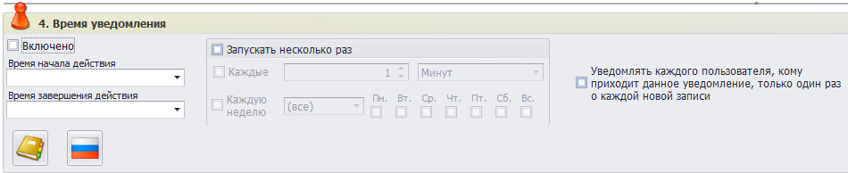
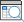
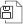

# Настройка уведомлений

Форма «Настройка уведомлений» предназначена для создания шаблонов уведомлений, которые будут получать пользователи при выполнении различных условий. Настройки уведомлений выполняются администратором.
Для перехода к форме нужно в главном меню перейти во вкладку «Настройки программы» и выбрать нужный пункт:

Форма «Настройка уведомлений» состоит из трех областей:

- Панель поиска (выделена зеленым).
- Панель меню (выделена желтым).
- Настройки уведомлений (выделены голубым).
 

Для отображения имеющихся в Программе записей, содержащих настройки уведомлений, нужно в панели поиска выбрать один из трех вариантов:

- Показать все.
- Показать последние 10.
- Показать ранее выбранные.

Изначально записи настроек уведомлений в Программе отсутствуют.

В таблице ниже приведено описание кнопок панели меню.

<table border="1">
<tr>
    <td align="center"><b>Вид кнопки</b></td>
    <td align="center"><b>Название</b></td>
    <td align="center"><b>Назначение</b></td>
    <td align="center"><b>«Горячие» клавиши</b></td>
</tr>
<tr>
    <td></td>
    <td>Показать панель поиска</td>
    <td>Отображает/скрывает панель поиска</td>
    <td>Ctrl+F</td>
</tr>
<tr>
    <td></td>
    <td>Создать новую запись</td>
    <td>Производиться очистка текущей формы и подготовка к внесению информации о новом уведомлении</td>
    <td>Ctrl+N</td>
</tr>
<tr>
    <td></td>
    <td>Сохранить изменения</td>
    <td>Сохраняет изменения, сделанные в форме. Форма остается открытой</td>
    <td>Ctrl+S</td>
</tr>
<tr>
    <td></td>
    <td>Удалить запись</td>
    <td>Удаляет выбранную в панели поиска запись об уведомлении</td>
    <td></td>
</tr>
<tr>
    <td></td>
    <td>Информация о текущей записи</td>
    <td>Выводит подробную информацию о записи уведомления, выбранной в панели поиска</td>
    <td>Ctrl+I</td>
</tr>
<tr>
    <td></td>
    <td>Обновить форму</td>
    <td>Обновляет данные об уведомлениях и перерисовывает форму. При этом информация считывается из базы данных, а значит, все несохраненные изменения будут потеряны</td>
    <td>Ctrl+R или F5</td>
</tr>
<tr>
    <td></td>
    <td>Перезагрузить форму</td>
    <td>Заново перезагружает форму и все данные в ней. Информация загружается из базы данных, все несохраненные изменения будут потеряны</td>
    <td>Ctrl+F5 или F6</td>
</tr>
<tr>
    <td></td>
    <td>Сформировать текстовый документ</td>
    <td>Формирует текстовый документ</td>
    <td>Ctrl+P</td>
</tr>
<tr>
    <td></td>
    <td>Сохранить изменения и закрыть форму</td>
    <td>Сохраняет сделанные в настройках изменения и закрывает форму</td>
    <td>Ctrl+E</td>
</tr>
</table>

Настройки уведомлений включают в себя 6 группы параметров:

- Настройка условий.
- Лица, которые получат уведомление.
- Выполняемые действия, текст и внешний уведомлений.
- Время уведомления.
- Ссылки на оригиналы документов и приложенные файлы.
- Примечания.
  
На рисунке ниже группы параметров уведомлений показаны в свернутом виде. 

Чтобы развернуть нужную группу параметров требуется нажать на ней ЛКМ:

Рассмотрим указанные группы отдельно.

## 1. Настройка условий

Группа параметров «Настройка условий» задает критерии срабатывания уведомлений.
 

 
Группа состоит из двух областей параметров (выделены желтым и зеленым).

«Желтая» область содержит условия срабатывания уведомлений в новых проектах. Условия срабатывания задаются в виде настроек пресета. Сверху расположено меню, значения кнопок которого приведено в таблице.

<table border="1">
<tr>
    <td align="center"><b>Вид кнопки</b></td>
    <td align="center"><b>Название</b></td>
    <td align="center"><b>Назначение</b></td>
</tr>
<tr>
    <td></td>
    <td>Применить изменения настроек</td>
    <td>Внесенные изменения будут сохранены в памяти Программы. Для сохранения изменений в БД нужно нажать кнопку «Сохранить изменения» в меню формы</td>
</tr>
<tr>
    <td></td>
    <td>Показать заполненные свойства</td>
    <td>Выполняется переключение между режимами отображения свойств: только заполненные/все свойства </td>
</tr>
<tr>
    <td></td>
    <td>Раскрыть все свойства</td>
    <td>Выполняется раскрытие списка всех свойств. При повторном нажатии список будет свернут</td>
</tr>
<tr>
    <td></td>
    <td>Скопировать пресет в буфер обмена</td>
    <td>Пресет копируется в буфер обмена в виде строки Base64</td>
</tr>
<tr>
    <td></td>
    <td>Загрузить пресет из буфера обмена</td>
    <td>Пресет загружается из буфера обмена, полностью заменяя текущий</td>
</tr>
<tr>
    <td></td>
    <td>Сохранить пресет в файл</td>
    <td>Пресет сохраняется в файл</td>
</tr>
<tr>
    <td></td>
    <td>Загрузить пресет из файла</td>
    <td>Пресет загружается из файла, полностью заменяя текущий</td>
</tr>
</table>

Кнопки загрузки пресета из буфера или файла позволяют использовать для задания условий срабатывания уведомлений ранее сохранный пресет. Кнопки сохранения пресета в буфер или файл дают возможность использовать сохраненные данные при настройке других уведомлений.

Описание настроек условий срабатывания уведомления с использованием пресета приведены в таблице ниже.

 
<table border="1">
<tr>
    <td align="center"><b>Настройка</b></td>
    <td align="center"><b>Описание</b></td>
</tr>
<tr>
    <td>Включить пресет</td>
    <td>Выставление флага () делает уведомление активным</td>
</tr>
<tr>
    <td>Пресет поиска</td>
    <td>Выставление флага () раскрывает настройки условий уведомлений</td>
</tr>
<tr>
    <td>Пресет по номеру</td>
    <td>Указывается номер пресета, при срабатывании которого будет выводиться уведоление</td>
</tr>
<tr>
    <td>Добавлять записи по двойному нажатию левой кнопки мыши</td>
    <td></td>
</tr>
<tr>
    <td>Ручной фильтр</td>
    <td></td>
</tr>
</table>

«Зеленая» область позволяет задать условия срабатывания уведомлений в старых проектах.
 

Кнопка «Открыть в отдельной форме» () позволяет открыть выбранную запись в отдельном окне, в котором можно получить подробную информацию о записи, а также внести необходимые изменения. Выбрав нужное значение из списка, следует нажать кнопку  («Перейти к форме документа»). При нажатии кнопки «Настройка вида» () откроется меню, описание которого см. ниже.

Кнопка  («Группа добавления записей») активирует следующий набор кнопок:

<table border="1">
<tr>
    <td align="center"><b>Вид кнопки</b></td>
    <td align="center"><b>Название</b></td>
    <td align="center"><b>Назначение</b></td>
</tr>
<tr>
    <td></td>
    <td>Добавить новую корневую группу для условий, связанных по «И»</td>
    <td>Создает корневой контейнер для включения условий. В корневой контейнер могут быть включены вложенные группы условий</td>
</tr>
<tr>
    <td></td>
    <td>Добавить новую вложенную группу для условий, связанных по «И»</td>
    <td>Создает вложенный контейнер для условий. Контейнер может быть включен в корневой или выступать самостоятельно</td>
</tr>
<tr>
    <td></td>
    <td>Добавить новую вложенную группу для условий, связанных по «ИЛИ»</td>
    <td>Создает вложенный контейнер для условий. Контейнер может быть включен в корневой или выступать самостоятельно</td>
</tr>
<tr>
    <td></td>
    <td>Добавить новое условия для фильтрации данных*</td>
    <td>Позволяет добавить в выбранный контейнер условия, по которым будет выполняться фильтрация с учетом логики работы контейнера («И», «ИЛИ»)</td>
</tr>
<tr>
    <td colspan="3">* В качестве условий фильтрации можно выбрать объекты, организации, задания, универсальные документы, типизированные документы</td>
</tr>
</table>

При нажатии кнопки  («Добавить новое условия для фильтрации данных») откроется окно, показанное на рисунке выше. В нем необходимо выбрать условия для фильтрации, которые будут включены в выбранную корневую группу.

>ВАЖНО! Добавление условий для фильтрации возможно только в одну из перечисленных групп. Однако при настройке одного уведомления может использовать несколько групп.

При нажатии кнопки  («Удалить запись») выбранная запись будет удалена из списка.

Кнопка «Настройка вида» () предоставляет пользователю следующие возможности.

<table border="1">
<tr>
    <td align="center"><b>Вид кнопки</b></td>
    <td align="center"><b>Название</b></td>
    <td align="center"><b>Назначение</b></td>
</tr>
<tr>
    <td colspan="3" align="center"><b>Настройка вида</b></td>
</tr>
<tr>
    <td></td>
    <td>Автоподбор высоты строк</td>
    <td>Автоматически настраивает высоту строк в таблице</td>
</tr>
<tr>
    <td></td>
    <td>Автоподбор ширины колонок</td>
    <td>Автоматически настраивает ширину колонок в таблице</td>
</tr>
<tr>
    <td></td>
    <td>Раскрыть все</td>
    <td>Разворачивает список видов/типов</td>
</tr>
<tr>
    <td></td>
    <td>Свернуть все</td>
    <td>Сворачивает список видов/типов</td>
</tr>
<tr>
    <td></td>
    <td>Обновить</td>
    <td>Обновляет форму</td>
</tr>
<tr>
    <td colspan="3" align="center"><b>Экспорт и печать</b> ()</td>
</tr>
<tr>
    <td></td>
    <td>Экспорт в XLS</td>
    <td>Экспорт с сохранением в формате XLS</td>
</tr>
<tr>
    <td></td>
    <td>Экспорт в XLSX</td>
    <td>Экспорт с сохранением в формате XLSX</td>
</tr>
<tr>
    <td></td>
    <td>Экспорт в PDF</td>
    <td>Экспорт с сохранением в формате PDF</td>
</tr>
<tr>
    <td></td>
    <td>Экспорт в HTML</td>
    <td>Экспорт с сохранением в формате HTML</td>
</tr>
<tr>
    <td></td>
    <td>Экспорт в RTF</td>
    <td>Экспорт с сохранением в формате RTF</td>
</tr>
<tr>
    <td></td>
    <td>Экспорт в Text</td>
    <td>Экспорт с сохранением в формате Text</td>
</tr>
<tr>
    <td></td>
    <td>Расширенный экспорт</td>
    <td>Открывает настройки расширенного экспорта</td>
</tr>
<tr>
    <td></td>
    <td>Печать</td>
    <td>Отправляет на печать</td>
</tr>
</table>

В правой части «зеленой» области можно задать порядок следования данных в запросе. Для изменения порядка записей в запросе нужно воспользоваться кнопка «Переместить вверх» () и «Переместить вниз» (). Cписок формируется на основании имеющихся в уведомлении типов условий фильтрации («объект», «организация», «задание», «универсальный документ», «типизированный документ»).

Порядок следования данных в отчете является очень важным.

Если на первом месте будет «объект», то все остальные данные («документ», «организации» и т.д.) будут выбираться только для тех объектов, которые удовлетворяют указанным условиям. При этом документы, не привязанные к объектам, в отчет не попадут.

Если на первом месте будет «документ», то все остальные данные («объект», «организация» и т.д.) будут выбираться только если они связаны с документами этого типа, удовлетворяющим указанным условиям. При этом объекты и документы, которые не привязаны к этим документам, в отчет не попадут.

## 2. Лица, которые получат уведомление

Группа параметров «Лица, которые получат уведомление», как и «Настройка условий», разделена на область настроек для старых (выделена желтым) и новых (выделена зеленым) проектов.
 

В «желтой» области задаются роли получателей уведомлений из фиксированного списка:

Для выбора нужно выставить флаг () напротив соответствующей роли. При этом можно выбрать получение уведомления «Первому в списке» и «Всем, добавленным в список» (флаг в левом и правом столбце соответственно).

В «зеленой» области получателями можно указать всех пользователей Программы, выставив соответствующий флаг (), или выбрать отдельных пользователей. Для этого требуется нажать кнопку «Добавить новую запись» () в левой части области. Получателями могут быть выбраны отдельные физические лица, а также лица, объединенные в группы, сотрудники определенных организаций и т.д.
 

Для выбора требуется выставить флаг () напротив нужных получателей и нажать  («Завершить поиск с выбранным результатом»).

Кнопка  («Удалить выбранную запись») исключает выбранного получателя из списка. Кнопки  и  позволяют переместить получателей вверх и вниз в списке соответственно.

В правой части области напротив получателей можно выставить флаг () в столбце «Выделенные представители используются в переменных для печати документа». После этого получатели, отмеченные флагом, будут добавляться в документ при печати.

## 3. Выполняемые действия, текст и внешний вид уведомления

В этой группе задаются действия, которые будут выполняться при срабатывании уведомления, а также ряд других параметров.
 

Желтым на рисунке выделена область обычных действий, зеленым - область работы с пресетом.

В качестве обычных действий, выполняемых при срабатывании уведомления, могут быть назначены:

- Отправка сообщения.
- Проигрывание мелодии.
- Запуск файла.
- Открытие формы.
- Выполнение действия.

Задать можно одно или несколько действий. При выборе действия становится доступа вкладка с его настройками.

На рисунке ниже показана вкладка «Сообщение».

Если в качестве действия выбрана отправка сообщения, на указанной вкладке нужно выбрать формат сообщения: выводить его на экран или отправить на email. В последнем случае уведомление будет отправлено на адрес, привязанный к профилю указанного в получателях физического лица. Можно выбрать и оба варианта.

Кроме того, необходимо выбрать один из двух вариантов отображения уведомления:

- Одно окно сообщения для всех записей, входящих в уведомление.
- Отдельные окна сообщений для каждой записи, входящей в уведомления.

После этого в текстовом поле нужно ввести текст сообщения, которое будет отображаться при срабатывании уведомления. Кнопки справа от поля ввода сообщения ( и ) позволяют расширить поле ввода и развернуть текст на весь экран. При нажатии кнопки  будет открыто окно текстового редактора, в котором можно выполнить ввод текста и форматирование.

В поле «Форма, связанная с сообщением», нажав кнопку  или дважды нажав ЛКМ, в открывшемся окне можно выбрать форму, связанную с сообщением.
 

В зависимости от выбора сообщение может отображаться в виде системного сообщения или диалогового окна.

В поле «Цвет уведомления» после нажатия кнопки  открывается окно выбора цвета. Кроме вкладки «Пользовательские», доступные вкладки «Веб» и «Системные».
 

В поле «Время показа уведомления» необходимо задать значение в секундах.

В поле «Важность уведомления» можно присвоить сообщению приоритет:

- Самый низкий (задан по умолчанию).
- Низкий.
- Средний.
- Высокий.
- Самый высокий.
  
Кнопка  («Протестировать окно уведомления») позволяет проверить работу настроенного уведомления. При этом, если выбран формат системного сообщения, уведомление будет отображено в левом нижнем углу окна Программы. В случае выбора диалогового окна уведомление будет отображено в отдельной форме. 

В качестве действия можно выбрать и выполнение пресета.

Описание соответствующих настроек представлено в таблице ниже.
 
<table border="1">
<tr>
    <td align="center"><b>Настройка</b></td>
    <td align="center"><b>Описание</b></td>
</tr>
<tr>
    <td>Включить пресет</td>
    <td>Выставление флага () активирует возможность использования пресетов в качестве действий уведомления</td>
</tr>
<tr>
    <td>Текст уведомления</td>
    <td>Выставление флага () открывает группу настроек текста уведомления посредством пресета</td>
</tr>
<tr>
    <td>Пресет по номеру</td>
    <td>Указывается номер пресета, содержащий текст уведомления</td>
</tr>
<tr>
    <td>Добавлять записи по двойному нажатию левой кнопки мыши</td>
    <td></td>
</tr>
<tr>
    <td>Ручной фильтр</td>
    <td></td>
</tr>
<tr>
    <td colspan="2"></td>
</tr>
<tr>
    <td>Открывать вместо уведомления</td>
    <td>Выставление флага () открывает группу настроек пресета, открываемого вместо уведомления</td>
</tr>
<tr>
    <td>Пресет по номеру</td>
    <td>Указывается номер пресета, открываемый вместо уведомления</td>
</tr>
<tr>
    <td>Добавлять записи по двойному нажатию левой кнопки мыши</td>
    <td></td>
</tr>
<tr>
    <td>Ручной фильтр</td>
    <td></td>
</tr>
<tr>
    <td colspan="2"></td>
</tr>
<tr>
    <td>Открывать при нажатии кнопки «Открыть уведомление»</td>
    <td>Выставление флага () открывает группу настроек пресета, открываемого при нажатии кнопки «Открыть уведомление»</td>
</tr>
<tr>
    <td>Пресет по номеру</td>
    <td>В данном поле указывается номер пресета, открываемый при нажатии «Открыть уведомление»</td>
</tr>
<tr>
    <td>Добавлять записи по двойному нажатию левой кнопки мыши</td>
    <td></td>
</tr>
<tr>
    <td>Ручной фильтр</td>
    <td></td>
</tr>
<tr>
    <td colspan="2"></td>
</tr>
<tr>
    <td>Выполнять с нажатием кнопки «Ознакомлен с уведомлением»</td>
    <td>Выставление флага () открывает группу настроек пресета, открываемого при нажатии кнопки «Ознакомлен с уведомлением»</td>
</tr>
<tr>
    <td>Пресет по номеру</td>
    <td>В данном поле указывается номер пресета, открываемый при нажатии «Ознакомлен с уведомлением»</td>
</tr>
<tr>
    <td>Добавлять записи по двойному нажатию левой кнопки мыши</td>
    <td></td>
</tr>
<tr>
    <td>Ручной фильтр</td>
    <td></td>
</tr>
</table>

В случае выбора в качестве действия «Играть мелодию» во вкладке «Звук» нужно указать путь к файлу мелодии. Для этого нужно нажать кнопку «Выбрать файл» () и в открывшемся окне проводника выбрать нужный файл. С помощью кнопки «Протестировать звуковой сигнал» () можно выполнить проверку мелодии.

Если при срабатывании уведомления нужно запускать файл, необходимо выставить соответствующий флаг () и во вкладке «Файл» указать путь к файлу.

При выставлении флага () напротив действия «Открыть форму», ее нужно выбрать на вкладке «Форма».

При выставлении флага () напротив «Выполнить действие» можно выбрать один или несколько вариантов из списка, показанного на рисунке ниже.

## 4. Время уведомления

Группа параметров «Время уведомления» отвечает за расписание срабатывания уведомлений.

Установка флага () «Включено» делает уведомление активным, то есть оно будет запускаться в соответствии с настройками.

В полях «Время начала действия» и «Время окончания действия» в формате даты и времени задается временной интервал, во время которого уведомление будет выводиться в соответствии с расписанием. 

При установке флага () «Запускать несколько раз» становится доступна настройка расписания уведомления. В качестве параметров здесь можно задать временной интервал, через который будет выводиться уведомление. Для этого нужно установить флаг () «Каждые», задать нужное значение и выбрать единицу времени. Также можно установить флаг () «Каждую неделю» и задать дни, в который будет выводиться уведомление. Здесь в разворачиваемом списке можно выбрать неделю, в которую будет осуществляться вывод уведомления (первую, вторую, третью, четвертную, последнюю).

Кнопка «Перейти в журнал уведомления» () открывает форму журнала уведомления. Кнопка «Перейти в оперативный журнал» () позволяет перейти в форму оперативного журнала 

## 5. Ссылки на оригиналы документов
 
В этом разделе администратор может добавить файлы, содержащие сведения о том, в связи с чем было создано уведомление, а также другую информацию.
 

Кнопки «Импорт файлов» () и «Экспорт и импорт» () предлагают наборы действий по работе с файлами.
 

По кнопке «Управление файлами» () доступен набор дополнительных операций с файлами.

Настройки внешнего вида, отображаемые при нажатии кнопки (), описаны в таблице ниже. Кроме них, меню настройки внешнего вида включает следующие опции:

- Проверить информационные поля для выбранного файла.
- Заполнить информационные поля для приложенных файлов по всей базе данных.
  
При наведении на кнопку «Информация о выбранном файле» () станут видны сведения о файле, выбранном в поле: название, статус, размер, дата изменения и т.д.

Доступ к действиям с файлами также можно получить, нажав ПКМ в этой группе параметров. При этом будет открыто контекстное меню, в т.ч. включающее наборы действий по импорту и экспорту файлов, управлению файлами. 

<table border="1">
<tr>
    <td align="center"><b>Вид кнопки</b></td>
    <td align="center"><b>Название</b></td>
    <td align="center"><b>Назначение</b></td>
</tr>
<tr>
    <td></td>
    <td>Добавить файл напрямую со сканера</td>
    <td></td>
</tr>
<tr>
    <td></td>
    <td>Добавить новые файлы (либо перетащить файлы в поле)</td>
    <td></td>
</tr>
<tr>
    <td></td>
    <td>Добавить каталог с файлами (либо перетащите каталог в поле)</td>
    <td>Позволяет добавить все файлы, содержащиеся в выбранном или перетаскиваемом в поле каталоге</td>
</tr>
<tr>
    <td></td>
    <td>Добавить новый каталог для файлов</td>
    <td></td>
</tr>
<tr>
    <td></td>
    <td>Показать панель расширенного просмотра файла</td>
    <td>Здесь же отображается панель с расширенными возможностями просмотра</td>
</tr>
<tr>
    <td></td>
    <td>Открыть файл для просмотра во встроенном редакторе</td>
    <td></td>
</tr>
<tr>
    <td></td>
    <td>Открыть файлы для просмотра во внешнем приложении</td>
    <td></td>
</tr>
<tr>
    <td></td>
    <td>Распечатать с предпросмотром выбранные файлы</td>
    <td></td>
</tr>
<tr>
    <td></td>
    <td>Копировать выбранный файл в буфер обмена</td>
    <td></td>
</tr>
<tr>
    <td></td>
    <td>Добавить файл из буфера обмена</td>
    <td></td>
</tr>
<tr>
    <td></td>
    <td>Копировать внутреннюю ссылку на выбранные файлы</td>
    <td></td>
</tr>
<tr>
    <td></td>
    <td>Вставить файлы по скопированной внутренней ссылке</td>
    <td></td>
</tr>
<tr>
    <td></td>
    <td>Сохранить все изменения</td>
    <td></td>
</tr>
<tr>
    <td></td>
    <td>Сохранить выбранные файлы на диск как…</td>
    <td>Откроется диалоговое окно с выбором места сохранения выбранных файлов</td>
</tr>
<tr>
    <td></td>
    <td>Объединить выбранные файлы в один файл формата Adobe PDF</td>
    <td></td>
</tr>
<tr>
    <td></td>
    <td>Удалить выбранные файлы</td>
    <td></td>
</tr>
<tr>
    <td></td>
    <td>Галерея файлов</td>
    <td rowspan="3">Задают вид отображения файлов в поле (по аналогии с отображением файлов в каталогах ОС Windows)</td>
</tr>
<tr>
    <td></td>
    <td>Дерево файлов</td>
</tr>
<tr>
    <td></td>
    <td>Табличный вид простой</td>
</tr>
</table>

## 6. Примечания

В текстовое поле группы можно вносить дополнительную информацию об уведомлении.

