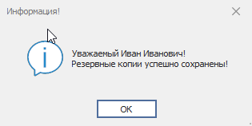

# Настройка конфигурации

Для перехода к настройке конфигураций в главном меню нужно перейти во вкладку «Настройки программы» и выбрать соответствующий пункт:

Откроется следующая форма:

 
Форма предназначена для настройки параметров работы баз данных (БД) и выполнения операций с ними.

В верхней части формы расположена панель меню:

Описание работы кнопок панели меню приведено в таблице ниже.

<table border="1">
<tr>
    <td align="center"><b>Вид кнопки</b></td>
    <td align="center"><b>Название</b></td>
    <td align="center"><b>Назначение</b></td>
    <td align="center"><b>«Горячие» клавиши</b></td>
</tr>
<tr>
    <td></td>
    <td>Создать новую запись</td>
    <td>Производиться очистка текущей формы и подготовка к внесению информации о новой</td>
    <td>Ctrl+N</td>
</tr>
<tr>
    <td></td>
    <td>Сохранить изменения</td>
    <td>Сохраняет изменения, сделанные в форме. Форма остается открытой</td>
    <td>Ctrl+S</td>
</tr>
<tr>
    <td></td>
    <td>Удалить запись</td>
    <td>Удаляет выбранную конфигурацию БД</td>
    <td></td>
</tr>
<tr>
    <td></td>
    <td>Обновить форму</td>
    <td>Обновляет данные о конфигурации БД и перерисовывает форму. Все несохраненные изменения будут потеряны</td>
    <td>Ctrl+R или F5</td>
</tr>
<tr>
    <td></td>
    <td>Перезагрузить форму</td>
    <td>Заново перезагружает форму и все данные в ней. Все несохраненные изменения будут потеряны</td>
    <td>Ctrl+F5 или F6</td>
</tr>
<tr>
    <td></td>
    <td>Сохранить изменения и закрыть форму</td>
    <td>Сохраняет сделанные в настройках конфигурации изменения и закрывает форму</td>
    <td>Ctrl+E</td>
</tr>
</table>

В нижней части формы расположен список имеющихся и доступных к созданию БД.

Минимальный набор баз, необходимых для работоспособности программы, включает в себя:

- Основную БД.
- Базу нарушений.
- Базу вложенных файлов.
  
Минимальный набор БД создается при установке программы, а также при создании новой конфигурации баз.

## Подключение баз данных

После установки СУБД и создания нужных баз данных, а также после установки Программы необходимо выполнить подключения к созданным БД. Для этого нужно выбрать нужную БД, нажав на ней ЛКМ. 

Далее выбрать тип БД, указать адрес сервера, имя БД, а также логин и пароль для подключения к серверу. 

Аналогичные операции необходимо повторить для каждой созданной БД.

Для подключения к БД можно использовать учетную запись, под которой выполнен вход в ОС Windows, для чего необходимо выставить соответствующий флаг.

## Операции с базами данных

Форма работы с БД содержит панель меню с шестью кнопками:

 
Кнопка «Индексация» запускает соответствующую операцию с БД текущей конфигурации, что позволяет ускорить работу Программы при обращении к базам. Индексация также запускается автоматически при обновлении БД. После запуска индексации необходимо дождаться ее завершения:
 

Кнопка «Резервная копия» запускает процесс резервирования БД. Создание резервной копии баз выполняется автоматически при каждом выходе из программы.

 
При нажатии кнопки «Восстановить базу» откроется окно проводника. В нем нужно выбрать директорию с резервными копиями, из которой будет выполнено восстановление баз. 

После завершения процесса восстановления Программа выведет сообщение о его результатах:

 
Клонирование позволяет выполнить полное копирование данных из одной БД в другую. Для выполнения этой операции необходимо нажать кнопку «Клонирование» и в открывшейся форме выбрать конфигурацию, в которую будет произведено копирование. 

>Выбрать конфигурацию, из которой будет выполняться клонирование, нельзя. Копирование возможно только из текущей конфигурации (выбранной при запуске Программы).

Клонируемые БД нужно отметить флагами (), после чего нажать кнопку «Запустить процесс клонирования отмеченных баз данных» или «Запустить процесс доклонирования отмеченных баз». В последнем случае в «принимающую» БД будет выполнена запись новых и измененных данных, совпадающие записи при этом останутся без именений. Операция доклонирования экономит время, но не гарантирует идентичности БД.

Если установить флаг () «Клонировать журнал событий», будет выполнено клонирование журнала событий, журнала последних изменений и журнала импорта. Эти данные не требуются для работы Программы, но помогают отслеживать стабильность ее выполнения и возникающие ошибки.

При нажатии кнопки «Восстановить администратора» будет создана учетная запись пользователя с правами администратора, если таковая отсутствовала в БД.

## Состояние баз данных

При запуске Программа проверяет БД, используемые в текущей (заданной по умолчанию) конфигурации. Сведения о состоянии баз выводятся в виде отметок на «бочонках» в окне ввода данных учетной записи:

 
Выбрать другую конфигурацию можно с помощью выпадающего списка.

Значки на бочонках могут означать следующие состояния БД:

 – производится подключение к БД.

 – соединение с базой установлено, производительность хорошая.

 – соединение с базой установить не удалось, проверьте настройки подключения, база отсутствует по указанной строке подключения.

 – соединение с базой установлено, нет прав доступа на запись в БД.

 – соединение с базой установлено.

 – соединение с базой установлено, для работы с новой версии БД обновите базу.

 – для работы с базой данных этого типа необходимо установить соответствующий драйвер.

 – не заданы настройки подключения БД.

 – соединение установлено, база данных при вводе пароля будет обновлена с текущей версии до необходимой.
 

Также в случае успешного соединения с БД при наведении на значок базы выводиться информации о ее версии:
 
