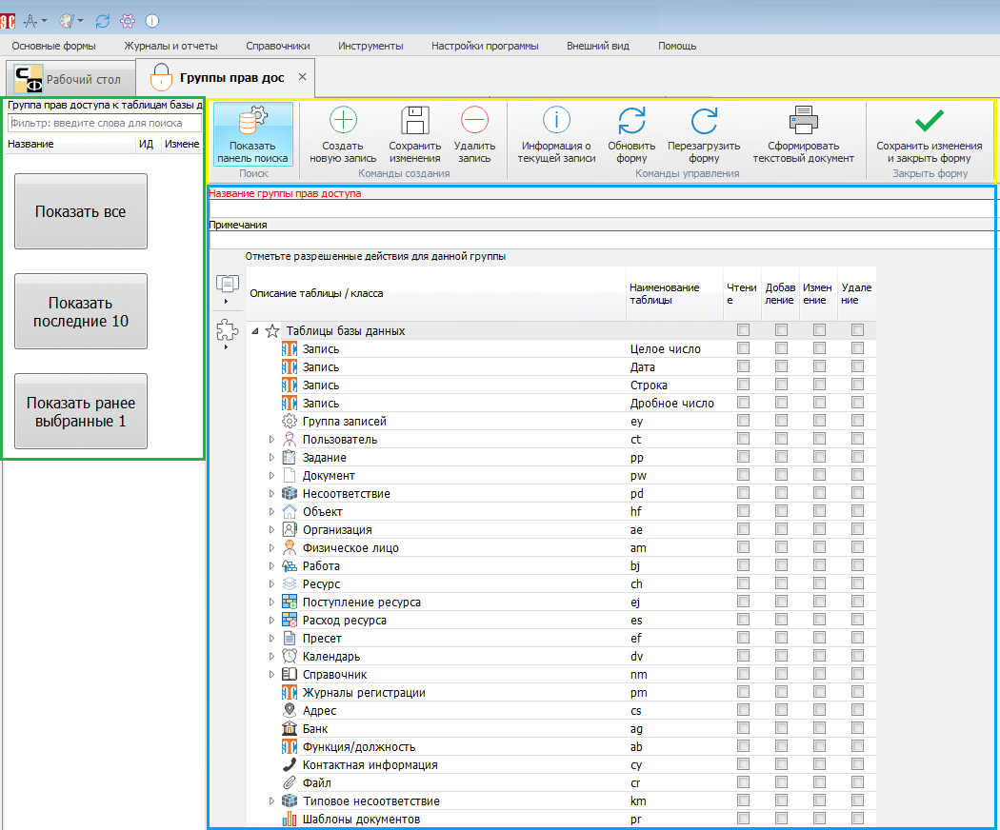

# Группы прав доступа

К настройке группы прав доступа (ГПД) можно перейти, выбрав в верхней части Программы вкладку «Настройки программы» и нажать кнопку «Группы прав доступа к таблицам базы»:

Также в форме настроек бизнес-ролей пользователей можно нажать ПКМ на строке «Группа прав доступа к таблицам базы данных» и выбрать пункт «Добавить новую группу доступа к таблицам базы данных»:

 
Откроется форма, состоящая из трех рабочих областей:

- Панель поиска (выделена зеленым).
- Панель меню (выделена желтым).
- Настройки ГПД (выделены голубым).
 

Чтобы посмотреть имеющиеся в Программе ГПД, нужно в панели поиска выбрать вариант отображения:

- Показать все.
- Показать последние 10.
- Показать ранее выбранные.

Будет отображен список ГПД (на рисунке ниже выделен желтым). После установки в Программе имеется только одна ГПД – Администратор.

Описание кнопок панели меню приведено в таблице.

<table border="1">
<tr>
    <td align="center"><b>Вид кнопки</b></td>
    <td align="center"><b>Название</b></td>
    <td align="center"><b>Назначение</b></td>
    <td align="center"><b>«Горячие» клавиши</b></td>
</tr>
<tr>
    <td></td>
    <td>Показать панель поиска</td>
    <td>Отображает/скрывает панель поиска</td>
    <td>Ctrl+F</td>
</tr>
<tr>
    <td></td>
    <td>Создать новую запись</td>
    <td>Производиться очистка текущей формы ГПД и подготовка к внесению информации о новой ГПД</td>
    <td>Ctrl+N</td>
</tr>
<tr>
    <td></td>
    <td>Сохранить изменения</td>
    <td>Сохраняет изменения, сделанные в форме. Форма остается открытой</td>
    <td>Ctrl+S</td>
</tr>
<tr>
    <td></td>
    <td>Удалить запись</td>
    <td>Удаляет выбранную в панели поиска ГПД</td>
    <td></td>
</tr>
<tr>
    <td></td>
    <td>Информация о текущей записи</td>
    <td>Выводит подробную информацию о ГПД, выбранной в панели поиска</td>
    <td>Ctrl+I</td>
</tr>
<tr>
    <td></td>
    <td>Обновить форму</td>
    <td>Обновляет данные о ГПД и перерисовывает форму. При этом информация считывается из базы данных, а значит, все несохраненные изменения будут потеряны</td>
    <td>Ctrl+R или F5</td>
</tr>
<tr>
    <td></td>
    <td>Перезагрузить форму</td>
    <td>Заново перезагружает форму и все данные в ней. Информация загружается из базы данных, все несохраненные изменения будут потеряны</td>
    <td>Ctrl+F5 или F6</td>
</tr>
<tr>
    <td></td>
    <td>Сформировать текстовый документ</td>
    <td>Формирует текстовый документ</td>
    <td>Ctrl+P</td>
</tr>
<tr>
    <td></td>
    <td>Сохранить изменения и закрыть форму</td>
    <td>Сохраняет сделанные в настройках ГПД изменения и закрывает форму</td>
    <td>Ctrl+E</td>
</tr>
</table>

При нажатии кнопки  («Информация о текущей записи») откроется окно с дополнительными сведениями о ГПД, выбранной в панели поиска:

Помимо просмотра информации, в окне можно изменить статус доступа к ГПД и состояние активности ГПД. Изменения выполняются путем выбора нужного значения из выпадающего списка.

Статус доступа к записи может принимать одно из следующих значений:

- Все действия разрешены.
- Нельзя удалять запись.
- Нельзя изменять данные (только добавление).
- Только чтение.
- Запись невидима.

Состояние активности можно изменить с «активный» на «архив». При этом запись станет недействующей, но не будет удалена из Программы. При необходимости архивную ГПД можно вернуть в статус активной. Для сохранения изменений нужно нажать кнопку («Сохранить изменения и закрыть форму»). При закрытии формы с помощью  внесенные изменения будут отменены.

Зеленым на рисунке выше выделены дополнительные наборы кнопок для работы в форме ГПД:

- Вариант режима работы.

- Настройка вида.

Назначение кнопок описано в таблице ниже. 

<table border="1">
<tr>
    <td align="center"><b>Вид кнопки</b></td>
    <td align="center"><b>Название</b></td>
    <td align="center"><b>Назначение</b></td>
</tr>
<tr>
    <td colspan="3" align="center"><b>Набор кнопок «Варианты режима работы»</b></td>
</tr>
<tr>
    <td>-</td>
    <td>Показать разрешенные на чтение</td>
    <td>Отображает таблицы БД, доступные для чтения</td>
</tr>
<tr>
    <td>-</td>
    <td>Показать разрешенные на добавление</td>
    <td>Отображает таблицы БД, доступные для добавления</td>
</tr>
<tr>
    <td>-</td>
    <td>Показать разрешенные на удаление</td>
    <td>Отображает таблицы БД, доступные для удаления</td>
</tr>
<tr>
    <td>-</td>
    <td>Показать неразрешенные</td>
    <td>Отображает таблицы БД, доступ к которым запрещен</td>
</tr>
<tr>
    <td colspan="3" align="center"><b>Набор кнопок «Настройка вида»</b></td>
</tr>
<tr>
    <td></td>
    <td>Автоподбор высоты строк</td>
    <td>Автоматически настраивает высоту строк в таблице доступов</td>
</tr>
<tr>
    <td></td>
    <td>Автоподбор ширины колонок</td>
    <td>Автоматически настраивает ширину колонок в таблице доступов</td>
</tr>
<tr>
    <td></td>
    <td>Раскрыть все</td>
    <td>Раскрывает все вложенные элементы в таблице доступов</td>
</tr>
<tr>
    <td></td>
    <td>Свернуть все</td>
    <td>Скрывает все вложенные элементы в таблице доступов</td>
</tr>
<tr>
    <td></td>
    <td>Обновить</td>
    <td>Обновляет права доступа в таблицы данными из БД. Несохранные изменения будут потеряны</td>
</tr>
<tr>
    <td></td>
    <td>Экспорт и печать</td>
    <td>Позволяет экспортировать матрицу доступов в нужный формат, сохранить в виде файла и/или распечатать</td>
</tr>
</table>

Кнопка  («Расширенный экспорт») открывает матрицу доступа в редакторе, позволяющем настроить различные параметры (верхний/нижний колонтитулы, цвет фона, размер бумаги, ориентацию, масштаб, водяной знак и др.), после чего сохранить файл и/или отправить его на печать.

 
## Создание ГПР и настройка прав доступа

После нажатия кнопки  («Создать новую запись») текущая форма будет очищена и подготовлена для создания новой ГПД. После этого нужно ввести название новой ГПД и примечание (необязательно):

После ввода названия ГПД и примечания необходимо настроить права доступа к таблицам БД, выставив флагами () режимы доступа к нужным таблицам.

>ВАЖНО! Описанная настройка прав доступа посредством ГПД устанавливает верхнеуровневые права по работе с таблицами БД и обычно выполняется администратором информационной безопасности.
>
>По умолчанию для всех вновь созданных ГПД установлен доступ ко всем элементам - в настройках сняты все флаги. Если хотя бы один флаг будет выставлен, активным становится лишь отмеченный режим доступа к выбранному элементу, доступ к остальным элементам блокируется.