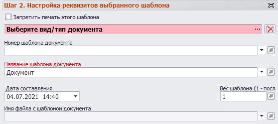
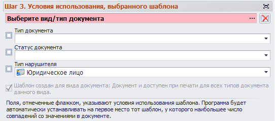

# Настройка шаблонов документов

Настройка шаблонов документов определяет формат и внешний вид документов при выводе на печать.

Для настройки шаблонов документов в главном меню необходимо перейти на вкладку «Настройки программы» и выбрать соответствующий пункт:

Откроется форма настройки шаблонов документов:

В верхней части формы расположено меню, описание которого приведено в таблице ниже.

<table border="1">
<tr>
    <td align="center"><b>Вид кнопки</b></td>
    <td align="center"><b>Название</b></td>
    <td align="center"><b>Назначение</b></td>
    <td align="center"><b>«Горячие» клавиши</b></td>
</tr>
<tr>
    <td></td>
    <td>Показать панель поиска</td>
    <td>Отображает/скрывает панель поиска</td>
    <td>Ctrl+F</td>
</tr>
<tr>
    <td></td>
    <td>Создать новую запись</td>
    <td>Производиться очистка текущей формы и подготовка к внесению информации о новой записи</td>
    <td>Ctrl+N</td>
</tr>
<tr>
    <td></td>
    <td>Сохранить изменения</td>
    <td>Сохраняет изменения, сделанные в форме. Форма остается открытой</td>
    <td>Ctrl+S</td>
</tr>
<tr>
    <td></td>
    <td>Удалить запись</td>
    <td>Удаляет выбранный в панели поиска шаблон</td>
    <td></td>
</tr>
<tr>
    <td></td>
    <td>Информация о текущей записи</td>
    <td>Выводит подробную информацию о ГПД, выбранной в панели поиска</td>
    <td>Ctrl+I</td>
</tr>
<tr>
    <td></td>
    <td>Обновить форму</td>
    <td>Обновляет данные о шаблоне и перерисовывает форму. При этом информация считывается из базы данных, а значит, все несохраненные изменения будут потеряны</td>
    <td>Ctrl+R или F5</td>
</tr>
<tr>
    <td></td>
    <td>Перезагрузить форму</td>
    <td>Заново перезагружает форму и все данные в ней. Информация загружается из базы данных, все несохраненные изменения будут потеряны</td>
    <td>Ctrl+F5 или F6</td>
</tr>
</table>

Настройки шаблонов объединены в группы (шаги):

- Шаг 1. Общая настройка для всех шаблонов.

 
- Шаг 2. Настройка реквизитов выбранного шаблона.

- Шаг 3. Условия использования выбранного шаблона.
  

Для получения доступа к настройкам нужно развернуть группу, нажав ЛКМ на ее названии. Свернуть группу можно, еще раз кликнув ЛКМ на ее названии.

Под указанными группами находиться инструкция по работе с формой. Инструкцию и другие группы настроек для удобства можно развернуть на весь экран, нажав  справа от названия группы. Чтобы закрыть окно, нужно нажать кнопку  в правом верхнем углу.

 
## Шаг 1. Общая настройка для всех шаблонов

На этом шаге выбирается формат вывода документов при создании по умолчанию. Для этого необходимо нажать «Выбрать формат» и в открывшемся окне указать необходимое расширение.

При этом для каждого отдельного документа при выводе на печать можно будет выбрать формат, отличный от заданного по умолчанию.

## Шаг 2. Настройка реквизитов выбранного документа

Группа настроек шага 2 показана на рисунке ниже.

 
При выставлении флага () «Запретить печать этого шаблона» документы, созданные с его использованием, нельзя будет отправить на печать.

В поле «Выберите вид/тип документа» указывается вид документа, для которого выполняется настройка шаблона. Чтобы выбрать документ, в открывшемся перечне нужно дважды нажать по нему ЛКМ.

Таким образом, если мы выберем тип документа (например, Акт итоговой проверки), ниже введем название шаблона (например, «Акт итоговой проверки»), то после сохранения изменений при открытии Акта итоговой проверки и нажатии кнопки «Сформировать текстовый документ» будет выведен этот шаблон:

В поле «Номер шаблона документа» указывается уникальный номер шаблона. По этому идентификатору можно ссылаться на шаблон из пресета или скрипта.

>ВАЖНО! Выбор вида/типа документа не является обязательным. В настоящее время чаще используются шаблоны, доступ к которым выполняется по их уникальному номеру. Стоит учитывать, что если не указан вид/тип документа, то получить доступ к шаблону можно только из пресета или скрипта, сославшись на него по номеру.

Чтобы сослаться на шаблон из пресета, в настройках последнего на вкладке «Действия» требуется добавить пункт «Сформировать текстовый документ для выбранных строк», выделить это действие и в свойствах в разделе «Настройка экспорта и печати» ввести номер шаблона в соответствующее поле:

Здесь же можно указать дополнительные свойства:

- Название выходного файла для сформированного документа.
- Не показывать диалог сохранения, сохранять во временную директорию.
- Открывать/не открывать файл во внешнем редакторе (при отключении опции файл будет выведен на печать без его открытия).
  
Дата составления содержит информацию о времени формирования шаблона. По умолчанию проставляется текущее время, но можно указать его и вручную.

Вес шаблона – это приоритет использования шаблона документа (актуально для документов, у которых более одного шаблона). Чем выше вес шаблона, тем более высокий у него приоритет. Таким образом, из шаблонов с весом 1 и 10 при выводе на печать по умолчанию будет выбран шаблон с приоритетом 10.

## Шаг 3. Условия использования выбранного шаблона

Настройки шага 3 показаны на рисунке ниже.

 
Настройка «Тип документа» определяет тип документа, к которому привязан шаблон. При этом, если для типа документа создать подтип, то эта настройка будет иметь приоритет над весом шаблона, настраиваемом на шаге 2, и для созданного подтипа вне зависимости от веса будет выведен именно этот шаблон (для активации настройки нужно выставить флаг ()
 

Приоритет над весом шаблона имеет и настройка «Статус», также активизуемая флагом. Если документ имеет статус, то при выводе на печать будет выбран шаблон с указанным статусом.

Настройка «Тип нарушителя» (включается выставлением флага () может принимать одно из следующих значений:

- Юридическое лицо.
- Должностное лицо.
- Физическое лицо.
- Индивидуальный предприниматель. 

«Тип нарушителя» также имеет приоритет перед весом шаблона. При этом приоритер этой настройки ниже, чем у «Статуса документа» и «Типа документа». Соответственно, если для документа задан статус и есть шаблон этого документа с таким статусом, то при печати выбран будет именно он, даже если задан тип нарушителя и имеется соответствующий шаблон. Настройка «Тип документа» при этом обладает наивысшим приоритетом из трех. 

Возможна ситуация, когда у нескольких шаблонов подтипы совпадают. В этом случае шаблон будет выбираться с учетом статуса и/или типа нарушителя. Если статусы и типы нарушителея не заданы, выбор шаблона осуществляется по весу.

## Шаг 4. Загрузка и редактирование самого шаблона документа

Настройки шага 4 находятся в правой части формы «Настройка шаблонов».

 

На этом шаге выполняется правка шаблона документа в редакторе. 

В левой части на рисунке выше доступно меню работы с шаблонами, описание кнопок которого приведено в таблице ниже.

<table border="1">
<tr>
    <td align="center"><b>Вид кнопки</b></td>
    <td align="center"><b>Название</b></td>
    <td align="center"><b>Назначение</b></td>
</tr>
<tr>
    <td></td>
    <td>Открыть для редактирования</td>
    <td>Шаблон будет открыт для редактирования в отдельном окне тестового редактора. После внесения изменения нужно нажать «Сохранить изменения» () </td>
</tr>
<tr>
    <td></td>
    <td>Загрузить шаблон из файла</td>
    <td>Будет открыто окно проводника Windows. При загрузке текущий шаблон документа будет заменен</td>
</tr>
<tr>
    <td></td>
    <td>Сохранить шаблон документа как…</td>
    <td>Сохраняет шаблон в файл в выбранной папке</td>
</tr>
<tr>
    <td></td>
    <td>Открыть список переменных</td>
    <td></td>
</tr>
<tr>
    <td></td>
    <td>Экспортировать все шаблоны в файл</td>
    <td>Выполняется экспорт шаблонов в файл</td>
</tr>
<tr>
    <td></td>
    <td>Импортировать все шаблоны из файла</td>
    <td>Выполняется импорт шаблонов из файла</td>
</tr>
<tr>
    <td></td>
    <td>Удалить все шаблоны из базы</td>
    <td>Удаляет все шаблоны документов</td>
</tr>
</table>

При открытии шаблона он также будет доступен в поле шага 4.

 
 
При этом в верхней части поля станет доступно изменение режима (режим просмотра, режим чтения, текстовый редактор). При выборе режима текстового редактора шаблон можно редактировать прямо в поле шага 4.

 
 
Здесь же, слева от кнопок переключения режима, расположена кнопка «Экспорт и печать», позволяющая выбрать формат, в который будет экспортирован шаблон, а также перейти в окно предварительного просмотра.

 

Для сохранения отредактированного шаблона нужно нажать соответствующую кнопку () в поле шага 4.

Для сохранения всех изменений, сделанных в форме настройки шаблонов, нужно нажать кнопку «Сохранить изменения» () в меню формы.

## Пример использования переменных для печати в пресетах

Переменные для печати (ПдП) позволяют ссылаться на поля пресета. При выводе на печать в этом случае вместо указанных ссылок будут отображены значения полей, на которые они ссылаются. Ниже приведен пример работы с ПдП.

Ссылка на ПдП в пресетах имеет вид:

>%HRSN1_(177)(1)(2)(21,11,35)}

где: 

>%HRSN1 – указатель начала ссылки. 
>177 – идентификатор пресета. 
>1 – идентификатор строки пресета. 
>2 – идентификатор колонки пресета. 
>21 – формат вывода (в данном случае «Горизонтальная таблица как строка»). 
>11 – форма символа, разделяющего ячейки. 
>35 – формат символа, разделяющего строки.
  
В качестве примера добавим в шаблон Акта итоговой проверки следующую ссылку:

%HRSN1_(Организация)(1)(1,2)(21,11,35)}

Здесь указана ссылка на пресет с идентификатором «Организация», идентификатор строки 1, идентификаторв колонок 1 и 2:

 
 
При печати Акта итоговой проверки по этому шаблону получим следующий результат:
 
 

В примере из пресета взяты полные и сокращенные наименования организации. При этом для третьей организации (Org3) сокращенное наименование не указано, т.к. не заполнено в данных об этой организации.