# Настройка шаблонов документов

Настройка шаблонов документов определяет формат и внешний вид документов при выводе на печать.

Для настройки шаблонов документов в главном меню необходимо перейти на вкладку «Настройки программы» и выбрать соответствующий пункт (рис.1).

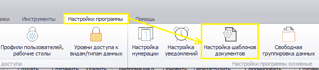 
<i>Рисунок 1. Переход в настройкам шаблонов документов</i>

Откроется форма настройки шаблонов документов (рис.2).

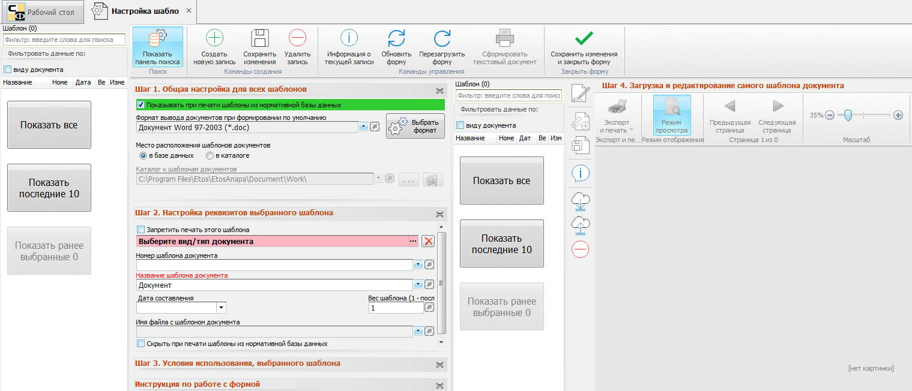 
<i>Рисунок 2. Форма настройки шаблонов документов</i>

В верхней части формы расположено меню, описание которого приведено в табл.1.

<table border="1">
<tr>
    <td align="center"><b>Вид кнопки</b></td>
    <td align="center"><b>Название</b></td>
    <td align="center"><b>Назначение</b></td>
    <td align="center"><b>«Горячие» клавиши</b></td>
</tr>
<tr>
    <td align="center"></td>
    <td>Показать панель поиска</td>
    <td>Отображает/скрывает панель поиска</td>
    <td>Ctrl+F</td>
</tr>
<tr>
    <td align="center"></td>
    <td>Создать новую запись</td>
    <td>Производиться очистка текущей формы и подготовка к внесению информации о новой записи</td>
    <td>Ctrl+N</td>
</tr>
<tr>
    <td align="center"></td>
    <td>Сохранить изменения</td>
    <td>Сохраняет изменения, сделанные в форме. Форма остается открытой</td>
    <td>Ctrl+S</td>
</tr>
<tr>
    <td align="center"></td>
    <td>Удалить запись</td>
    <td>Удаляет выбранный в панели поиска шаблон</td>
    <td></td>
</tr>
<tr>
    <td align="center"></td>
    <td>Информация о текущей записи</td>
    <td>Выводит подробную информацию о ГПД, выбранной в панели поиска</td>
    <td>Ctrl+I</td>
</tr>
<tr>
    <td align="center"></td>
    <td>Обновить форму</td>
    <td>Обновляет данные о шаблоне и перерисовывает форму. При этом информация считывается из базы данных, а значит, все несохраненные изменения будут потеряны</td>
    <td>Ctrl+R или F5</td>
</tr>
<tr>
    <td align="center"></td>
    <td>Перезагрузить форму</td>
    <td>Заново перезагружает форму и все данные в ней. Информация загружается из базы данных, все несохраненные изменения будут потеряны</td>
    <td>Ctrl+F5 или F6</td>
</tr>
</table>

<i>Таблица 1. Назначение кнопок меню формы</i>

Настройки шаблонов объединены в группы (шаги):

- Шаг 1. Общая настройка для всех шаблонов (рис.3).

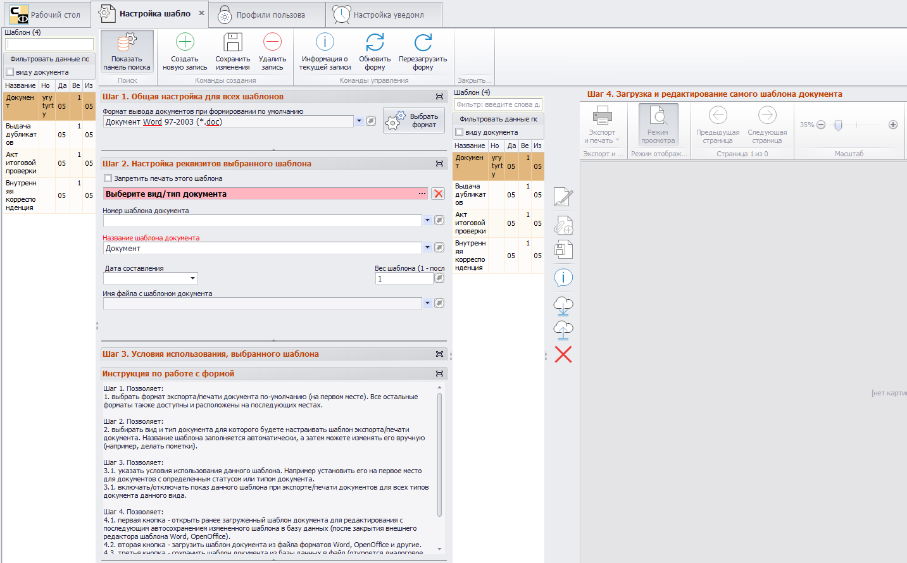 
<i>Рисунок 3. Шаг 1. Общая настройка для всех шаблонов</i>

 
- Шаг 2. Настройка реквизитов выбранного шаблона (рис.4).

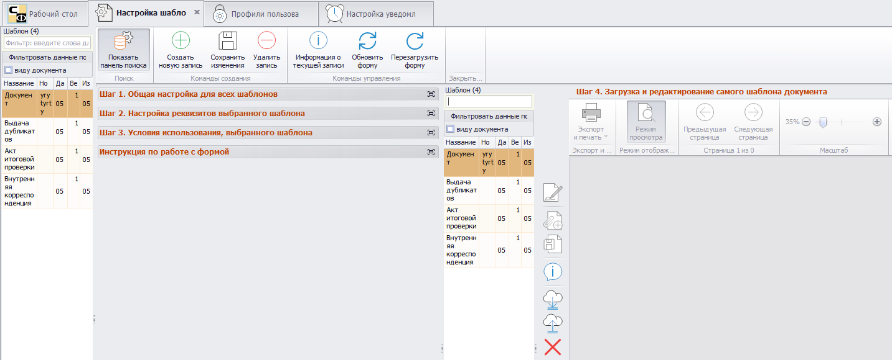 
<i>Рисунок 4. Шаг 2. Настройка реквизитов выбранного шаблона</i>

- Шаг 3. Условия использования выбранного шаблона (рис.5).

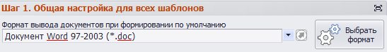 
<i>Рисунок 5. Шаг 3. Условия использования выбранного шаблона</i>

Для получения доступа к настройкам нужно развернуть группу, нажав ЛКМ на ее названии (рис.6). Свернуть группу можно, еще раз кликнув ЛКМ на ее названии.

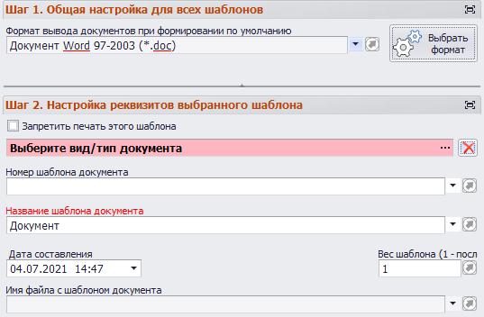 
<i>Рисунок 6. Группы настроек в развернутом виде</i>

Под указанными группами находиться инструкция по работе с формой. Инструкцию и другие группы настроек для удобства можно развернуть на весь экран, нажав  (рис.7) справа от названия группы. Чтобы закрыть окно, нужно нажать кнопку  в правом верхнем углу.

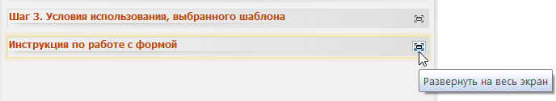 
<i>Рисунок 7. Кнопка «Развернуть на весь экран» рядом с инструкцией к форме</i>

 
## Шаг 1. Общая настройка для всех шаблонов

На этом шаге выбирается формат вывода документов при создании по умолчанию. Для этого необходимо нажать «Выбрать формат» и в открывшемся окне указать необходимое расширение (рис.8).

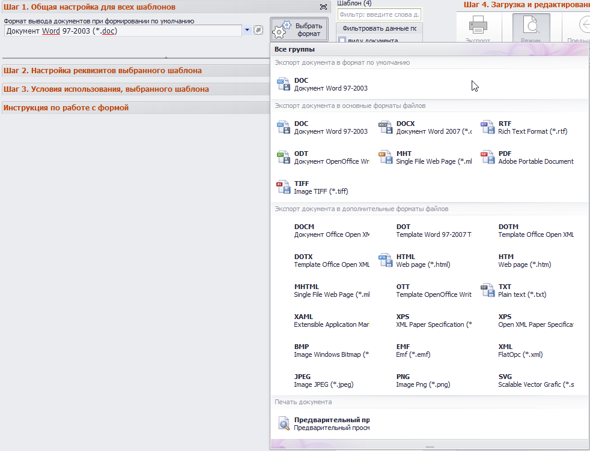 
<i>Рисунок 8. Выбор формата для формирования документов по умолчанию</i>

При этом для каждого отдельного документа при выводе на печать можно будет выбрать формат, отличный от заданного по умолчанию.

## Шаг 2. Настройка реквизитов выбранного документа

Группа настроек шага 2 показана на рис.9.

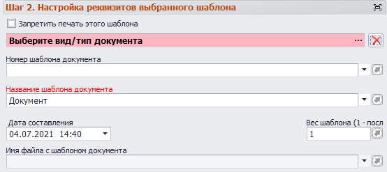 
<i>Рисунок 9. Группа настроек шага 2</i>

 
При выставлении флага () «Запретить печать этого шаблона» документы, созданные с его использованием, нельзя будет отправить на печать.

В поле «Выберите вид/тип документа» указывается вид документа, для которого выполняется настройка шаблона. Чтобы выбрать документ, в открывшемся перечне нужно дважды нажать по нему ЛКМ (рис.10).

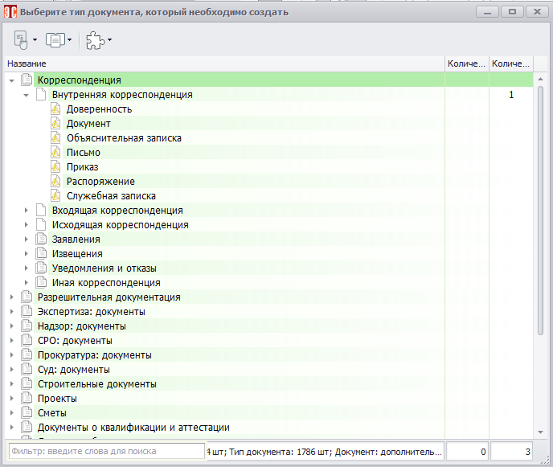 
<i>Рисунок 10. Выбор шаблона-основы для создаваемого документа</i>

Таким образом, если мы выберем тип документа (например, Акт итоговой проверки), ниже введем название шаблона (например, «Акт итоговой проверки»), то после сохранения изменений при открытии Акта итоговой проверки и нажатии кнопки «Сформировать текстовый документ» будет выведен этот шаблон (на рис.11 выделен желтым).

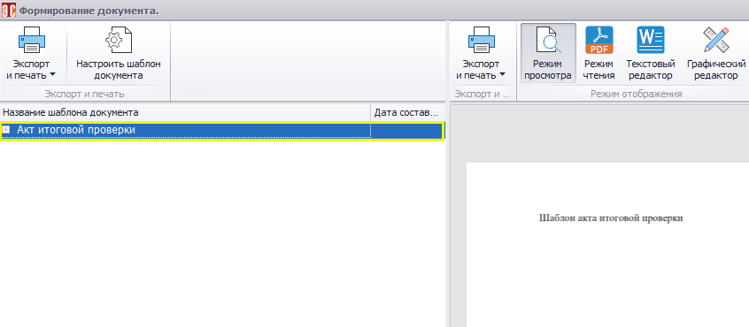 
<i>Рисунок 11. Шаблон документа</i>

В поле «Номер шаблона документа» указывается уникальный номер шаблона. По этому идентификатору можно ссылаться на шаблон из пресета или скрипта.

>ВАЖНО! Выбор вида/типа документа не является обязательным. В настоящее время чаще используются шаблоны, доступ к которым выполняется по их уникальному номеру. Стоит учитывать, что если не указан вид/тип документа, то получить доступ к шаблону можно только из пресета или скрипта, сославшись на него по номеру.

Чтобы сослаться на шаблон из пресета, в настройках последнего на вкладке «Действия» требуется добавить пункт «Сформировать текстовый документ для выбранных строк», выделить это действие и в свойствах в разделе «Настройка экспорта и печати» ввести номер шаблона в соответствующее поле (рис.12).

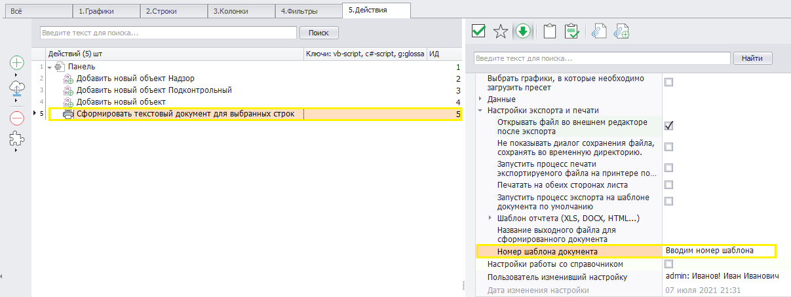 
<i>Рисунок 12. Ссылка на шаблон по номеру из пресета</i>

Здесь же можно указать дополнительные свойства:

- Название выходного файла для сформированного документа.
- Не показывать диалог сохранения, сохранять во временную директорию.
- Открывать/не открывать файл во внешнем редакторе (при отключении опции файл будет выведен на печать без его открытия).
  
Дата составления содержит информацию о времени формирования шаблона. По умолчанию проставляется текущее время, но можно указать его и вручную.

Вес шаблона – это приоритет использования шаблона документа (актуально для документов, у которых более одного шаблона). Чем выше вес шаблона, тем более высокий у него приоритет. Таким образом, из шаблонов с весом 1 и 10 при выводе на печать по умолчанию будет выбран шаблон с приоритетом 10.

## Шаг 3. Условия использования выбранного шаблона

Настройки шага 3 показаны на рис.13.

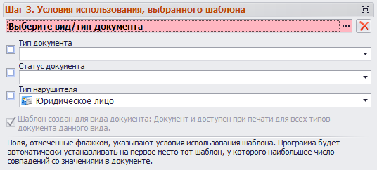 
<i>Рисунок 13. Группа настроек шага 3</i>

 
Настройка «Тип документа» определяет тип документа, к которому привязан шаблон. При этом, если для типа документа создать подтип (рис.14), то эта настройка будет иметь приоритет над весом шаблона, настраиваемом на шаге 2, и для созданного подтипа вне зависимости от веса будет выведен именно этот шаблон (для активации настройки нужно выставить флаг ().

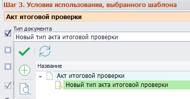 
<i>Рисунок 14. Подтип документа</i>

Приоритет над весом шаблона имеет и настройка «Статус», также активизуемая флагом. Если документ имеет статус, то при выводе на печать будет выбран шаблон с указанным статусом.

Настройка «Тип нарушителя» (включается выставлением флага () может принимать одно из следующих значений:

- Юридическое лицо.
- Должностное лицо.
- Физическое лицо.
- Индивидуальный предприниматель. 

«Тип нарушителя» также имеет приоритет перед весом шаблона. При этом приоритер этой настройки ниже, чем у «Статуса документа» и «Типа документа». Соответственно, если для документа задан статус и есть шаблон этого документа с таким статусом, то при печати выбран будет именно он, даже если задан тип нарушителя и имеется соответствующий шаблон. Настройка «Тип документа» при этом обладает наивысшим приоритетом из трех. 

Возможна ситуация, когда у нескольких шаблонов подтипы совпадают. В этом случае шаблон будет выбираться с учетом статуса и/или типа нарушителя. Если статусы и типы нарушителея не заданы, выбор шаблона осуществляется по весу.

## Шаг 4. Загрузка и редактирование самого шаблона документа

Настройки шага 4 находятся в правой части формы «Настройка шаблонов» (рис.15).

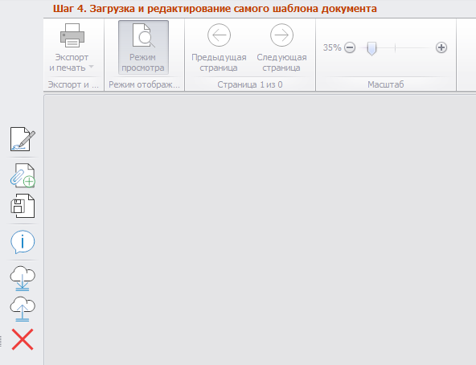 
<i>Рисунок 15. Настройки шага 4</i>

На этом шаге выполняется правка шаблона документа в редакторе. 

В левой части на рис.15 доступно меню работы с шаблонами, описание кнопок которого приведено в табл.2.

<table border="1">
<tr>
    <td align="center"><b>Вид кнопки</b></td>
    <td align="center"><b>Название</b></td>
    <td align="center"><b>Назначение</b></td>
</tr>
<tr>
    <td align="center">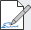</td>
    <td>Открыть для редактирования</td>
    <td>Шаблон будет открыт для редактирования в отдельном окне тестового редактора. После внесения изменения нужно нажать «Сохранить изменения» () </td>
</tr>
<tr>
    <td align="center"></td>
    <td>Загрузить шаблон из файла</td>
    <td>Будет открыто окно проводника Windows. При загрузке текущий шаблон документа будет заменен</td>
</tr>
<tr>
    <td align="center"></td>
    <td>Сохранить шаблон документа как…</td>
    <td>Сохраняет шаблон в файл в выбранной папке</td>
</tr>
<tr>
    <td align="center"></td>
    <td>Открыть список переменных</td>
    <td></td>
</tr>
<tr>
    <td align="center"></td>
    <td>Экспортировать все шаблоны в файл</td>
    <td>Выполняется экспорт шаблонов в файл</td>
</tr>
<tr>
    <td align="center"></td>
    <td>Импортировать все шаблоны из файла</td>
    <td>Выполняется импорт шаблонов из файла</td>
</tr>
<tr>
    <td align="center"></td>
    <td>Удалить все шаблоны из базы</td>
    <td>Удаляет все шаблоны документов</td>
</tr>
</table>

<i>Таблица 2. Назначение кнопок меню работы с шаблонами</i>

При открытии шаблона он также будет доступен в поле шага 4 (рис.16).

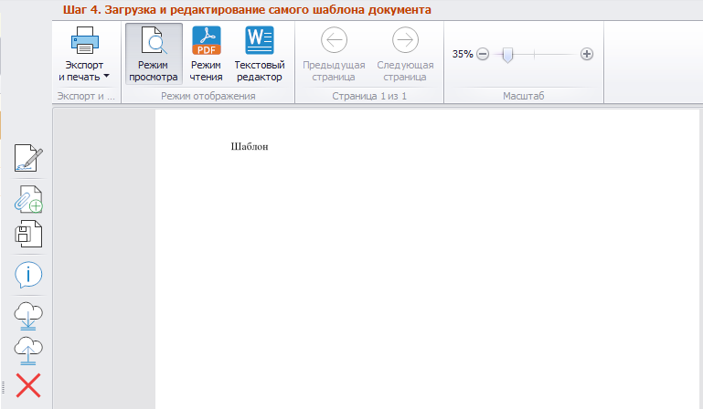 
<i>Рисунок 16. Шаблон документа в поле шага 4</i>

 
При этом в верхней части поля станет доступно изменение режима (режим просмотра, режим чтения, текстовый редактор). При выборе режима текстового редактора шаблон можно редактировать прямо в поле шага 4 (рис.17).

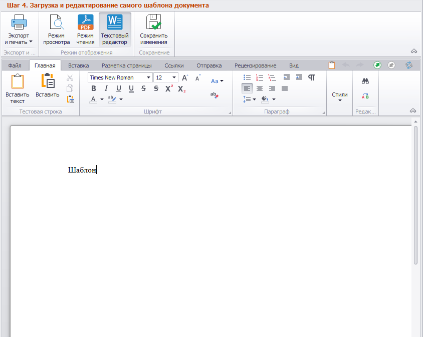 
<i>Рисунок 17. Редактирование шаблона в поле шага 4 (режим «Тестовый редактор»)</i>

 
Здесь же, слева от кнопок переключения режима, расположена кнопка «Экспорт и печать», позволяющая выбрать формат, в который будет экспортирован шаблон, а также перейти в окно предварительного просмотра (рис.18).

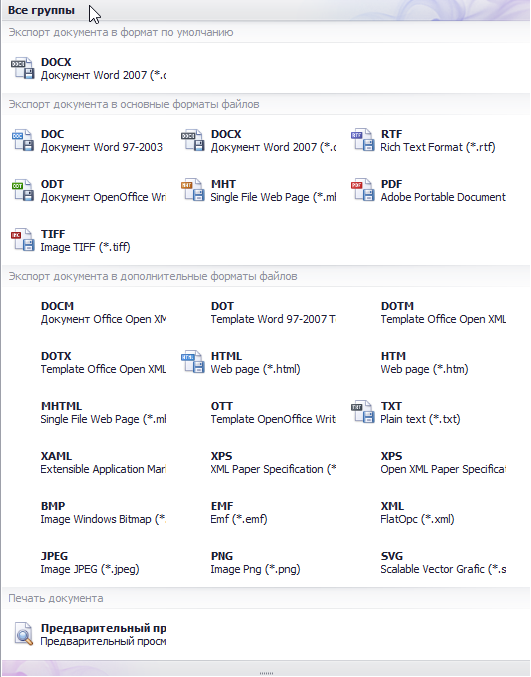 
<i>Рисунок 18. Выбор формата экспорта шаблона, предварительный просмотр</i>

Для сохранения отредактированного шаблона нужно нажать соответствующую кнопку () в поле шага 4.

Для сохранения всех изменений, сделанных в форме настройки шаблонов, нужно нажать кнопку «Сохранить изменения» () в меню формы.

## Пример использования переменных для печати в пресетах

Переменные для печати (ПдП) позволяют ссылаться на поля пресета. При выводе на печать в этом случае вместо указанных ссылок будут отображены значения полей, на которые они ссылаются. Ниже приведен пример работы с ПдП.

Ссылка на ПдП в пресетах имеет вид:

>%HRSN1_(177)(1)(2)(21,11,35)}

где: 

>%HRSN1 – указатель начала ссылки. 
>177 – идентификатор пресета. 
>1 – идентификатор строки пресета. 
>2 – идентификатор колонки пресета. 
>21 – формат вывода (в данном случае «Горизонтальная таблица как строка»). 
>11 – форма символа, разделяющего ячейки. 
>35 – формат символа, разделяющего строки.
  
В качестве примера добавим в шаблон Акта итоговой проверки следующую ссылку:

%HRSN1_(Организация)(1)(1,2)(21,11,35)}

Здесь указана ссылка на пресет с идентификатором «Организация», идентификатор строки 1, идентификаторв колонок 1 и 2 (рис.19).

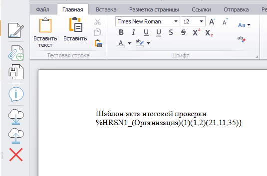 
<i>Рисунок 19. Ссылка на пресет в шаблоне</i>

 
При печати Акта итоговой проверки по этому шаблону получим следующий результат, показанный на рис.20.

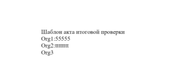 
<i>Рисунок 20. Результат печати</i>

В примере из пресета взяты полные и сокращенные наименования организации. При этом для третьей организации (Org3) сокращенное наименование не указано, т.к. не заполнено в данных об этой организации.