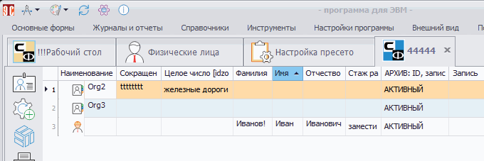

# Показать/скрыть архивные (удаленные) записи

Рассмотрим этот пункт на примере организаций. Перейдем в основную форму «Организации», в списке организаций выберем «Организация 1», нажмем кнопку «Информация о текущей записи» (), в открывшемся окне сменим статус на «Архив» (рис.1) и закроем окно, нажав .

 
<i>Рисунок 1. Смена статуса</i>

После обновления формы организация исчезнет из панели поиска. Однако она будет видна в списке, если включить показ архивных записей. Для этого необходимо в левом верхнем углу окна Программы нажать кнопку  и выбрать соответствующий пункт (рис.2).

 
<i>Рисунок 2. Включение показа архивных записей</i>

 
Чтобы скрыть архивные записи, нужно повторно нажать на тот же пункт меню.

С удаленными записями ситуация аналогична. Если удалить организацию, а после включить отображение удаленных записей, она снова появится в панели поиска. Для включения/отключения показа удаленных записей используется соответствующий пункт в меню, показанном на рис.2.

Описанные действия применимы и к другим объектам Программы: физическим лицам, объектам, профилям пользователей, группам прав доступа и т.д.

Возможность показать/скрыть архивные (удаленные) записи используется и в пресетах. В БД отметка о том, что запись находится в архиве, содержится в поле workstate. Сведения о том, что запись удалена, находятся в поле ideletestate. На рис.3 эти поля показаны в виде колонок пресета.

 
<i>Рисунок 3. Поля workstate и ideletestate в настройках пресета</i>

В настройках пресета также нужно добавить фильтры (рис.4) и действия (рис.5).

 
<i>Рисунок 4. Фильтры по статусам в настройках пресета</i>

 
<i>Рисунок 5. Действия по смене статуса в настройках пресета</i>

 
Сначала выполним пресет без включенных фильтров (рис.6). Отобразятся организации с любыми статусами.

 
<i>Рисунок 6. Результат выполнения пресета без фильтров</i>

Теперь включим фильтр «Только активные записи организаций» (рис.7).

 
<i>Рисунок 7. Включение фильтра в настройках пресета</i>

После сохранения изменений и выполнения пресета будут показаны организации только со статусом «Активный» (рис.8).

 
<i>Рисунок 8. Результат выполнения пресета с фильтром</i>

 
Если задействовать фильтр, показанный на рис.7 в строке 7, то отображение/скрытие архивных записей будет зависеть от состояния переключателя показа/скрытия архивных записей, как было описано выше (рис.9).

 
<i>Рисунок 9. Показать/скрыть архивные записи в пресете</i>

Аналогичным образом названные поля БД можно использовать и для настройки пресетов, отвечающих за другие другие объекты Программы.