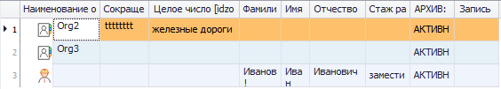

# Показать/скрыть архивные (удаленные) записи

Рассмотрим этот пункт на примере организаций. Перейдем в основную форму «Организации», в списке организаций выберем «Организация 1», нажмем кнопку «Информация о текущей записи» (), в открывшемся окне сменим статус на «Архив» и закроем окно, нажав .

После обновления формы организация исчезнет из панели поиска. Однако она будет видна в списке, если включить показ архивных записей. Для этого необходимо в левом верхнем углу окна Программы нажать кнопку  и выбрать соответствующий пункт.

 
Чтобы скрыть архивные записи, нужно повторно нажать на тот же пункт меню.

С удаленными записями ситуация аналогична. Если удалить организацию, а после включить отображение удаленных записей, она снова появится в панели поиска. Для включения/отключения показа удаленных записей используется соответствующий пункт в меню, показанном на рисунке выше.

Описанные действия применимы и к другим объектам Программы: физическим лицам, объектам, профилям пользователей, группам прав доступа и т.д.

Возможность показать/скрыть архивные (удаленные) записи используется и в пресетах. В БД отметка о том, что запись находится в архиве, содержится в поле workstate. Сведения о том, что запись удалена, находятся в поле: ideletestate. Вот так они выглядят в виде колонок пресета.

В настройках пресета также нужно добавить фильтры и действия.

 
 
Сначала выполним пресет без включенных фильтров. Отобразятся организации с любыми статусами.
 
 

Теперь включим фильтр «Только активные записи организаций».

 

После сохранения изменений и выполнения пресета будут показаны организации только со статусом «Активный».

 
 
Если задействовать фильтр, показанный на рисунке выше в строке 7, то отображение/скрытие архивных записей будет зависеть от состояния переключателя показа/скрытия архивных записей, как было описано выше.

Аналогичным образом названные поля БД можно использовать и для настройки пресетов, отвечающих за другие другие объекты Программы.