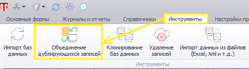
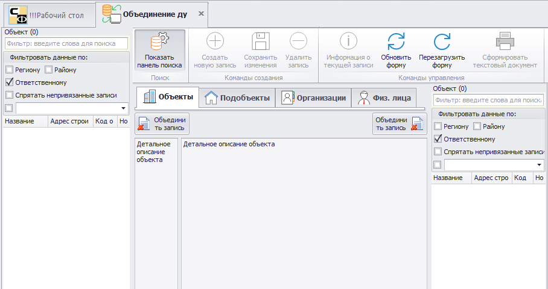
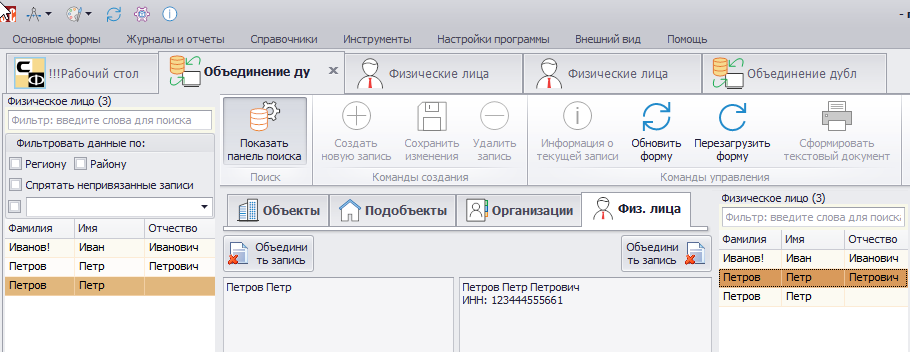
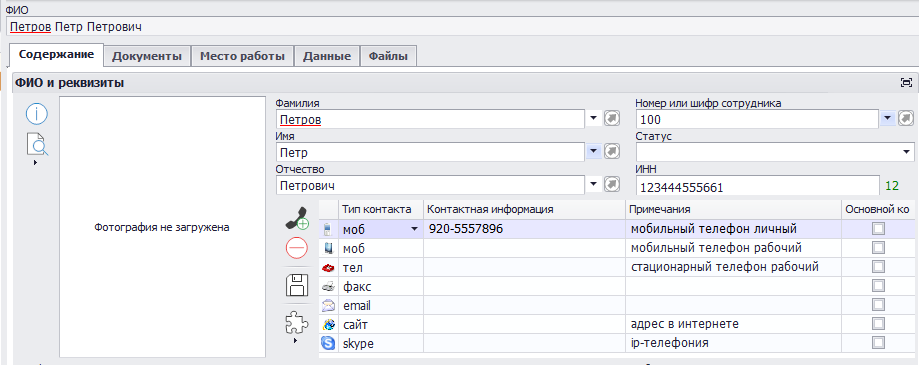

# Объединение дублирующих записей

Для перехода к управлению объединением дублирующихся записей (ДЗ) в главном меню Программы нужно перейти на вкладку «Инструменты» и выбрать соответствующий пункт (рис.1).

 
<i>Рисунок 1. Переход к работе по объединению ДЗ</i>

Форма работы с ДЗ показана на рис.2.

 
<i>Рисунок 2. Форма работы с ДЗ</i>

 
Объедение ДЗ доступно для объектов, подобъектов (в настроящее время практически не используется), организаций и физических лиц. Необходимость объединения может возникнуть, если разные пользователи внесли в Программу информацию об одном и том же объекте, организации или физическом лице, и какое-то время эти записи велись и обновлялись параллельно. В таком случае операция объединения позволит избежать ручной сверки записей, а также позволит исключить потерю данных, в том числе приложенных файлов.

При этом стоит учитывать, что если информация в каком-то поле объединяемых записей не совпадает, то после объединения останется лишь одно значение - то, которое было у «принимающей» записи. Значение «принимаемой» записи станет недоступно, так как после объединения сама эта запись будет удалена. 

Рассмотрим объединение ДЗ рассмотри на пример физических лиц. В Программе имеются записи о физических лица «Петров Петр» и «Петров Петр Петрович» (рис.3).

 
<i>Рисунок 3. Объединяемые записи</i>

 
В центре формы видна разница между записями: для правой указан ИНН. Кроме того, в записи «Петров Петр» указан мобильный телефон, а в записи «Петров Петр Петрович» это поле пустое. При нажатии левой кнопки «Объединить запись» () данные из левой записи переписываются в правую, левая при этом удаляется. При нажатии правой кнопки данные с правой стороны будет перенесены в левую запись, правая будет удалена.

Нажмем левую кнопку, и данные из «Петров Петр» будут переписаны в «Петров Петр Петрович», а сама запись «Петров Петр» после выполнения операции будет удалена. Теперь перейдем к перечню физических лиц, выделим «Петров Петр Петрович» и посмотрим результат объединения (рис.4).

 
<i>Рисунок 4. Результат операции объединения ДЗ</i>

 
Как видим, в записи сохранились все имевшиеся в ней данные, а также добавился мобильный телефон из записи, с которой было выполнено объединение.

