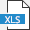

# Справочник видов/типов для всех записей

## Общее описание

Для перехода к настройкам справочника видов/типов для всех записей (СВЗ) в главном меню Программы нужно перейти на вкладку «Справочники» и выбрать соответствующий пункт.

 
Откроется форма, показанная на рисунке ниже. 

 
Форма СВЗ содержит коллекции данных, в которые собраны все имеющиеся в Программе виды/типы записей. Под записью в данном случае имеется в виду элемент (документ, организация, физическое лицо и т.д.) или группа элементов коллекции данных (например, группа документов «Внутренняя корреспонденция» и т.п.).

По умолчанию каждая КД содержит справочник видов/типов, который можно просмотреть, нажав ПКМ на соответствующей КД. Список записей можно развернуть/свернуть.

В верхней части формы расположено меню, описание которого приведено ниже.

Подменю, вызываемое кнопкой  («Управляющие команды»), открывает доступ к командам «Добавить новый тип документа» () и «Сохранить изменения» (). Сохранение изменений также доступно по нажатию комбинации Ctrl + S.
 

При нажатии кнопки  («Настройка вида») открывается подменю настройки внешнего вида формы СВЗ, а также экспорта видов/типов КД в выбранный формат файла и/или отправки их на печать.

 
Описание подменю «Настройка вида»

<table border="1">
<tr>
    <td align="center"><b>Вид кнопки</b></td>
    <td align="center"><b>Название</b></td>
    <td align="center"><b>Назначение</b></td>
</tr>
<tr>
    <td colspan="3" align="center"><b>Настройка вида</b></td>
</tr>
<tr>
    <td></td>
    <td>Автоподбор высоты строк</td>
    <td>Автоматически настраивает высоту строк</td>
</tr>
<tr>
    <td></td>
    <td>Автоподбор ширины колонок</td>
    <td>Автоматически настраивает ширину колонок в таблице</td>
</tr>
<tr>
    <td></td>
    <td>Раскрыть все</td>
    <td>Разворачивает список видов/типов</td>
</tr>
<tr>
    <td></td>
    <td>Свернуть все</td>
    <td>Сворачивает список видов/типов</td>
</tr>
<tr>
    <td></td>
    <td>Обновить</td>
    <td>Обновляет форму</td>
</tr>
<tr>
    <td colspan="3" align="center"><b>Экспорт и печать</b> ()</td>
</tr>
<tr>
    <td></td>
    <td>Экспорт в XLS</td>
    <td>Экспорт с сохранением в формате XLS</td>
</tr>
<tr>
    <td></td>
    <td>Экспорт в XLSX</td>
    <td>Экспорт с сохранением в формате XLSX</td>
</tr>
<tr>
    <td></td>
    <td>Экспорт в PDF</td>
    <td>Экспорт с сохранением в формате PDF</td>
</tr>
<tr>
    <td></td>
    <td>Экспорт в HTML</td>
    <td>Экспорт с сохранением в формате HTML</td>
</tr>
<tr>
    <td></td>
    <td>Экспорт в RTF</td>
    <td>Экспорт с сохранением в формате RTF</td>
</tr>
<tr>
    <td></td>
    <td>Экспорт в Text</td>
    <td>Экспорт с сохранением в формате Text</td>
</tr>
<tr>
    <td></td>
    <td>Расширенный экспорт</td>
    <td>Открывает настройки расширенного экспорта</td>
</tr>
<tr>
    <td></td>
    <td>Печать</td>
    <td>Отправляет на печать</td>
</tr>
</table>

При выборе коллекции данных «Документ» становится доступно подменю, показанное на рисунке ниже.

 
Если опция «Показать типы документов» () включена (по умолчанию включена), то в списке записей будут отображаться типы документов, входящие в группы. Если кнопке неактивна, в списке будут отображены только группы, входящие в них документы будут не видны.

Кнопка «Показать количество шаблонов для печати по каждому виду документа» () показывает/скрывает данные о количестве шаблонов. Если кнопка активна, данные отображаются в виде двух дополнительных столбцов:

- Количество шаблонов для печати в банке данных.
- Количество шаблонов для печати, созданных пользователем.

Столбцы «Вид записи», «Тип записи константа» и «Тип записи пользователя» содержат идентификаторы видов/типов записей и групп записей. Используя эти идентификаторы, можно ссылаться на соответствующие записи и группы записей.
Столбец «Вид записи» содержит идентификатор группы записей. Например, на рисунке ниже видно, что все группа «Технические условия» имеет идентификатор 103.

Столбец «Тип записи константа» может содержать идентификатор группы записей или записи, относящейся к конкретному виду/типу. Так, если развернуть подгруппу «Временные технические условия», то можно увидеть, что столбец содержит уникальный идентификатор для всех временных технических условий (31610), а также идентификаторы для записей конкретных документов, входящих в данную подгруппу:

 
В примере выше столбец «Тип записи пользователя» везде имеет значение «0». Ненулевое значение он принимает для записей, создаваемых пользователем. Ниже показан созданный новый тип временных технических условий, имеющий в этом столбце ненулевое значение.

Столбцы, содержащие идентификаторы, указывают на место хранения записи в таблице БД. Так, «Вид записи» соответствует полю paper_type, а «Тип записи константа» и «Тип записи пользователя» полям paper_isubtypec и paper_isubtypeu соответственно.

>ВАЖНО! Идентификаторы в разных БД для одних и тех же записей будут отличаться. Их нельзя использовать для переноса объектов (элементов) из базы в базу.

## Пример использования справочников видов/типов в пресетах

В качестве примера использования идентификаторов из СВЗ в пресетах рассмотрим наложение фильтра по определенному виду документа. Для этого в настройках пресета во вкладке «Фильтры» добавим вид «Заявление на выдачу дубликата разрешения на строительство» и включим этот фильтр.

 
В результате из БД будут загружаться только документы соответствующего вида, то есть поля идентификаторов которых (paper_type, paper_isubtypec, paper_isubtypeu) в БД соответствуют указанному виду.  

Другим примером использования идентификаторов в пресете является добавление организации определенного типа. Для этого в настройках пресета во вкладке «Действия» добавим действие «Добавить новую организацию», в свойствах этого действия выставим флаг () «Вид/тип добавляемой записи» и выберем «Новый тип коммерческих организаций: уровень 1».

Удалить по умолчанию имеющиеся в БД типы записей невозможно. Операция удаления доступна только для пользовательских типов записей. Для этого в меню «Управляющие команды», выделив нужную запись, требуется выбрать пункт «Удалить выбранный тип документа» или нажать ПКМ на записи и выбрать тот же пункт.

 
В открывшемся окне необходимо подтвердить удаление, нажав «Да».

Меню КД «Сотрудник организации» (содержит список должностей организаций) и «Объект: подрядная организация» (содержит данные о функциях (направлениях деятельности) подрядных организаций) имеют отличия.

Кнопка «Добавить новую запись» () создает запись, которой, нажав ЛКМ, можно присвоить нужное значение. Кнопка «Сохранить изменения» () записывает сделанные изменения в БД. Кнопка «Удалить запись» () выполняется указанное действие для выбранной записи. Меню  («Настройка вида») описано выше.

Записи коллекций данных «Сотрудник организации» и «Объект: подрядная организация» не имеют идентификаторов и используются как вспомогательные типовые элементы.

