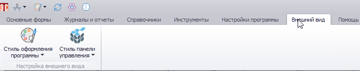
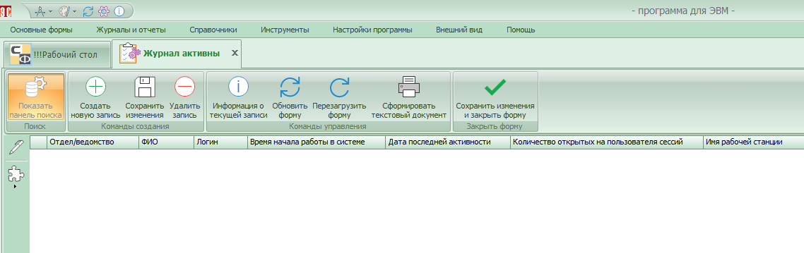
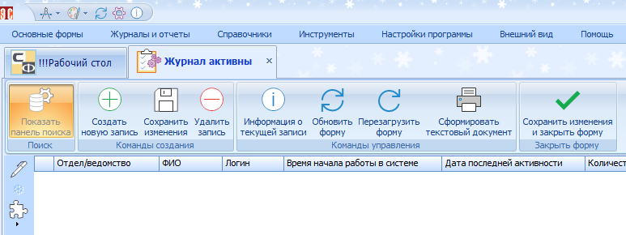
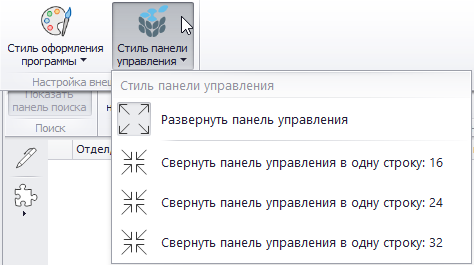
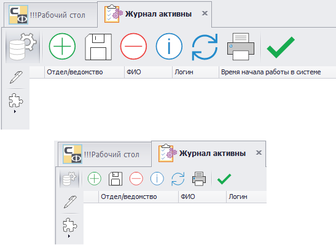
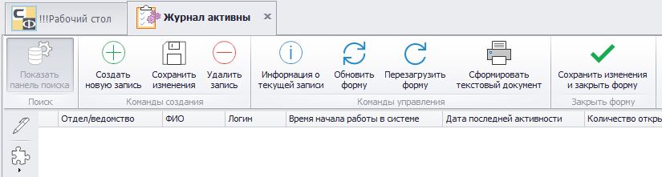

# Стиль управления

Настройка стиля управления предполагает изменение внешнего вида Программы. Для этого нужно перейти на вкладку «Внешний вид», на которой расположено две кнопки «Стиль оформления Программы» и «Стиль панели управления».

При нажатии «Стиль оформления Программы» откроется окно, в котором можно выбрать обложку, отличную от установленной по умолчанию. При выборе обложки будет изменено всё оформление Программы. Примеры приведены на рисунках ниже.

 

«Стиль панели управления» отвечает за параметры верхней панели Программы, влияющие на ее (панели) ширину.

 

Ниже показаны различные варианты отображения панели.

 

Опция «Развернуть панель управления» возвращает вид панели к изначальному, на котором видны подписи к кнопкам.

 

