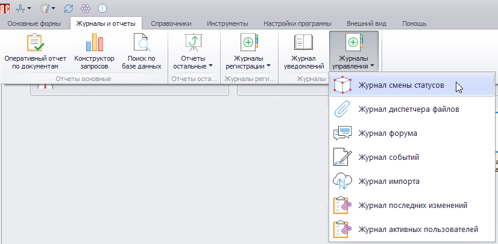
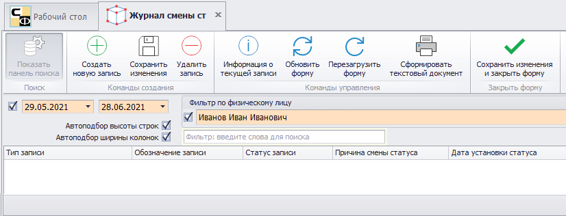
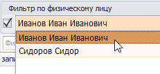
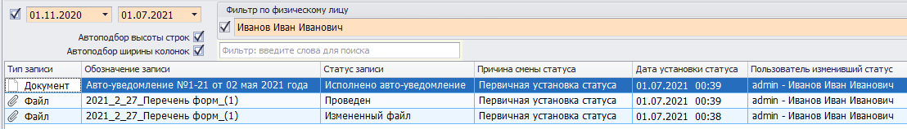
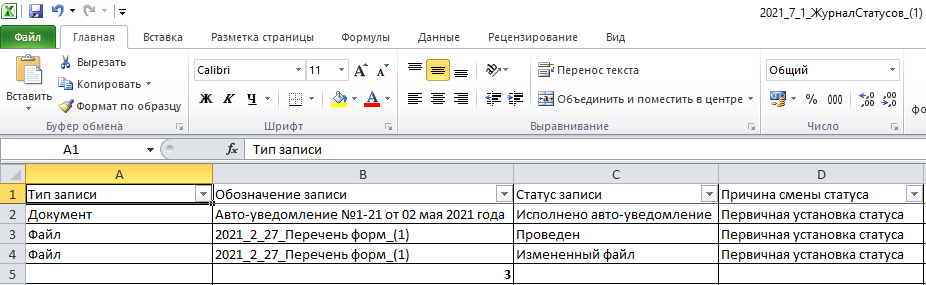

# Журнал смены статусов

В журнал смены статусов (ЖСС) вносится информация о смене статуса файлов, документов, файлов, объектов и пр., т.е. о внесении изменений в поле «Статус».

Для перехода в ЖСС нужно в главном меню открыть вкладку «Журналы и отчеты» и в раскрывающемся списке «Журналы управления» выбрать нужный пункт.

 
Откроется следующая форма:

В верхней части формы ЖСС расположены фильтры, которые можно применить к записям ЖСС. Чтобы вывести записи за определенный промежуток времени, нужно выставить флаг () в левой части формы и выбрать начальную и конечную дату интервала.

Для применения фильтра по физическому лицу необходимо также выставить соответствующий флаг и в выпадающем списке выбрать физлицо.

Для удобства отображения записей можно установить автоматическую настройку высоты строк и ширины колонок, выставив соответствующие флаги.

На рисунке ниже приведен пример записей в ЖСС.

Меню, расположенное в верхней части формы, здесь не применяется. Исключение составляет кнопки «Сохранить изменения и закрыть форму» () и «Сформировать текстовый документа» (). При нажатии последней будет сформирован файл формата Excel, содержащий записи ЖСС.

