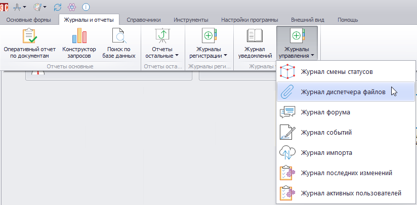
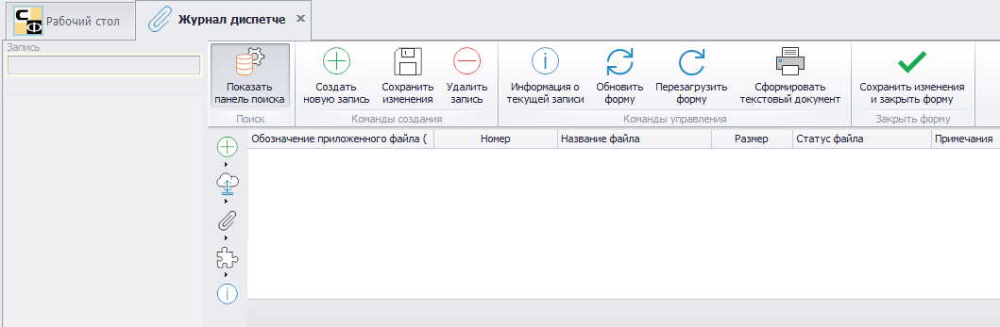
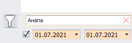
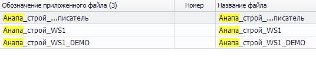

# Журнал диспетчера файлов

В журнале диспетчера файлов (ЖДФ) содержится информация обо всех файлах, загруженных в Программу.

Для перехода к ЖДФ нужно в главном меню открыть вкладку «Журналы и отчеты» и в раскрывающемся списке «Журналы управления» выбрать нужный пункт.

Откроется следующая форма:

Меню, расположенное в верхней части формы, здесь не применяется. Исключение составляет кнопка «Сохранить изменения и закрыть форму» ().

В левой части формы расположено меню команд работы с файлами (кнопки , , , ), а также набор команд настройки внешнего вида (кнопка ).

Описание наборов кнопок работы с файлами приведено в таблице.

<table border="1">
<tr>
    <td align="center"><b>Вид кнопки</b></td>
    <td align="center"><b>Название</b></td>
    <td align="center"><b>Назначение</b></td>
</tr>
<tr>
    <td align="center" colspan="3"><b>Набор «Добавление файлов» (кнопка )</b></td>
</tr>
<tr>
    <td></td>
    <td>Добавить файл напрямую со сканера</td>
    <td></td>
</tr>
<tr>
    <td></td>
    <td>Добавить каталог с файлами (либо перетащите каталог в поле)</td>
    <td>Позволяет добавить все файлы, содержащиеся в выбранном или перетаскиваемом в поле каталоге</td>
</tr>
<tr>
    <td></td>
    <td>Добавить новый каталог для файлов</td>
    <td></td>
</tr>
<tr>
    <td align="center" colspan="3"><b>Набор «Импорт файлов» (кнопка )</b></td>
</tr>
<tr>
    <td></td>
    <td>Копировать выбранный файл в буфер обмена</td>
    <td></td>
</tr>
<tr>
    <td></td>
    <td>Добавить файл из буфера обмена</td>
    <td></td>
</tr>
<tr>
    <td></td>
    <td>Копировать внутреннюю ссылку на выбранные файлы</td>
    <td rowspan="2">Позволяют вместо повторного добавления уже загруженного файла использовать в уведомлениях ссылки на него. Для этого надо скопировать ссылку, перейти в нужное уведомление и вставить ссылку</td>
</tr>
<tr>
    <td></td>
    <td>Вставить файлы по скопированной внутренней ссылке</td>
</tr>
<tr>
    <td align="center" colspan="3"><b>Набор «Управление файлами» (кнопка )</b></td>
</tr>
<tr>
    <td></td>
    <td>Показать панель расширенного просмотра файла</td>
    <td>Здесь же отображается панель с расширенными возможностями просмотра</td>
</tr>
<tr>
    <td></td>
    <td>Открыть файл для просмотра во встроенном редакторе</td>
    <td></td>
</tr>
<tr>
    <td></td>
    <td>Открыть файлы для просмотра во внешнем приложении</td>
    <td></td>
</tr>
<tr>
    <td></td>
    <td>Открыть форму, к которой прикреплен файл</td>
    <td></td>
</tr>
<tr>
    <td></td>
    <td>Распечатать выбранные файлы с предпросмотром</td>
    <td></td>
</tr>
<tr>
    <td></td>
    <td>Распечатать все файлы с предпросмотром</td>
    <td></td>
</tr>
<tr>
    <td></td>
    <td>Галерея файлов</td>
    <td rowspan="4">Задают вид отображения файлов в поле (по аналогии с отображением файлов в каталогах ОС Windows)</td>
</tr>
<tr>
    <td></td>
    <td>Дерево файлов</td>
</tr>
<tr>
    <td></td>
    <td>Табличный вид простой</td>
</tr>
<tr>
    <td></td>
    <td>Табличный вид расширенный</td>
</tr>
<tr>
    <td></td>
    <td>Сохранить все изменения</td>
    <td></td>
</tr>
<tr>
    <td></td>
    <td>Сохранить выбранные файлы на диск как…</td>
    <td>Откроется диалоговое окно с выбором места сохранения выбранных файлов</td>
</tr>
<tr>
    <td></td>
    <td>Сохранить выбранную директорию на диска как…</td>
    <td></td>
</tr>
<tr>
    <td></td>
    <td>Объединить выбранные файлы в один файл формата Adobe PDF</td>
    <td></td>
</tr>
<tr>
    <td></td>
    <td>Удалить выбранные файлы</td>
    <td></td>
</tr>
</table>

Получить доступ к операциям с файлами и настройкам внешнего вида также можно через контекстное меню, вызываемое нажатием ПКМ в поле формы ЖДС.

Описание функций по настройке внешнего вида.

<table border="1">
<tr>
    <td align="center"><b>Вид кнопки</b></td>
    <td align="center"><b>Название</b></td>
    <td align="center"><b>Назначение</b></td>
</tr>
<tr>
    <td colspan="3" align="center"><b>Настройка вида</b></td>
</tr>
<tr>
    <td></td>
    <td>Показывать все колонки</td>
    <td></td>
</tr>
<tr>
    <td></td>
    <td>Автоподбор высоты строк</td>
    <td>Автоматически настраивает высоту строк в таблице</td>
</tr>
<tr>
    <td></td>
    <td>Автоподбор ширины колонок</td>
    <td>Автоматически настраивает ширину колонок в таблице</td>
</tr>
<tr>
    <td></td>
    <td>Раскрыть все</td>
    <td>Разворачивает список видов/типов</td>
</tr>
<tr>
    <td></td>
    <td>Свернуть все</td>
    <td>Сворачивает список видов/типов</td>
</tr>
<tr>
    <td></td>
    <td>Обновить</td>
    <td>Обновляет форму</td>
</tr>
<tr>
    <td colspan="3" align="center"><b>Экспорт и печать</b> ()</td>
</tr>
<tr>
    <td></td>
    <td>Экспорт в XLS</td>
    <td>Экспорт с сохранением в формате XLS</td>
</tr>
<tr>
    <td></td>
    <td>Экспорт в XLSX</td>
    <td>Экспорт с сохранением в формате XLSX</td>
</tr>
<tr>
    <td></td>
    <td>Экспорт в PDF</td>
    <td>Экспорт с сохранением в формате PDF</td>
</tr>
<tr>
    <td></td>
    <td>Экспорт в HTML</td>
    <td>Экспорт с сохранением в формате HTML</td>
</tr>
<tr>
    <td></td>
    <td>Экспорт в RTF</td>
    <td>Экспорт с сохранением в формате RTF</td>
</tr>
<tr>
    <td></td>
    <td>Экспорт в Text</td>
    <td>Экспорт с сохранением в формате Text</td>
</tr>
<tr>
    <td></td>
    <td>Расширенный экспорт</td>
    <td>Открывает настройки расширенного экспорта</td>
</tr>
<tr>
    <td></td>
    <td>Печать</td>
    <td>Отправляет на печать</td>
</tr>
</table>

В левой нижней части формы расположен фильтр, позволяющий отображать файлы, измененные в указанный период. Также здесь можно ввести текст для поиска. 

В списке останутся файлы, в полях которых будут найдены соответствия введенному тексту, а сами соответствия подсветятся желтым

