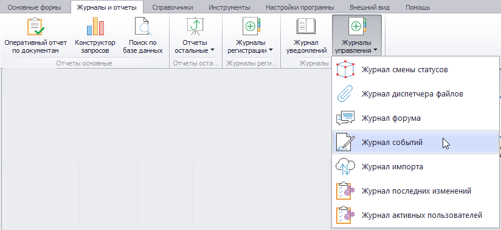
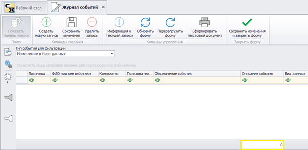
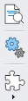
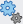
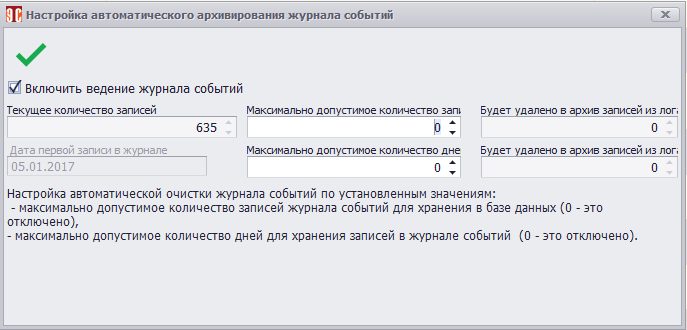
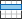
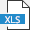
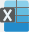
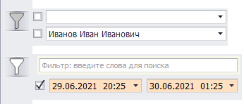
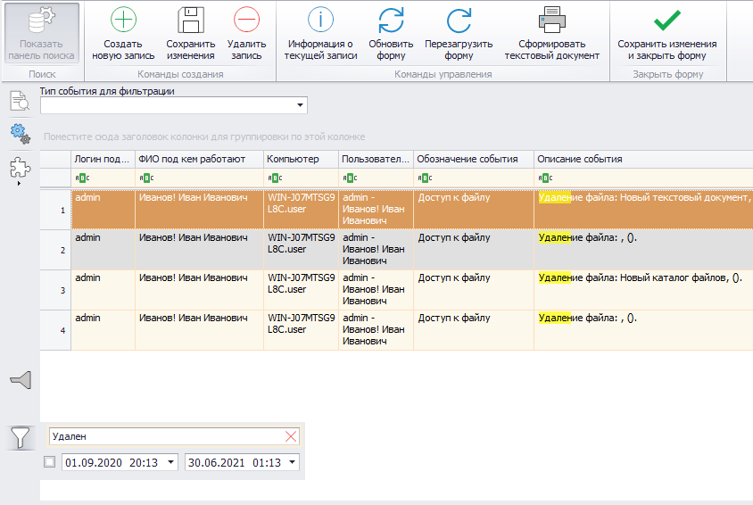

# Журнал событий

В журнале событий (ЖС) содержатся подробные сведения о действиях, выполняемых в Программе.

Для перехода в ЖС нужно в главном меню открыть вкладку «Журналы и отчеты» и в раскрывающемся списке «Журналы управления» выбрать нужный пункт (рис.1).

 
<i>Рисунок 1. Переход к ЖС</i>

Откроется форма, показанная на рис.2.

 
<i>Рисунок 2. Форма ЖС</i>

В поле, выделенном желтым, отображается информация о количестве записей в журнале.

Меню, расположенное в верхней части формы, здесь не применяется. Исключение составляет кнопки «Сохранить изменения и закрыть форму» () и «Сформировать текстовый документа» (). При нажатии последней будет сформирован файл формата Excel, содержащий записи ЖС.

В левой части формы расположено дополнительное меню (рис.3).

 
<i>Рисунок 3. Дополнительное меню формы ЖС</i>

Кнопка «Открыть в отдельной форме» () позволяет открыть формы, связанные с записью в журнале событий. Эта кнопка работает для форм, связанных с записью в журнале. Для таких событий, как «Прямой запрос в базу данных», «Доступ к файлу» и т.д., она не применяется.

Кнопка «Настройка журнала событий» () позволяет включать/выключать ведение журнала событий, а также задать правила очистки журнала. При ее нажатии будет открыто окно, показанное на рис.4.

 
<i>Рисунок 4. Настройка журнала событий</i>

Флаг () позволяет включать/отключать ведение ЖС. Поле «Текущие количество записей» содержит данные о количестве событий в журнале в данный момент. Поле «Дата первой записи» содержит дату самого старого события, имеющегося в журнале.

Поля «Максимально допустимое количество записей журнала для хранения в БД» и «Максимально допустимое количество дней для хранения записей в ЖС» позволяют задать количество записей, которые могут содержаться в журнале, и количество дней, за которое в журнале должны храниться записи. Если в этих полях указан «0», то в ЖС будут храниться записи за все время (автоматическая очистка журнала не производится). При указании количества записей или дней хранения в поле «Будет удалено в архив записей из лога» появится количество событий, записи о которых будут удалены в архив в случае сохранения настроек.

Для сохранения настроек нужно нажать кнопку «Сохранить изменения и закрыть форму» ()

Кнопка «Настройка вида» () дает доступ к набору инструментов для настройки отображения данных в ЖС. Их описание приведено в табл.1.

<table border="1">
<tr>
    <td align="center"><b>Вид кнопки</b></td>
    <td align="center"><b>Название</b></td>
    <td align="center"><b>Назначение</b></td>
</tr>
<tr>
    <td colspan="3" align="center"><b>Настройка вида</b></td>
</tr>
<tr>
    <td align="center"></td>
    <td>Объединить одинаковые ячейки таблицы</td>
    <td>Объединяет одинаковые записи в ЖС. При активации кнопка меняет вид на </td>
</tr>
<tr>
    <td align="center"></td>
    <td>Показывать все колонки</td>
    <td></td>
</tr>
<tr>
    <td align="center"></td>
    <td>Автоподбор высоты строк</td>
    <td>Автоматически настраивает высоту строк в таблице</td>
</tr>
<tr>
    <td align="center"></td>
    <td>Автоподбор ширины колонок</td>
    <td>Автоматически настраивает ширину колонок в таблице</td>
</tr>
<tr>
    <td></td>
    <td>Раскрыть все</td>
    <td>Разворачивает список видов/типов</td>
</tr>
<tr>
    <td></td>
    <td>Свернуть все</td>
    <td>Сворачивает список видов/типов</td>
</tr>
<tr>
    <td align="center"></td>
    <td>Обновить</td>
    <td>Обновляет форму</td>
</tr>
<tr>
    <td colspan="3" align="center"><b>Экспорт и печать</b> ()</td>
</tr>
<tr>
    <td align="center"></td>
    <td>Экспорт в XLS</td>
    <td>Экспорт с сохранением в формате XLS</td>
</tr>
<tr>
    <td align="center"></td>
    <td>Экспорт в XLSX</td>
    <td>Экспорт с сохранением в формате XLSX</td>
</tr>
<tr>
    <td align="center"></td>
    <td>Экспорт в PDF</td>
    <td>Экспорт с сохранением в формате PDF</td>
</tr>
<tr>
    <td align="center"></td>
    <td>Экспорт в HTML</td>
    <td>Экспорт с сохранением в формате HTML</td>
</tr>
<tr>
    <td align="center"></td>
    <td>Экспорт в RTF</td>
    <td>Экспорт с сохранением в формате RTF</td>
</tr>
<tr>
    <td></td>
    <td>Экспорт в Text</td>
    <td>Экспорт с сохранением в формате Text</td>
</tr>
<tr>
    <td align="center"></td>
    <td>Расширенный экспорт</td>
    <td>Открывает настройки расширенного экспорта</td>
</tr>
<tr>
    <td align="center"></td>
    <td>Печать</td>
    <td>Отправляет на печать</td>
</tr>
</table>

<i>Таблица 1. Назначение кнопок меню настройки внешнего вида</i>

В верхней части формы также имеется фильтр, позволяющий выбрать один из следующих типов событий:

- Добавление в БД.
- Изменение в БД.
- Удаление из БД.
- Системный лог.
- Выгрузка на сайт.
- Работа веб- и win-сервисов.
- Авторизация пользователя.
- Запуск процессов, заданий, задач.
- Доступ к файлам.
- Изменение прав доступа у пользователя.
- Веб: добавление в БД.
- Веб: изменение в БД.
- Веб: удаление из БД.
- Веб: системный лог.
- Веб: авторизация пользователя.
- Веб: запуск процессов, заданий, задач.
- Веб: доступ к файлам.
- Веб: изменение прав доступа у пользователя.
- 
В левой нижней части формы ЖС находятся еще два фильтра (рис.5.):

- Фильтр по организации и по сотруднику (кнопка );
- Фильтр по тексту и по временному интервалу (кнопка ).

 
<i>Рисунок 5. Дополнительные фильтры</i>

Фильтры могут применяться к списку событий по одному или совместно. Для фильтрации по организации, сотруднику и временному интервалу требуется выстановить флаг () рядом с нужным фильтром и задат критерий фильтрации (организацию, сотрудника и/или временной интервал).

Для использования текстового фильтра нужно ввести нужный текст в поле. При этом в списке событий останутся только соответствующие запросу, а совпадения будут подсвечены желтым (рис.6).

 
<i>Рисунок 6. Пример результатов работы фильтров событий</i>

