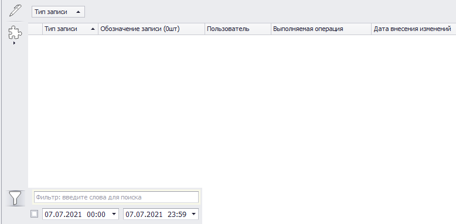
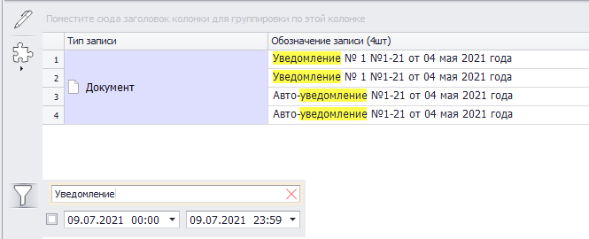

# Журнал последних изменений

В журнале последних изменений (ЖПИ) содержатся сведения обо всех изменения, выполненных в Программе.

Для перехода в ЖПИ нужно в главном меню открыть вкладку «Журналы и отчеты» и в раскрывающемся списке «Журналы управления» выбрать нужный пункт (рис.1).

 
<i>Рисунок 1. Переход к ЖПИ</i>

Откроется форма, показанная на рис.2.

 
<i>Рисунок 2. Форма ЖПИ</i>

Записи в ЖПИ объединены в группы по измененным объектам. Для получения доступа к списку изменений группы его нужно развернуть, нажав  рядом с нужной группой (рис.3).

 
<i>Рисунок 3. Записи в ЖПИ в свернутом и развернутом виде</i>

В журнале приводятся сведения:

- о пользователе, выполнившем изменение;
- об операции, в результате которой произошло изменение;
- о дате и времени внесения изменений.
  
В левой части формы расположена кнопка «Показать текстовый фильтр» (), активирующая фильтр по тексту (рис.4). Если им воспользоваться, в списке записей журнала останутся только те записи, которые содержат введенный текст. Фильтрация по датам в этой форме не применяется.

 
<i>Рисунок 4. Текстовый фильтр формы ЖПИ</i>

 
Пример работы фильтра приведен на рис.5.

 
<i>Рисунок 5. Пример работы фильтра</i>

