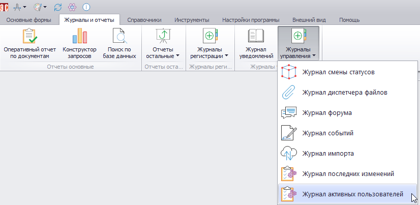
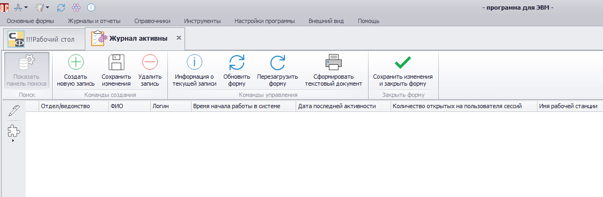
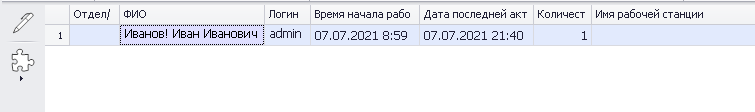

# Журнал активных пользователей

В журнале активных пользователей (ЖАП) администратор Программы может просмотреть сведения о пользователях, которые выполняли действия в Программе в течение последних 15 минут.

Для перехода в ЖАП нужно в главном меню открыть вкладку «Журналы и отчеты» и в раскрывающемся списке «Журналы управления» выбрать нужный пункт (рис.1).

 
<i>Рисунок 1. Переход к ЖАП</i>

Откроется форма, показанная на рис.2.

 
<i>Рисунок 2. Форма ЖАП</i>

 
В этой форме можно получить информацию о ФИО пользователя, его подразделении, а также:

- Логин.
- Время начала работы в системе.
- Дате последней активности.
- Количество открытых на пользователя сессий.
- Имя рабочей станции, с которой работает пользователь.
  
Пример отображения данных в ЖАП приведен на рис.3.

 
<i>Рисунок 3. Пример отображения данных в ЖАП</i>

