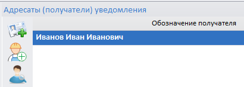
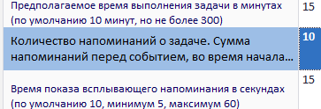

# Установка системы уведомлений

Если в Программе планируется работа с уведомлениями, необходимо дополнительно загрузить архив [«Генератор уведомлений»](../distib/Генератор%20уведомлений.rar) (RAR, 589 КБ). Архив содержит группу пресетов «Генератор уведомлений», справочники, а также свойства кнопок в виде файлов. Ниже приведена подробная инструкция по настройке системы. 

Новая система уведомлений полностью построена с использованием пресетов и является полноценной заменой системы уведомлений, вызываемой из пунктов меню:
- Настройки программы --> Настройка уведомлений;
- Журналы и отчеты --> Журнал уведомлений.

Указанные компоненты системы уведомлений отключены и в последствии будут выведены из Программы.

Далее под «системой уведомлений» понимается новая система уведомлений.

Для загрузки группы пресетов нужно перейти в раздел «Настройка пресетов» и воспользоваться функцией «Добавить группы пресетов из файла» (рис.1). 

 
<i>Рисунок 1. Добавление группы пресетов из файла</i>

 
После завершения операции в списке пресетов будет добавлена группа «Генератор уведомлений» (рис.2).

 
<i>Рисунок 1. Группа пресетов «Генератор уведомлений»</i>

Далее в настройках профилей пользователей нужно перейти на вкладку «Рабочий стол» и добавить 4 формы кнопки, выбрав пресет в качестве формы для них и указав им следующие названия:

- «Ручные уведомления»;
- «Генератор уведомлений»;
- «Журнал уведомлений»;
- «График задач».
  
Указанные кнопки соответствуют компонентам системы уведомлений. В качестве параметра «Пресет, загружаемый при нажатии кнопки» для добавленных кнопок следует указать пресеты из загруженной ранее группы пресетов: «Ручные-уведомления», «Генератор-уведомлений», «ЖурналУведомлений», «ГрафикЗадач». 

Чтобы придать кнопкам аутентичный вид и легко находить их на рабочем столе с помощью функции «Загрузить свойства из файла» (рис.3), поочередно выполним импорт свойств для каждой из созданных кнопок. Для этого нужно выделить кнопку и после нажатия  выбрать соответствующий файл из загруженного архива (рис.4).

 
<i>Рисунок 3. Загрузка свойств из файла</i>

 
<i>Рисунок 4. Файлы свойств кнопок</i>

После загрузки свойств для всех кнопок и сохранения изменений получим картину, показанную на рис.5.

 
<i>Рисунок 5. Кнопки системы уведомлений</i>

Далее рассмотрим компоненты системы уведомлений.

## 1. Структура уведомления

Чтобы лучше понять структуру уведомления, обратимся к журналу уведомлений, в области настройки содержащему записи о вновь создаваемых уведомлениях (рис.6). 

 
<i>Рисунок 6. Запись уведомления в области настройки</i>

В журнале, доступном в форме ручных уведомлений, при нажатии соответствующей кнопки видна структура уведомления (рис.7). 

 
<i>Рисунок 7. Структура уведомлений в журнале формы РУ</i>

Строка «Заголовок № 1» является общим заданием, связанным с генератором уведомлений, в котором указывается, когда начать генерацию уведомлений.

Следующая строка «Нажмите ссылку» представляет собой задачу, которая генерируется.

По каждой задаче генерируется напоминание, форма которого задается настройками. В примере на рис.7 это выдача всплывающего уведомления. Также это может быть отправка на электронную почту и/или создание диалогового окна уведомления.

В соответствии со структурой уведомлений в журнале можно посмотреть, сколько уведомлений было сгенерировано для пользователя в рамках одной задачи (рис.8).

 
<i>Рисунок 8. Все сгенерированные уведомления пользователя по задаче</i>

В столбце «Ошибки» приводится информация о произошедших сбоях, например, проблеме с отправкой уведомления на электронную почту.

## 2. Ручные уведомления

### 2.1. Общее сведения, описание интерфейса и параметров 

Ручные уведомления являются простым типом уведомлений.

При нажатии кнопки «Ручные уведомления» (рис.9) после выполнения пресета будет открыта форма, показанная на рис.10.

 
<i>Рисунок 9. Кнопка «Ручные уведомления» на рабочем столе</i>

 

 
<i>Рисунок 10. Форма настройки РУ</i>

Для наглядности на рис.11-13 показаны области формы настройки ручных уведомлений, на рис.10 выделенные цветом:

- область управления;
- область параметров генератора уведомлений;
- область расширенных настроек.

 
<i>Рисунок 11. Область управления</i>

 

 
<i>Рисунок 12. Область параметров генератора</i>

 

 
<i>Рисунок 13. Область расширенных настроек</i>

 
Область управления (рис.11) в правой верхней части содержит кнопку «Журнал», при нажатии на которую вместо областей параметров генератора уведомлений и расширенных настроек будет показана область журнала (рис.14). При этом форма настройки ручных уведомлений примет вид, показанный на рис.15.

 
<i>Рисунок 14. Область журнала</i>

 

 
<i>Рисунок 15. Форма настройки ручных уведомлений с областью журнала</i>

В табл.1 приведено описание меню области управления ручных уведомлений.

<table border="1">
<tr>
    <td align="center"><b>Вид кнопки</b></td>
    <td align="center"><b>Название</b></td>
    <td align="center"><b>Назначение</b></td>
</tr>
<tr>
    <td align="center"></td>
    <td>Добавить новое уведомление</td>
    <td>Создает новое ручное уведомление в области уведомлений</td>
</tr>
<tr>
    <td align="center"></td>
    <td>Запустить уведомление</td>
    <td>После запуска уведомление будет отображаться в соответствии с расписанием и другими настройками</td>
</tr>
<tr>
    <td align="center"></td>
    <td>Сохранить внесенные изменения</td>
    <td>Записывает внесенные в настройки уведомлений изменения в БД</td>
</tr>
<tr>
    <td align="center"></td>
    <td>Поместить выбранные записи в удаленные</td>
    <td>Присваивает выбранным уведомлениям статус удаленных. Если отображение удаленных записей отключено, уведомления пропадают из области управления. Для их отображения нужно включать показ удаленных записей. Записи со статусом удаленных могут быть восстановлены администратором Программы</td>
</tr>
<tr>
    <td align="center"></td>
    <td>Удалить выбранные записи из базы данных</td>
    <td>Удаляет выбранные уведомления из БД. Их восстановление невозможно</td>
</tr>
</table>

<i>Таблица 1. Описание меню области управления</i>

В верхней части области управления расположены фильтры. Текстовый фильтр позволяет выполнять поиск по названию уведомления, а также по дате и времени начала генерации уведомлений. Фильтр по дате позволяет задать временной интервал,  в пределах которого будет осуществляться поиск. Сверка значений осуществляется по дате и времени начала генерации уведомлений.

Область расширенных настроек содержит шесть групп опций, описание которых приведено в табл.2.

<table border="1">
<tr>
    <td align="center"><b>Группа опций</b></td>
    <td align="center"><b>Описание</b></td>
</tr>
<tr>
    <td align="center">Адресаты (получатели) уведомления</td>
    <td>С помощью данной опции можно задать адресатов, которым будет направляться уведомление. В качестве адресатов могут быть пользователи Программы, физлицо. В дальнейшем в качестве получателей можно будет выбирать бизнес-роли, группы прав доступа и профили пользователей. Сейчас это можно сделать вручную. Процесс добавления в качестве получателей бизнес роли, группы прав доступа и профиля пользователей описан в разделе 6.3
</tr>
<tr>
    <td align="center">Открывать форму при нажатии уведомления</td>
    <td>Позволяет указать пресет или запись, которые откроются при нажатии уведомления</td>
</tr>
<tr>
    <td align="center">Напоминать до начала уведомления за указанный период времени</td>
    <td>Очень часто уведомления используются для постановки задач. Данная опция позволяет напомнить о предстоящей задаче за указанный период до начале выполнения</td>
</tr>
<tr>
    <td align="center">Напоминать после начала уведомления через указанный период времени</td>
    <td>Данная опция формирует напоминания о об активных (невыполненных) задачах</td>
</tr>
<tr>
    <td align="center">Email на которые отправится уведомление, если установлен флаг SendEmail</td>
    <td>Позволяет указать адреса электронной почты, на которые будет направляться уведомление</td>
</tr>
<tr>
    <td align="center">Условия активности. Пока любое из условий выполняется как True либо нет условий, напоминание будет активным, но в заданный срок действия</td>
    <td>Позволяет задать различные условия, при невыполнении которых работа уведомления останавливается. Описание данной группы опций приведено в разделе 6.2</td>
</tr>
</table>

<i>Таблица 2. Описание групп опций области расширенных настроек</i>

В табл.3 приведено описание группы опций «Адресаты (получатели) уведомления».

<table border="1">
<tr>
    <td align="center"><b>Вид кнопки</b></td>
    <td align="center"><b>Название</b></td>
    <td align="center"><b>Назначение</b></td>
</tr>
<tr>
    <td align="center"></td>
    <td>Добавить связь с пользователем</td>
    <td>Позволяет выбрать пользователя Программы в качестве получателя уведомления</td>
</tr>
<tr>
    <td align="center"></td>
    <td>Поиск организации / физлица по базе данных</td>
    <td>Позволяет выбрать организации и отдельных сотрудников в качестве получателей уведомлений. С помощью кнопки можно вручную добавить адресатами уведомлений бизнес-роли, группы прав доступа и профили пользователей. Как это сделать, описано в разделе 6.3</td>
</tr>
<tr>
    <td align="center"></td>
    <td>Просмотр сведений о физическом лице</td>
    <td>Позволяет получить дополнительную информацию о выбранном физлице – адресате уведомлений</td>
</tr>
<tr>
    <td align="center"></td>
    <td>Удалить связь с пользователем</td>
    <td>Удаляет адресатов уведомлений</td>
</tr>
<tr>
    <td align="center"></td>
    <td>Перезагрузить пресет</td>
    <td>Обновляет область «Адресаты (получатели) уведомления»</td>
</tr>
<tr>
    <td align="center"></td>
    <td>Открыть в отдельной форме ФИО</td>
    <td>Открывает подробную информацию о выбранном адресате уведомлений в отдельной форме</td>
</tr>
<tr>
    <td align="center"></td>
    <td>Добавить указатель на вид / тип к выбранному документу</td>
    <td></td>
</tr>
</table>

<i>Таблица 3. Описание меню группы опций «Адресаты (получатели) уведомления»</i>

Другие группы опций, указанные в табл.2, содержат кнопки  и , предназначенные соответственно для добавления (создания) и удаления элемента группы опций. Действие кнопки  группы опций «Условия активности» аналогично описанию, приведенному в табл.3.

Область журнала также содержит меню. Его описание представлено в табл.4.

<table border="1">
<tr>
    <td align="center"><b>Вид кнопки</b></td>
    <td align="center"><b>Название</b></td>
    <td align="center"><b>Назначение</b></td>
</tr>
<tr>
    <td align="center"></td>
    <td>Сохранить внесенные изменения</td>
    <td>Записывает внесенные в настройки уведомлений изменения в БД</td>
</tr>
<tr>
    <td align="center"></td>
    <td>Удалить выбранные записи из базы данных</td>
    <td>Удаляет выбранные записи из БД. Их восстановление невозможно</td>
</tr>
<tr>
    <td align="center"></td>
    <td>Обновить данные</td>
    <td>Обновляет данные из БД. Все несохраненные изменения будут потеряны</td>
</tr>
<tr>
    <td align="center"></td>
    <td>Перезагрузить пресет</td>
    <td>Обновляет пресета из БД. Все несохраненные изменения будут потеряны</td>
</tr>
<tr>
    <td align="center"></td>
    <td>Настройки отображения (группа кнопок)</td>
    <td>Группа кнопок позволяет выполнить автоматический подбор высоты строк и ширины колонок, а также «раскрыть всё» и «свернуть всё» (рис.16)</td>
</tr>
</table>

<i>Таблица 4. Меню области журнала</i>

 

 
<i>Рисунок 16. Кнопки настроек отображения</i>

Сведения о параметрах генератора уведомлений приведены в табл.5.

<table border="1">
<tr>
    <td align="center"><b>№ п/п</b></td>
    <td align="center"><b>Параметр</b></td>
    <td align="center"><b>Описание</b></td>
</tr>
<tr>
    <td colspan="3" align="center"><b>Группа «Параметры генератора уведомлений»</b></td>
</tr>
<tr>
    <td align="center">1</td>
    <td>Обозначение генератора уведомлений</td>
    <td>Название уведомления</td>
</tr>
<tr>
    <td align="center">2</td>
    <td>Примечание</td>
    <td>Примечание (вводиться при необходимости)</td>
</tr>
<tr>
    <td align="center">3</td>
    <td>Включить авто-уведомление (запустить генерацию задач)</td>
    <td>Включение () / выключение () уведомления (равнозначно данной функции в области управления)</td>
</tr>
<tr>
    <td align="center">4</td>
    <td>Заголовок уведомления</td>
    <td>Заголовок, отображаемый при выводе уведомления</td>
</tr>
<tr>
    <td align="center">5</td>
    <td>Содержание уведомления</td>
    <td>Текст уведомления</td>
</tr>
<tr>
    <td align="center">6</td>
    <td>СПАМ: отправить уведомление всем пользователям системы</td>
    <td>Уведомление отправляется абсолютно всем. Использовать не рекомендуется</td>
</tr>
<tr>
    <td align="center">7</td>
    <td>Номер</td>
    <td>Номер уведомления в базе данных</td>
</tr>
<tr>
    <td align="center">8</td>
    <td>Дата создания</td>
    <td>Дата создания уведомления</td>
</tr>
<tr>
    <td align="center">9</td>
    <td>Дата и время начала генерации уведомлений</td>
    <td>Указывается время первого вывода уведомления после запуска (нажатия )</td>
</tr>
<tr>
    <td align="center">10</td>
    <td>Дата и время окончания генерации уведомлений</td>
    <td>Указывается время последнего вывода уведомления. Уведомление будет выводиться с учетом интервалов, но последнее будет выведено не позже указанного здесь времени</td>
</tr>
<tr>
    <td align="center">11</td>
    <td>Срок действия каждого сгенерированного уведомления (по умолчанию 2 дня)</td>
    <td>Указывается срок, в течение которого выводится уведомление (в днях)</td>
</tr>
<tr>
    <td align="center">12</td>
    <td>Важность уведомлений 0..4</td>
    <td>Задается важность уведомления. Возможные значения: - самый низкий (0); - низкий (1); - средний (2); - высокий (3); - самый высокий (4)
</td>
</tr>
<tr>
    <td align="center">13</td>
    <td>Показать всплывающее уведомление ShowAlert</td>
    <td>Уведомление в виде всплывающего окна</td>
</tr>
<tr>
    <td align="center">14</td>
    <td>Показать диалоговое окно ShowDialog (блокирует работу до закрытия окна)</td>
    <td>Уведомление в виде диалогового окна. Окно Программы при выводе данного уведомления недоступно. Для возврата к окну Программы нужно закрыть диалоговое окно</td>
</tr>
<tr>
    <td align="center">15</td>
    <td>Отправить на почту адресатам SendMail</td>
    <td>Включает () / отключает () отправку уведомления на почту тем, кто указан в адресатах</td>
</tr>
<tr>
    <td align="center">16</td>
    <td>Запустить пресет StartPreset</td>
    <td>Включает () / отключает () выполнение пресета, номер которого указан пункте 27 настоящей таблицы</td>
</tr>
<tr>
    <td align="center">17</td>
    <td>Содержание уведомления</td>
    <td>Включает () / отключает () выполнение скрипта, номер которого указан в пункте 28 настоящей таблицы. ВНИМАНИЕ: Опция в разработке
</td>
</tr>
<tr>
    <td align="center">18</td>
    <td>Предполагаемое время выполнения задачи в минутах (по умолчанию 10 минут, но не более 300)</td>
    <td>Указывается время, отведенное на выполнение задачи</td>
</tr>
<tr>
    <td align="center">19</td>
    <td>Количество напоминаний о задаче. Сумма напоминаний перед событием, во время начала и повторений после начала (0 – неограниченно) </td>
    <td>Указывается общее количество напоминаний о задаче, которые будет выведены. При достижении указанного числа работа уведомления останавливается</td>
</tr>
<tr>
    <td align="center">20</td>
    <td>Время показа всплывающего напоминания в секундах (по умолчанию 10, минимум 5, максимум 60)</td>
    <td>Время, в течение которого будет отображаться всплывающее окно уведомления</td>
</tr>
<tr>
    <td align="center">21</td>
    <td>Если true, то найти свободное время у ФИО для начала задачи, начиная с DateStart до DateStart + 24 часа. Если false, то задача начнется точно в указанное время DateStart</td>
    <td>В случае активации данной опции () Программа будет автоматически искать свободное время у получателей уведомлений для запуска задачи. Поиск свободного времени осуществляется со времени, указанного в пункте 9 настоящей таблицы, и длится в течение 24 часов. При включении данной опции необходимо обязательно задавать предполагаемое время выполнения задачи (пункт 18 настоящей таблицы). В случае если свободного времени в ближайшие 24 часа недостаточно, задачи будут включаться в график указанного периода «вторым слоем», независимо от наличия времени</td>
</tr>
<tr>
    <td align="center">22</td>
    <td>Цвет фона уведомления</td>
    <td>Выбора фона уведомления из палитры</td>
</tr>
<tr>
    <td align="center">23</td>
    <td>Цвет текста уведомления</td>
    <td>Выбора цвета текста уведомления из палитры</td>
</tr>
<tr>
    <td align="center">24</td>
    <td>Расположение всплывающего уведомления</td>
    <td>В качестве положения всплывающего окна уведомления можно выбрать: - правый верхний угол экрана (TopRight); - правый нижний угол экрана (BottomRight); - левый верхний угол экрана (TopLeft); - левый нижний угол экрана (BottomLeft)
</td>
</tr>
<tr>
    <td align="center">25</td>
    <td>Эффекты появления всплывающего уведомления</td>
    <td>Можно выбрать следующие эффекты появления всплывающего уведомления: - FadeIn; - SlideVertical; - SlideHorizontal; - MoveVertical; - MoveHorizontal
</td>
</tr>
<tr>
    <td colspan="3" align="center"><b>Группа «Условия генерации уведомлений»</b></td>
</tr>
<tr>
    <td align="center">26</td>
    <td>Номер пресета, после запуска которого для каждой строки генерируется отдельное уведомление для каждого пользователя. Если при очередном запуске пресета какая-то строка не появляется, то уведомления для этой записи отключаются со статусом выполнено</td>
    <td>ВНИМАНИЕ: Данный параметр актуален только для автоматических уведомлений, описанных в разделе 3. Подробно работа с данным параметром описана в разделе 3.2</td>
</tr>
<tr>
    <td colspan="3" align="center"><b>Группа «Запускаемый пресет StartPreset»</b></td>
</tr>
<tr>
    <td align="center">27</td>
    <td>Номер пресета, который выполняется во время уведомления (Показ уведомления, Отправка  почты) при установленном флажке «Запустить пресет StartPreset»</td>
    <td>Указывается номер запускаемого пресета. Пресет выполняется при включенной в пункте 16 настоящей таблице опции</td>
</tr>
<tr>
    <td colspan="3" align="center"><b>Группа «Запускаемый скрипт StartScript»</b></td>
</tr>
<tr>
    <td align="center">28</td>
    <td>Номер глобального скрипта, который запускается во время уведомления (Показ уведомления, Отправка почты) при установленном флажке «Запустить StartScript»</td>
    <td>Указывается номер запускаемого скрипта. Скрипт выполняется при включенной в пункте 17 настоящей таблице опции. ВНИМАНИЕ: Опция в разработке
</td>
</tr>
<tr>
    <td colspan="3" align="center"><b>Группа «Параметры генератора уведомлений»</b></td>
</tr>
<tr>
    <td align="center">29</td>
    <td>Статус генератора уведомлений</td>
    <td>Статус генератора уведомлений в виде текста</td>
</tr>
<tr>
    <td align="center">30</td>
    <td>Id</td>
    <td>Идентификатора генератора уведомлений</td>
</tr>
<tr>
    <td align="center">31</td>
    <td>istatusc</td>
    <td>Статус генератора уведомлений в виде служебных данных</td>
</tr>
<tr>
    <td align="center">32</td>
    <td>workstate</td>
    <td>Состояние уведомления: в архиве / не в архиве</td>
</tr>
<tr>
    <td align="center">33</td>
    <td>guid</td>
    <td>Присваивается всей линейке задач, уведомлений, напоминаний (поле sSyncGuid), появляющихся на базе данного генератора уведомлений</td>
</tr>
</table>

<i>Таблица 5. Описание параметров генератора уведомлений</i>

### 2.2. Примеры работы с ручными уведомлениями

Рассмотрим несколько примеров работы с ручными уведомлениями.

Добавим новое уведомление с помощью кнопки , и, щелкнув на нем ЛКМ, переименуем его в «Тест № 1». Далее активируем уведомление, выставив флаг  напротив названия уведомления или в области параметров генератора уведомлений напротив «Включить авто-уведомление (запустить генерацию задач)» (рис.17). Данные способы включения равнозначны.

 
<i>Рисунок 17. Способы включения уведомления</i>

В параметрах генератора уведомлений, как и в области управления, можно задать название уведомления, при необходимости ввести примечание.

Далее в параметрах генератора уведомлений нужно ввести заголовок уведомления, который будет отображаться при его выводе (введем «Заголовок № 1). В поле «Содержание уведомления» введем «Нажмите ссылку». Чтобы уведомление не терялось на фоне программы, выберем цвет фона уведомления – оранжевый. На этом подготовка самого простого уведомления завершена. Запустим его, нажав кнопку .

Через несколько секунд созданное уведомление появится левом верхнем углу экрана (рис.18).

 
<i>Рисунок 18. Вывод простого уведомления</i>

В данном случае уведомления является ознакомительным, т.к. никаких действий к нему не привязано.

При этом, если нажать кнопку «Журнал» (рис.18), мы увидим, что в нем уже появились сведения о сработавшем уведомлении (рис.19).

 
<i>Рисунок 19. Сработавшее уведомление в журнале</i>

В журнале отмечено, какая задача была сформирована, во сколько произошел показ уведомления. Также видно, что уведомление направлено всем пользователям, т.к. в данном примере мы не конкретизировали его адресатов.

Добавим к ранее созданному уведомлению адресата. Для этого в области расширенных настроек в группе опций «Адресаты (получатели) уведомления» нажмем  и во вкладке «Физические лица» проставив флаг  рядом с ФИО выберем пользователя, под которым в данный момент выполнен вход в Программу, и нажмем  (рис.20).

 
<i>Рисунок 20. Выбор получателя уведомления</i>

Получатель добавлен (рис.21).

 
<i>Рисунок 21. Добавленный получатель уведомлений</i>

>ВНИМАНИЕ: В разделе [6.3](#63-порядок-добавления-бизнес-ролей-групп-прав-доступа-и-профилей-пользователей-в-качестве-адресатов-уведомлений) описан порядок добавления бизнес ролей, групп прав доступа и профилей пользователей в качестве адресатов уведомлений.

В параметрах генератора уведомлений укажем количество напоминаний о задаче, например, 2 раза, установим флаги  напротив «Показывать всплывающее уведомление ShowAlert» и «Отправить на почту адресатам SendEmail» (рис.22).

 
<i>Рисунок 22. Настройки уведомления в области параметров генератора уведомлений</i>

В области расширенных настроек активируем опцию «Напоминать после начала уведомления через указанный период времени», задав значение 3 минуты (рис.23).

 
<i>Рисунок 23. Указанный период вывода повторных уведомлений</i>

Стоит отметить, что, если не выбран иной вид оповещения (диалоговое окно, отправка на электронную почту и т.д.), параметр «Показывать всплывающее уведомление ShowAlert» используется по умолчанию (притом что флаг не выставлен).

После выполнения указанных настроек запустим уведомление, нажав . В результате получим уведомление, показанное на рис.24.

 
<i>Рисунок 24. Выведенное уведомление с дополнительными настройками</i>

 
Поскольку в качестве получателя выбран конкретный пользователь, на уведомлении появилась кнопка , позволяющая отложить уведомление на 15 минут. Нажав кнопку «Журнал», можно просмотреть запись о сработавшем уведомлении. В соответствующих столбцах приведена информация о времени показа уведомления, времени отправки на электронную почту. Если была нажата кнопка «Отложить на 15 минут» (), то данное уведомление будет показано через 3 минуты (в соответствии с настройками), а также через 15 минут (в соответствии с запросом пользователям). При показе через 15 минут повторной отправки уведомления на электронную почту не будет.

Вернемся к настройке уведомления и зададим «Расположение всплывающего уведомления». По умолчанию выбрано значение TopLeft, вывод осуществляется в левом верхнем углу экрана. В качестве возможных значения можно выбрать один из четырех углов экрана (рис.25).

 
<i>Рисунок 25. Варианты отображения всплывающего уведомления</i>

 
При желании также можно выбрать «Эффекты появления всплывающего уведомления».

Усложним уведомление и в области расширенных настроек укажем форму, которую нужно открывать при нажатии на уведомление. Для этого укажем номер пресета, идентификатор записи и тип записи (рис.26).

 
<i>Рисунок 26. Настроенная форма, открываемая при нажатии на уведомление</i>

 
В области дополнительных настроек можно указать дополнительные адреса электронной почты, на которые будет отправляться уведомление (рис.27).

 
<i>Рисунок 27. Настроенная отправка уведомления на дополнительный Email</i>

В дополнительных настройках можно задать условие активности. В данном случае уведомление будет работать до тех пор, пока указанное условия является верным (true). После того как условие перестает выполняться, работа уведомления прекращается (рис.28).

 
<i>Рисунок 28. Настроенное условие активности</i>

Описание условий активности приведено в разделе [6.2](#62-условия-активности).

Запускаем уведомление. В соответствии с настройками уведомление показано в правом нижнем углу экрана (рис.29).

 
<i>Рисунок 29. Выведенное уведомление</i>

Поскольку была указана форма, которая будет открыта при нажатии уведомления, на нем появилась кнопка  («Открыть уведомление»).

В правом верхнем углу уведомления под «крестиком» расположена кнопка «скрепка», при нажатии которой уведомление будет зафиксировано на экране и не пропадет до его принудительного закрытия. В таком режиме уведомление можно перетаскивать, зажав на нем ЛКМ.

Открыть уведомление можно нажав на кнопку  или ссылку в уведомлении. В данном примере будет открыта указанная форма (рис.30).

 
<i>Рисунок 30. Открытая форма уведомления</i>

 
Вернемся к условиям активности. На рис.28 указано, что уведомление будет активно до тех пор, пока значение value1 не достигнет 100.

Скорректируем количество напоминаний тестового уведомления, указав 10 (рис.31).

 
<i>Рисунок 31. Скорректированное количество напоминаний</i>

После запуска уведомления в соответствии с настройками оно также будет отображено в правом нижнем углу экрана. При этом в журнале можно увидеть, что была выполнена отправка на две электронные почты: почту получателя уведомления, а также указанную дополнительную (рис.32).

 
<i>Рисунок 32. Уведомление в журнале</i>

Также в журнале в столбце «Состояние [workstate]» указан статус уведомления. Можно увидеть, что ранее показанные уведомления находятся в архиве, а последнее – в активном состоянии.

В журнале в столбце «Время уведомления о задаче» указано время следующего показа уведомления. Дождемся времени повторного показа (для экономии времени можно перевести часы вперед). После нового вывода уведомления в журнале обновится информация о следующем показе и появится запись о том, что уведомление снова было отправлено на два Email (рис.33). 

 
<i>Рисунок 33. Уведомление в журнале</i>

Аналогичным образом уведомление будет выводиться и заноситься в журнал указанное число раз (в нашем случае - 10). Вспомним, однако, что для нашего уведомления задано условия активности (рис.28), которое приписывает проверять таблицу документов (pw) по полю istatusc с идентификатором 138927 на равенство значению «100». Это означает, что пока для документа, открываемого при нажатии на уведомлении, значение «Статус документа встроенный, целое число [istatusc]» не будет равно 100, уведомление будет показываться. Укажем «100» в данном значении (рис.34).

 
<i>Рисунок 34. Поле istatusc равно «100»</i>

 
Теперь, несмотря на то что количество напоминаний о задаче равно 10 и количество показов уведомления его еще не достигло, вывод следующего уведомления в соответствии со временем в журнале будет отменен, т.к. условие активности больше не выполняется. При этом в журнале появиться запись о том, что завершились условия активности уведомления (рис.35).

 
<i>Рисунок 35. Информация о завершении условий активности в журнале</i>

Стоит учитывать, что, если снова указать значение istatusc, отличное от 100, для выполнения уведомления его нужно запустить вновь нажатием кнопки , т.к. оно перенесено в архив. Это как раз является одной из особенностей ручных уведомлений.

Здесь в качестве действия можно выбрать и другие операции (рис.36).

 
<i>Рисунок 36. Варианты действий при задании условий активности</i>

В данном примере рассмотрен не полный перечень возможных параметров ручных уведомлений, для которых также можно задавать дату и время начала и окончания показа уведомления и т.д. Подробное описание параметров ручных уведомлений приведено в разделе [2.1](#21-общее-сведения-описание-интерфейса-и-параметров).

Если указано время начала уведомления, при его запуске в журнале появится запись об активном уведомлении с указанием времени первого показа. В случае достижения времени окончания показа уведомление будет перенесено в архив, о чем также появится запись в журнале. В этом случае в столбце статуса записи указывается «Истек срок» (рис.37).

 
<i>Рисунок 37. Статус «Истек срок»</i>

## 3. Генератор уведомлений

### 3.1. Общее сведения, описание интерфейса и параметров

Генератор уведомлений, в отличие от ручных уведомлений, предназначен для создания и управления автоматическими уведомлениями. Форма генератора уведомлений показана на рис.38.

 
<i>Рисунок 38. Форма генератора уведомлений</i>

В левой части формы генератора уведомлений распложена область управления (рис.39), которая несколько отличается от области управления ручными уведомлениями.

 
<i>Рисунок 39. Область управления генератора уведомлений</i>

 
Во избежание путаницы опишем данную область отдельно. В табл.6 приведено описание меню области управления генератора уведомлений.

<table border="1">
<tr>
    <td align="center"><b>Вид кнопки</b></td>
    <td align="center"><b>Название</b></td>
    <td align="center"><b>Назначение</b></td>
</tr>
<tr>
    <td align="center"></td>
    <td>Добавить новое уведомление</td>
    <td>Создает новое автоуведомление в области уведомлений</td>
</tr>
<tr>
    <td align="center"></td>
    <td>Сохранить внесенные изменения</td>
    <td>Записывает внесенные в настройки уведомлений изменения в БД</td>
</tr>
<tr>
    <td align="center"></td>
    <td>Поместить выбранные записи в удаленные</td>
    <td>Присваивает выбранным уведомлениям статус удаленных. Если отображение удаленных записей отключено, уведомления пропадают из области управления. Для их отображения нужно включать показ удаленных записей. Записи со статусом удаленных могут быть восстановлены администратором Программы</td>
</tr>
<tr>
    <td align="center"></td>
    <td>Удалить выбранные записи из базы данных</td>
    <td>Удаляет выбранные уведомления из БД. Их восстановление невозможно</td>
</tr>
<tr>
    <td align="center"></td>
    <td>Запустить генерацию уведомления сначала (игнорировать предыдущие уведомления)</td>
    <td>заново запускает отправку всех ранее сгенерированных уведомлений. ВНИМАНИЕ: Данная опция преимущественно используется для отладки. В случае ее применения может начаться поток уведомлений, которые уже неактуальны (СПАМ, использоваться осторожно)</td>
</tr>
</table>

Таблица 6. Описание меню области управления генератора уведомлений<i></i>

Область параметров генератора уведомлений и область расширенных настроек, а также область, открываемая при нажатии кнопки «Журнал», аналогичны данным областям, описанным в разделе [2.1](#21-общее-сведения-описание-интерфейса-и-параметров).

Отличия генератора уведомлений от ручных уведомлений состоит в том, что генератор уведомлений автоматически проверяет выполнение условий, заданных в настройках уведомлений. Автоматическая проверка в данном случае заменяет нажатие кнопки запуска уведомления   в ручном уведомлении. Это работает только для включенных уведомлений.

>ВНИМАНИЕ! Стоит помнить, что при достижении указанного количества напоминаний о задаче автоматическое уведомление будет перезапущено с тем же количеством напоминаний. Таким образом, данный параметр не позволяет остановить выполнение автоматического уведомления.

Выполнение автоматических уведомлений может быть остановлено, если наступило время окончания генерации уведомлений или перестало выполняться условие активности уведомлений, а также за счет параметра «Условия генерации уведомлений», где указывается пресет, запуск которого активирует генерацию отдельного уведомления для каждого пользователя.

В случае, когда при очередном запуске пресета какая-то строка не появляется, уведомление для этой записи отключается со статусом «Выполнено». В качестве примера такой ситуации можно привести случай, когда заявление со статусом «новый» поступило на исполнение. По данному документу в соответствии настройками будут выводиться уведомления. После того как кто-то из исполнителей возьмет поступившее заявление в работу, его статус измениться. В этом случае уведомления по данному документу выводиться перестанут. При срабатывании уведомления каждый адресат получает отдельную задачу.

### 3.2 Пресет-условие генерации уведомлений

Как было сказано выше, данный параметр предназначен только для работы с автоматическими уведомлениями, создаваемыми за счет использования генератора уведомлений, и  является, по сути, главным отличием ручных и автоматических уведомлений.

Для примера работы пресета, задаваемого в качестве условия генерации уведомления, выполним настройку уведомления, задав значения параметров генератора уведомлений в соответствии с рис.40.

 
<i>Рисунок 40. Область управления генератора уведомлений</i>

Как видно на рис.40, в качестве пресета-условия генерации уведомлений указан пресет с номером «ПС.список.Тест.Авто-уведомлений».

В расширенных настройках зададим адресата уведомлений (рис.41), открываемую при нажатии уведомления форму (рис.42), напоминание после начала уведомления (рис.43), а также условия активности уведомления (рис.44).

 
<i>Рисунок 41. Адресат уведомления</i>

 
<i>Рисунок 42. Форма, открываемая при нажатии уведомления</i>

 
<i>Рисунок 43. Напоминание после начала уведомлений</i>

 
<i>Рисунок 44. Условия активности уведомления</i>

Если пресет не указан, уведомление будет запускаться в любом случае через указанные промежутки, пока не сработают условия прекращения. Если указан пресет-условие, то при запуске уведомления выполняется указанный пресет и для каждой его строки для каждого адресата генерируется отдельное уведомление. То есть, если в адресатах уведомления указаны пять пользователей, каждый из них получит отдельный комплект уведомлений.

В данном примере пресет, указанный как условие генерации уведомлений, представляет собой документы о праве собственности (рис.45).

 
<i>Рисунок 45. Документы в пресете-условии</i>

Таким образом, для каждого пользователя будет сгенерировано уведомление по каждому документу о праве собственности.
После запуска для четырех документов, показанных на рис.45, будут сгенерированы уведомления (рис.46).
 

 
<i>Рисунок 46. Уведомления, сгенерированные с использованием пресета-условия</i>

В журнале будет отражены соответствующие записи (рис.47).

 
<i>Рисунок 47. Записи об уведомлениях в журнале</i>

 
В статусе записи (рис.47) указано «Выполнено», т.к. уведомление было выведено трижды для каждого документа, в соответствии с настройками на рис.40. Это значит, что по этим документам напоминания больше генерироваться не будут.

Далее добавим в настройках пресета-условия еще один документ, например, «Свидетельство на право собственности на землю №000000048 от 11 июня 2020 года». После добавления нового документа по нему будет автоматически сгенерировано уведомление (рис.48).

 
<i>Рисунок 48. Уведомление, сгенерированное по новому документу</i>

После генерации трех уведомления задача также перейдет в статус «Выполнено». При этом по документам, для которых ранее задача уже была завершена, уведомления не генерируются (генерация происходит только для новых документов). 

Если в этой ситуации добавить еще одного адресата, то для новых документов будут генерироваться уведомления уже для двух адресатов. Стоит учитывать, что для документов, для которых задача ранее уже была завершена, уведомления больше не будут генерироваться даже для вновь добавленных адресатов.

Уведомления для нового адресата не будут выводиться в виде всплывающих подсказок, т.к. для этого нужно выполнить вход в Программу с использованием его учетной записи. При этом сгенерированные уведомления для нового адресата будут видны в журнале.

## 4. Журнал уведомлений

На рис.49 показана форма журнала уведомлений.

 
<i>Рисунок 49. Форма журнала уведомлений</i>

Форма содержит фильтры по дате и тексту, позволяющие выполнять фильтрацию уведомления по указанному временному интервалу и текстовый поиск по различным полям уведомлений соответственно.

Кнопки меню, расположенные в правой части формы предназначены для удаления выбранных записей из БД () и перемещения выбранных записей в архив (). Записи, перемещенные в архив, могут быть отражены путем включения отображения архивных записей.

## 5 График задач

### 5.1 Общее сведения, описание интерфейса

График задач позволяет просматривать информацию о сформированных задачах с привязкой к календарю. Форма графика задач показана на рис.50.

 
<i>Рисунок 50. Форма графика задач</i>

Форма графика задач включает область управления и календарный план, показанные на рис.51-52.

 
<i>Рисунок 51. Область управления графика задач</i>

 

 
<i>Рисунок 52. Календарный план</i>

Табл.7 содержит описание меню области управления графика задач.

<table border="1">
<tr>
    <td align="center"><b>Вид кнопки</b></td>
    <td align="center"><b>Название</b></td>
    <td align="center"><b>Назначение</b></td>
</tr>
<tr>
    <td align="center"></td>
    <td>Создать уведомление для ФИО</td>
    <td>К данной к кнопке привязывается скрипт, создающий уведомление (задачу) для определенного адресата прямо из окна графика задач</td>
</tr>
<tr>
    <td align="center"></td>
    <td>Создать уведомления для всех</td>
    <td>К данной кнопке привязывается скрипт, создающий уведомление для всех</td>
</tr>
<tr>
    <td align="center"></td>
    <td>Сохранить внесенные изменения</td>
    <td>Записывает внесенные в настройки уведомлений изменения в БД</td>
</tr>
<tr>
    <td align="center"></td>
    <td>Удалить выбранные записи из базы данных</td>
    <td>Удаляет выбранные уведомления из БД. Их восстановление невозможно</td>
</tr>
<tr>
    <td align="center"></td>
    <td>Обновить данные</td>
    <td>Обновляет данные из БД. Все несохраненные изменения будут потеряны</td>
</tr>
<tr>
    <td align="center"></td>
    <td>Перезагрузить пресет</td>
    <td>Обновляет пресет из БД. Все несохраненные изменения будут потеряны</td>
</tr>
<tr>
    <td align="center"></td>
    <td>Настройки отображения (группа кнопок)</td>
    <td>Позволяет выполнить автоматический подбор высоты строк и ширины колонок, а также «раскрыть все» и «свернуть все» (рис.53)</td>
</tr>
</table>

<i>Таблица 7. Описание меню области управления графика задач</i>

 
<i>Рисунок 53. Кнопки настроек отображения</i>

Текстовый фильтр области управления графика задач дает возможность поиска по различным полям задач, включая статус, ID и т.д. При помощи фильтра по дате можно задать временной интервал. В этом случае будут отражены все задачи, для которых время начала и окончания задачи попало в указанный интервал.

При выборе задачи в области управления в календарном плане будет отражен интервал, отведенный на ее выполнение.

### 5.2 Пример работы с графиком задач

Для рассмотрения примера работы с графиком задач (ГЗ) настроим уведомления с параметрами, показанными на рис.54.

 
<i>Рисунок 54. Параметры уведомления</i>

Как видно из рис.54, у нас активна опция поиска свободного времени сотрудников и указано предполагаемое время выполнения задачи (15 минут). Также для данного уведомления нужно выбрать адресата. Об опции поиска свободного времени сотрудника сказано в табл.5 (строка 21) раздела [2.1](#21-общее-сведения-описание-интерфейса-и-параметров).

Далее запустим настроенное уведомление 5 раз. В этом случае в области управления графиком задач увидим 5 задач (рис.55).

 
<i>Рисунок 55. Задачи в области управления ГЗ</i>

 

При этом данные задачи будут по порядку размещены в календарном плане (рис.56).

 
<i>Рисунок 56. Задачи в календарном плане (1)</i>

 

Это произошло потому, что установлена опция выбора свободного времени сотрудника, которому адресована задача. Т.к. других задач у адресата уведомления нет, сгенерированные 5 задач выстроились одна за другой. Также на рис.56 видно, что одна из задач выделена жирным. Это задача, выбранная в данный момент в области управления графиком задач. Если выбрать следующую задачу, то картина будет выглядеть, как показано на рис.57.

 
<i>Рисунок 57. Задачи в календарном плане (2)</i>

 

Наведя ЛКМ на календарный план, зажав Ctrl и прокручивая колесо мыши, можно менять масштаб, увеличивать и удалять изображение задач на плане (рис.58).

 
<i>Рисунок 58. Задачи в календарном плане (масштаб изменен)</i>

 

На календаре, расположенном справа в области календарного плана жирным выделены даты, на которые запланированы какие-либо задачи (рис.59).

 
<i>Рисунок 59. Даты с имеющими задачами</i>

 

На календаре можно выбирать как одну дату, так и несколько. Для выбора интервала дат нужно нажать ЛКМ на первой дате и путем протягивания не отпуская ЛКМ выделить нужную область дат (рис.60). В результате данной операции в календарном плане будет отражена информация о задачах, попавших в выделенный диапазон (рис.61).

 
<i>Рисунок 60. Выбор интервала дат</i>

 

 
<i>Рисунок 61. Выделенный интервал дат на календарном плане</i>

Кнопка  прямо из окна графика задач создает уведомление, показанное на рис.62.

 
<i>Рисунок 62. Уведомление для всех, созданное в форме ГЗ</i>

Как было сказано выше, кнопка  позволяет создавать в окне графика задач целевое уведомление (задачу) с использование скрипта. Данные опции настраиваются индивидуально.

## 6 Дополнительные возможности системы уведомлений

### 6.1 Выполнение пресета по расписанию

С помощью генератора уведомлений можно настроить выполнение пресета по расписанию. Настройки в этом случае следует задать, как показано на рис.63.

 
<i>Рисунок 63. Настройка задания для выполнения пресета по расписанию</i>

В области расширенных настроек указывается необходимый интервал напоминания (рис.64), а также адресаты.

 
<i>Рисунок 64. Интервал напоминания</i>

При необходимости можно указать время начала и окончания генерации уведомления.

### 6.2 Условия активности

В рассмотренном пресете-условии в качестве условий активности используется запись в базе данных (рис.65).

 
<i>Рисунок 65. Условия активности по записи в БД</i>

Также возможен вариант условия активности по SQL-запросу (рис.66).

 
<i>Рисунок 66. Условие активности по SQL-запросу</i>

###  6.3 Порядок добавления бизнес-ролей, групп прав доступа и профилей пользователей в качестве адресатов уведомлений

Чтобы в качестве адресатов выбрать бизнес-роль, группу прав доступа или профиль пользователя, нужно добавить в адресаты любого пользователя или сотрудника, а затем изменить поле OwnerType (рис.67), указав значение в соответствии с табл.8.

 
<i>Рисунок 67. Поле OwnerType</i>

 

<table border="1">
<tr>
    <td align="center"><b>Тип получателя уведомлений</b></td>
    <td align="center"><b>Значение поля OwnerType</b></td>
</tr>
<tr>
    <td>Бизнес роль</td>
    <td align="center">1058</td>
</tr>
<tr>
    <td>Группа прав доступа</td>
    <td align="center">1061</td>
</tr>
<tr>
    <td>Профиль пользователей</td>
    <td align="center">1062</td>
</tr>
<tr>
    <td>ФИО</td>
    <td align="center">4</td>
</tr>
<tr>
    <td>Сотрудник</td>
    <td align="center">7</td>
</tr>
<tr>
    <td>Пользователь</td>
    <td align="center">19</td>
</tr>
</table>

<i>Таблица 8. Значения поля OwnerType для задаваемых вручную получателей уведомлений</i>

Таким образом, в поле OwnerType указывается тип получателя уведомлений. При этом в поле idowner нужно указать идентификатор типа получателя, который и будет адресатом. Посмотреть идентификатор бизнес ролей можно в панели поиска в настройках бизнес-ролей (рис.68).

>ВАЖНО: Значение поля idfio (рис.67) должно быть удалено.

 
<i>Рисунок 68. Просмотр идентификаторов бизнес ролей (столбец ИД)</i>

 

Идентификаторы профилей пользователей и групп прав доступа можно просмотреть в соответствующих настройках, аналогично идентификаторам бизнес-ролей.

Таким образом, чтобы выбрать в качестве адресата всех пользователей с ролью «Пользователь-ПТО» (рис.68), нужно задать значение OwnerType = 1058 и значение idowner = 3 (рис.69).

 
<i>Рисунок 69. Выбор бизнес-роли в качестве адресата уведомлений</i>

 

